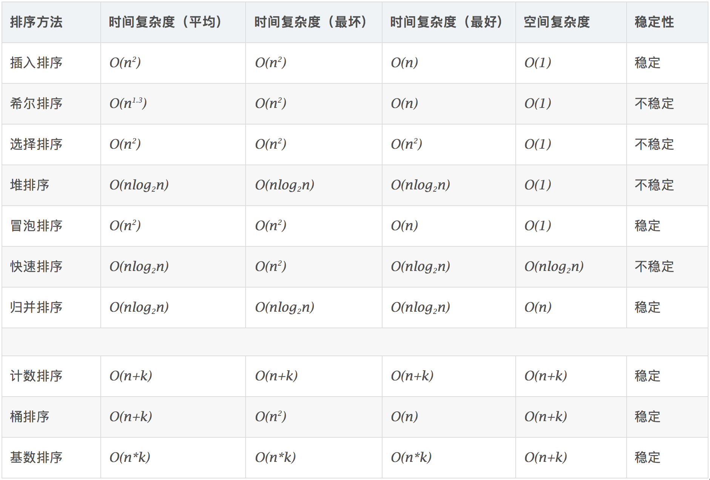

# 排序算法

## 目录

* 选择排序
* 冒泡排序
* 插入排序
* 快速排序
* 归并排序
* 希尔排序
* 堆排序
* 计数排序
* 桶排序
* 基数排序

## 算法复杂度（Algorithm complexity）

| 算法 | 时间复杂度（平均） | 时间复杂度（最坏） | 时间复杂度（最好） | 空间复杂度 | 稳定性 |
| ---- | ------------------ | ------------------ | ------------------ | ---------- | ------ |

