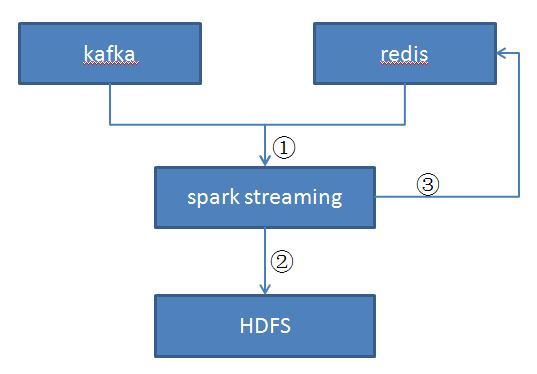

# EDCS (Eway Data Collect System)

## 系统目标

edcs 是一款将 kafka 的数据保存到 HDFS（落盘操作）的系统，承担着消费者（consumer）的角色。


## 设计方案  

### 整体架构  

Redis + Spark streaming + Kafka  

Redis 用于保存着当前对每个分区 (Partition) 最新的偏移量 （Offset），这样保证了每次落盘的数据都是最新的数据（尚未保存至 HDFS 上的数据）。  
Spark streaming 实时计算框架，对 Kafka 中的数据进行处理，本系统中主要承担 HDFS 文件写入操作，Kafka 输入数据来源。

设计架构图
  
edcs 系统设计架构图

1. 基于 redis 存储的 offset 得到当前 kafka 的数据流
2. 将数据写入至 HDFS 文件系统中
3. 更新 redis 中存储的 offset 


### HDFS 写入方案 

由于 RDD 写入文件是多 part 写入的，因而我们需要将多个 part 文件整合至一起写入至新的文件，写完之后将原来的多 part 文件删除，保证磁盘的整洁性。当该文件超过一定大小时，我们需要重新写入新的文件。本系统中设置当文件超过 128m 时重新写入新的文件。


## 实现细节   

3.1 配置文件  

本系统共有 5 个配置文件  
kafka.properties kafka 的相关配置信息  
redis.properties redis 的相关配置信息  
log4j.properties log4j 的相关配置信息  
spark.properties spark 的相关配置信息  
url.properties HDFS 文件的相关信息

3.2 创建 spark streaming 并转换为 RDD 

```scala
val rdds = KafkaUtils.createDirectStream[Long, String, LongDecoder
      , StringDecoder, (Long, String)](ssc, KafkaHelper.initKafkaParams(), genTopicAndPartition(KafkaHelper.initKafkaParams), messageHandler)
      .transform { rdd =>
         offsetRanges = rdd.asInstanceOf[HasOffsetRanges].offsetRanges
          offsetService.setTempOffset(offsetRanges.toList.asJava)
         rdd.map {
            case (k, v) => 
               v
         }
      }
```
详见com.edcs.collect.stream.CollectStreamingTask#main  


3.3 HDFS 相关操作  

新建 hdfs 文件

```bash
org.apache.hadoop.fs.FileSystem#createNewFile(org.apache.hadoop.fs.Path)
```

写入hdfs文件

```bash
java.io.FilterOutputStream#write(byte[])
```

删除hdfs文件

```bash
org.apache.hadoop.fs.FileSystem#delete(org.apache.hadoop.fs.Path, boolean)
```

复制hdfs文件

```bash
org.apache.hadoop.fs.FileUtil#copy(org.apache.hadoop.fs.FileSystem, org.apache.hadoop.fs.Path, org.apache.hadoop.fs.FileSystem, org.apache.hadoop.fs.Path, boolean, org.apache.hadoop.conf.Configuration)
```

详见com.eway.edcs.collect.utils.Util  

### 四、常见问题及解决方案  

4.1 启动 edcs  

4.1.1 本地启动  

在 spark.properties 设置 spark.master=local
直接运行 com.edcs.collect.stream.CollectStreamingTask
记得设置环境变量 HADOOP_USER_NAME=root，其中 root 代表你要写入文件所有者，否则会报异常。


4.1.2 集群启动  

在 spark.properties 设置 spark.master=spark://192.168.1.121:7077  
进入 192.168.1.122 机器  

运行 bash /tmp/spark-submit/submit-data-collect.sh  
submit-data-collect.sh 运行原理  
	将 edcs 打包的目录依次拷贝至 spark 集群的各个节点 
	采用 spark-submit 方式将任务提交至 spark 集群上去运行  
其中第一步很关键，不然运行时会抛出 class not found 异常  

4.2 HDFS 路径设置  

HDFS 路径设置信息在 url.properties 这个配置文件里面  
```bash
output.path
```
设置 rdd.saveTextFile() 的路径位置目录，该路径最终会被删除  
```bash
fs.default.name
```
hdfs 文件目录  
```bash
temp.file
```
文件临时保存路径，将 output.path 下的文件内容全部整合到该临时文件中
```bash
dest.path
```
当临时文件超过 128m 时，文件会被复制到该路径下，同时删除临时文件  

4.3 分割文件时数据丢失  

当 temp 文件超过 128m 时，我们需要将其复制到新的文件中去，并将原来的 temp 文件清空。这里有个小细节，我们在判断是否超出时，是拿已有的 temp 文件大小加上当前待写入字符串大小和 128m 进行比较。当超出时，我们将原有的 temp 文件复制到新文件中去，并清空 temp文件，但是此时待写入字符串要记得保存到 temp 中去，否则该字符串会丢失。  

4.4 常见错误  
```bash
org.apache.kafka.common.errors.RecordTooLargeException: The message is 200000044 bytes when serialized which is larger than the maximum request size you have configured with the max.request.size configuration.
```
初始化 KafkaSinkerService 时设置 max.request.size 参数
```bash
org.apache.kafka.common.errors.RecordTooLargeException: The message is 200000044 bytes when serialized which is larger than the total memory buffer you have configured with the buffer.memory configuration.
```
初始化 KafkaSinkerService 时设置 buffer.memory 参数  
```bash
java.lang.AssertionError: assertion failed: Ran out of messages before reaching ending offset 2 for topic paul_2 partition 3 start 0. This should not happen, and indicates that messages may have been lost
```
kafka consumer 端配置 fetch.message.max.bytes 参数，要大于所发消息的大小

### 作者
本文由尹仁强创建，由王若凡整理