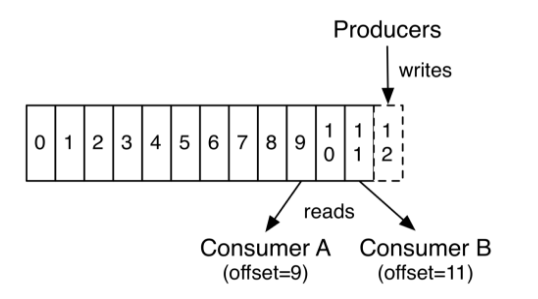

# Kafka 入门指南

## 文档目的

本文档提供 Kafka 入门级帮助，帮助读者快速理解什么是 Kafka 以及 Kafka 的工作机制。
Kafka 详细中文教程 http://orchome.com/kafka/index 。

## Kafka

Kafka 是消息中间件的一种，简单而言，可以将 Kafka 理解为一个消息队列，消息队列可以理解为消息的进出通道，既可以将消息放置在该队列里，又可以将消息从该队列里取出来。

## Kafka 工作机制

既然 kafka 是一个消息队列，包含了存消息和取消息两种行为，那么我们就有如下的问题？ 
谁来放？生产者（Producer），专门用来生产消息的。
如何区分消息？消息标签（Topic），每种消息都有一个标签加以区分。 
怎么放？分区（Partition），分区可以看做一个队列，同一标签的消息可以放置在多个分区，新来消息放置在队列最后。  
放在那里？ kafka 服务器即 broker ，可以视作消息队列。
谁来取？消费者（Consumer），专门用来取出生产者存放的消息。
取谁？消息主题（Topic），消费者根据 topic 取出同一标签下的消息。 
如何取？从分区中去取。根据消息 topic 可以获得存放该消息的所有分区。每个分区会保存一个消息 offset，可以理解为下标。消费者根据 offset 取出消息。默认取完消息后，offset 会移动到最新的消息处。如果想读取之前的消息，直接将 offset 往前移动即可。




上面两幅图解释了生产者存放消息和消费者消费消息的机制

## Kafka 编程指南

* 生产者

初始化生产者

```java
// properties 表示 kafka 初始化生产者的一些配置参数
Producer<String, String> producer = new KafkaProducer<String, String>(properties);
```

生产者发生消息

```java
// 先初始化一个 ProducerRecord，topic 代表消息主题，context 代表消息内容。然后调用 send 函数进行发送。
ProducerRecord<String, String> producerRecord = new ProducerRecord<String, String>(topic, context);
producer.send(producerRecord);
```

* 消费者

初始化消费者

```java
// ConsumerConfig 代表 kafka 初始化消费者的一些配置参数
ConsumerConnector consumer = Consumer.createJavaConsumerConnector(ConsumerConfig);
```

消费者接收消息
先初始化待消费的 topic 集合

```java
Map<String, Integer> topickMap = new HashMap<String, Integer>();
topickMap.put(topic, 1);
```

得到消息流 map，key 代表 topic，value 代表该 topic 对应的消息流

```java
Map<String, List<KafkaStream<byte[], byte[]>>> streamMap = consumer.createMessageStreams(topickMap);
```

遍历该 streamMap 可以得到所有的 topic 对应的消息流

```java
while (true) {
   for (Map.Entry<String, List<KafkaStream<byte[], byte[]>>> result : streamMap.entrySet()) {
        String topic = result.getKey();
        System.out.println("*********topic********" + topic);
        KafkaStream<byte[], byte[]> stream = streamMap.get(topic).get(0);
        ConsumerIterator<byte[], byte[]> it = stream.iterator();

        if (messages.containsKey(topic)) {
            count = messages.get(topic);
        }
        try {
            while (it.nonEmpty() && it.hasNext()) {
                it.next();
            }
        } catch (Exception ignored) {
            // TODO
        }
    }
}
```

这里有个细节需要注意下：

Kafka 的消费者在消费过程中抵触是一个阻塞队列，kafka 默认配置下当该队列没有消息的时候会一直在等待直至有消息到来。 这种情况不适合多topic的情况，因为会一直等待某个 topic 对应消息的到来，程序会阻塞在那里。

这里采取一种讨巧的方式，初始化 kafka 消费者的时候配置一个参数，

```java
props.put("consumer.timeout.ms", "1000");
```

默认 kafka 配置为 -1 即一直等待。这里设置为 1s，当超出 1s 后仍然没有消息到来，这里会抛出异常。我们也就利用这个异常来跳出这个 topic 的消息等待来获取下一个 topic 的相关消息。
