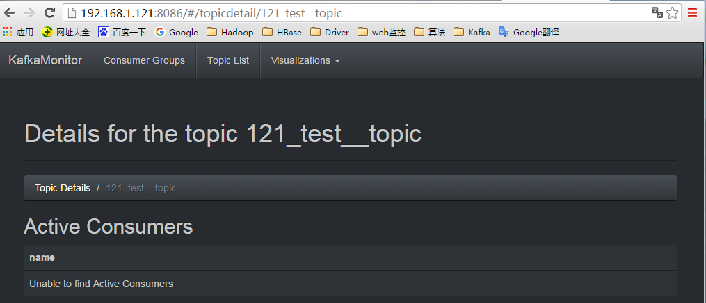

# 部署 KafakOffsetMonitor

## 下载

Github 的上的 KafkaOffsetMonitor 的 JAR 中的静态资源有些链接用到了 Google 的超链接，所有如果直接只用，若本地木有代理软件会启动出错，这里使用网络所提供的 JAR ，这个 JAR 是经过静态资源改版后重新编译的使用本地静态资源。

> https://github.com/quantifind/KafkaOffsetMonitor
> http://pan.baidu.com/s/1sj0YERV

## 安装部署

KafkaOffsetMonitor 的安装部署较为简单，所有的资源都打包到一个 JAR 文件中了，因此，直接运行即可，省去了配置。

这里在 /root/Cloud/kafka-0.10.0.1/bin 下新建一个名为 kafka_offset 文件夹，单独用于 Kafka 的监控目录，然后此文件夹下新建一个启动 KafkaOffsetMonitor 的脚本，脚本名称：mobile_start_en.sh ，内容如下：


脚本解释：指明运行 Web 监控的类，然后要填写 ZK 集群信息，接着是 Web 运行端口，页面数据刷新的时间以及保留数据的时间值。

## 启动

进入 /root/Cloud/kafka-0.10.0.1/bin/kafka-offset 路径下

```sh
$ chmod +x  mobile_start_en.sh
$ ./mobile_start_en.sh
```


进程 2314，即为：KafkaOffsetMonitor


## Web 端

访问：192.168.1.121:8086
Web 端详情：
查看 Kafka 集群信息：


点击查看 TopicList：


每个 Topic 的详情：


