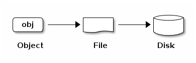
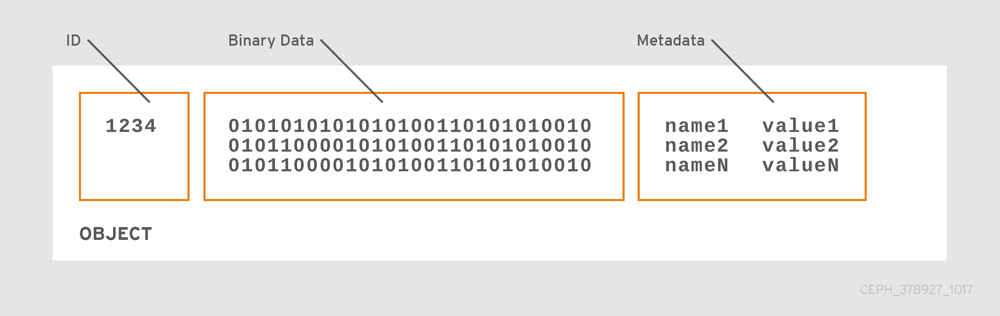

# Ceph 架构


* **LIBRADOS**: 允许直接访问 RADOS 的库，支持 C、C++、Java、Python、Ruby 和 PHP
* **RADOSGW**: 基于 Bucket 的 REST 网关，兼容 S3 和 Swift
* **RBD**: 完全分布式块设备，带有 Linux 内核客户端和 QEMU/KVM 驱动
* **CEPHFS**: POSIX 兼容的分布式文件系统，带有 Linux 内核客户端和支持 FUSE
* **RADOS**: 由自处理、自管理的智能节点组成的可靠、自治、分布式对象存储

## 目录

* [Ceph 存储集群 | RADOS 集群](rados/README.md)
* Ceph 客户端
  * [Ceph 块设备](rbd/README.md)
  * [Ceph 文件系统](cephfs/README.md)
  * [Ceph 对象网关](radosgw/README.md)
  * [Ceph Manager](mgr/README.md)

## Ceph 存储集群

Ceph 提供了基于 [RADOS](https://ceph.com/wp-content/uploads/2016/08/weil-rados-pdsw07.pdf) 的可无限扩展的 Ceph 存储集群。

```c
-------------------------------------------------------------------------------------------

   +-----+            +-----+       +---------+     +--------+
   | APP |            | APP |       | HOST/VM |     | CLIENT |
   +-----+            +-----+       +---------+     +--------+
    da|ta              da|ta           da|ta           da|ta           【Ceph 客户端层】
      v                  v               v               v
++----------++     ++=========++     ++=====++      ++========++
|| librados ||     || RADOSGW ||     || RBD ||      || CEPHFS ||
++----------++     ++=========++     ++=====++      ++========++
      |                  |               |               |
-------------------------------------------------------------------------------------------
      |                  |               |               |
      v                  v               v               v
  +--------+        +--------+       +--------+      +--------+
  | object |        | object |       | object |      | object |        【Ceph 存储集群层】
  +--------+        +--------+       +--------+      +--------+
      ^                  ^               ^               ^
      |                  |               |               |
-------------------------------------------------------------------------------------------
      |                  |               |               |
      v                  v               v               v
  +--------+        +--------+       +--------+      +--------+
  |  file  |        |  file  |       |  file  |      |  file  |    【文件系统层（与 OS 平级）】
  +--------+        +--------+       +--------+      +--------+
-------------------------------------------------------------------------------------------

  ++======++   cp   ++======++  cp   ++======++  cp  ++======++
  || disk ||<------>|| disk ||<----->|| disk ||<---->|| disk ||     【物理块设备层（即 OSD）】
  ++======++        ++======++       ++======++      ++======++

-------------------------------------------------------------------------------------------
```

### 守护进程

Ceph 存储集群由两种守护进程组成：

| 守护进程            | 描述                                                                                                                                                             |
| ------------------- | ---------------------------------------------------------------------------------------------------------------------------------------------------------------- |
| Ceph Monitor Daemon | * 维护 Cluster Map 的主副本（master copy），客户端将从中检索一份副本（copy） <br> * 支持高可用集群 <br>                                                          |
| Ceph OSD Daemon     | * 检查自身和其他 OSD 的状态，并将报告发送给 Ceph Monitor Daemon <br>  * 客户端与每个 Ceph OSD Daemon 使用 [CRUSH 算法](#) 计算 `数据位置` 信息，不需要中央查找表 |

Ceph 为 Ceph 存储集群提供了原生接口 librados，以及构建在 librados 之上的许多服务接口。

### 存储数据



* Ceph 存储集群从 `Ceph 客户端` 接收数据，并将所有数据存储为对象（换句话说，Ceph 存储集群也是一个对象存储）
* 每个对象对应于文件系统中的一个文件，该文件存储在对象存储设备（Object Storage Device，即 OSD）上
* Ceph OSD Daemon 将所有数据作为对象存储在 `平面命名空间`（Flat Namespace）中（没有目录层次结构）
* 对象具有集群唯一的标识符（ID）、二进制数据以及一组 name/value 对组成的元数据，是否具有元数据完全取决于 `Ceph 客户端`。例如 CephFS 使用元数据来存储文件属性（如：文件所有者、创建时间、上次修改日志等）



> Ceph 客户端 —— 可以访问 Ceph 存储集群的 Ceph 组件集合，包括 Ceph 对象网关、Ceph 块设备、Ceph 文件系统、以及相应的库（如 librados）、内核模块（如 ceph.ko、rbd.ko） 和 FUSE

### 可伸缩性和高可用性

* Ceph 客户端和 Ceph OSD Daemon 都使用 [CRUSH](https://ceph.com/wp-content/uploads/2016/08/weil-crush-sc06.pdf) 算法计算对象位置信息，从而消除了集中式网关，使 Ceph 客户端可以与 Ceph OSD Daemon 直接交互
* Ceph OSD Daemon 在其他 OSD 节点上创建对象副本，以确保数据安全性和高可用性；同时还使用一组 Monitor 来确保高可用性

### Cluster Map

Ceph 依赖于 Ceph 客户端和 Ceph OSD Daemon，拥有集群拓扑机构，包括 5 个 Map，统称为 `Cluster Map`：

| Map         | 查看命令                                                                                                                        | 包含信息                                                                                                                                                                      |
| ----------- | ------------------------------------------------------------------------------------------------------------------------------- | ----------------------------------------------------------------------------------------------------------------------------------------------------------------------------- |
| Monitor Map | `ceph mon dump`                                                                                                                 | * 集群 fsid <br> * 每个 Monitor 的位置、名称地址和端口 <br> * Mon map epoch <br> * 创建时间和上次修改时间                                                                     |
| OSD Map     | `ceph osd dump`                                                                                                                 | * 集群 fsid <br> * 存储池列表、副本大小、PG 数量 <br> * OSD 列表及状态（如 up、in）                                                                                           |
| PG Map      | `ceph pg dump`                                                                                                                  | * PG 版本 <br> * PG 当前时间戳 <br> * last OSD map epoch <br> * full ratio <br> * 每个 PG 的详细信息（如 PG ID、Up Set、Acting Set、PG 状态以及每个存储池的数据使用统计信息） |
| CRUSH Map   | * 导出：`ceph osd getcrushmap -o {comp}` <br> * 解码：`crushtool -d {comp} -o {decomp}` <br> * 其他：`ceph osd crush dump` <br> | * 存储设备列表 <br> * 故障域层次结构（如 device、host、rack、row、room 等） <br> * 存储数据时所遍历层次结构的规则                                                             |
| MDS Map     | `ceph fs dump`                                                                                                                  | * MDS map epoch <br> * 存储元数据的池 <br> * 元数据服务器列表及状态                                                                                                           |

每个 Map 都保持其运行状态变化的迭代历史，Ceph Monitor 维护 Cluster Map 的主副本，包括集群成员、状态、变更以及 Ceph 存储集群的整体运行状态。

### 高可用 Monitor

* Ceph 客户端在读写数据之前，必须联系 Ceph Monitor 获取 Cluster Map 的最新副本
* 为了增加可靠性和容错能力，Ceph 支持一组 Monitor
* Monitor 集群中，延迟和其他故障可能导致一个或多个 Monitor 落后于集群的当前状态，因此 Ceph 必须在各种 Monitor 实例之间达成一致
* Ceph 要求超过一半的 Monitor 实例存活（如 1:1、2:3、3:5、4:7），并使用 [Paxos](#) 算法在 Monitor 之间就集群当前状态达成一致

### 高可用认证

* 为了识别用户并防止中间人攻击，Ceph 提供了 cephx 身份认证系统来验证 `用户` 和 `守护进程`，但不涉及数据加密
* Cephx 使用共享密钥进行双向身份验证，意味着客户端和 Monitor 集群都拥有客户端密钥的副本；与此同时，集群需要确保用户拥有密钥，并且用户需要确保集群拥有密钥副本

**Ceph 的一个关键可扩展性功能是避免 Ceph 对象存储的集中接口，这意味着 Ceph 客户端必须能够直接与 OSD 交互**

```c
+--------+                      +---------+
| Client |                      | Monitor |
+--------+                      +---------+
    |    request to create a user    |
    |------------------------------->|--------+ create user
    |                                |        | and
    |<-------------------------------|<-------+ store key
    |          transmit key          |
```

* 为了使用 cephx，管理员必须首先设置用户
* `client.admin` 用户从命令行调用 `ceph auth get-or-create-key` 以生成用户名和密钥
* Ceph 的认证子系统生成用户名和密钥，与监视器一同存储副本，并将用户密钥发送回 `client.admin` 用户，意味着客户端和 Monitor 共享一个密钥

```c
+--------+                       +---------+
| Client |                       | Monitor |
+--------+                       +---------+
    |         authenticate           |
    |------------------------------->|--------+ generate and
    |                                |        | encrypt
    |<-------------------------------|<-------+ session key
    | transmit encrypted session key |
    |                                |
    |--------+ decrypt               |
    |        | session               |
    |<-------+ key                   |
    |                                |
    |          req.ticket            |
    |------------------------------->|--------+ generate and
    |                                |        | encrypt
    |<-------------------------------|--------+ ticket
    |          recv.ticket           |
    |                                |
    |--------+                       |
    |        | decrypt tick          |
    |<-------+                       |
```

* 要通过 Monitor 进行身份验证，客户端会将用户名传递给 Monitor，Monitor 会生成会话密钥并

```c
+--------+                       +---------+                        +-----+            +-----+
| Client |                       | Monitor |                        | MDS |            | OSD |
+--------+                       +---------+                        +-----+            +-----+
    |     request to create a user   |                                 |                  |
    |------------------------------->|                                 |                  |
    |                                |                                 |                  |
    |<-------------------------------|                                 |                  |
    |     receive shared secret      | mon and client share a secret   |                  |
    |                                |<------------------------------->|                  |
    |                                |                                 |                  |
    |                                |<--------------------------------|----------------->|
    |                                | mon, mds and osd share a secret |                  |
    |          authenticate          |                                 |                  |
    |------------------------------->|                                 |                  |
    |<-------------------------------|                                 |                  |
    |          ression key           |                                 |                  |
    |                                |                                 |                  |
    |           req.ticket           |                                 |                  |
    |------------------------------->|                                 |                  |
    |<-------------------------------|                                 |                  |
    |           recv.ticket          |                                 |                  |
    |                                |                                 |                  |
    |                       make request (CephFS only)                 |                  |
    |----------------------------------------------------------------->|                  |
    |<-----------------------------------------------------------------|                  |
    |                     receive response (CephFs only)                                  |
    |                                                                                     |
    |                                  make request                                       |
    |-------------------------------------------------------------------------------------|
    |<------------------------------------------------------------------------------------|
    |                                receive response                                     |
```

### 启用超大规模智能守护进程

```c
                   +--------+
                   | Client |
                   +--------+
                      | ^
            Write (1) | | Ack (6)
                      v |
                +-------------+
                | Primary OSD |
                +-------------+
        Write (2)  | ^   ^ |    Write (3)
        +----------+ |   | +----------+
        | +----------+   +----------+ |
        | |  Ack (4)     Ack (5)    | |
        v |                         | v
+---------------+             +--------------+
| Secondary OSD |             | Tertiary OSD |
+---------------+             +--------------+
```

### 动态集群管理

```c
+--------+  Retrieves   +-------------+
| Client | -----------> | Cluster Map |
+--------+              +-------------+
    | Writes
    v
 +-----+
 | obj |
 +-----+
    | To
    v
+--------+              +-------------+
|  Pool  | -----------> | CRUSH Rule  |
+--------+   Selects    +-------------+
```

```c
+-----+  +-----+  +-----+  +-----+  +-----+
| obj |  | obj |  | obj |  | obj |  | obj |
+-----+  +-----+  +-----+  +-----+  +-----+
   |       |       |          |         |
   +-------+-------+          +---------+
           |                       |
           v                       v
+--------------------+    +--------------------+
| Placement Group #1 |    | Placement Group #2 |
+--------------------+    +--------------------+
            |                       |
            |     +-----------------+-----+
      +-----+-----|-----------+           |
      |           |           |           |
      v           v           v           v
 +--------+  +--------+  +--------+  +--------+
 | OSD #1 |  | OSD #2 |  | OSD #3 |  | OSD #4 |
 +--------+  +--------+  +--------+  +--------+
```

```c

        +-------+     +-------+
Before  | OSD 1 |     | OSD 2 |
        +-------+     +-------+
        +-------+     +-------+
        | PG #1 |     | PG #6 |
        | PG #2 |     | PG #7 |
        | PG #3 |     | PG #8 |
        | PG #4 |     | PG #9 |
        | PG #5 |     | PG #10|
        +-------+     +-------+

        +-------+     +-------+     +-------+
After   | OSD 1 |     | OSD 2 |     | OSD 3 |
        +-------+     +-------+     +-------+
        +-------+     +-------+     +-------+
        | PG #1 |     | PG #7 |     | PG #3 |
        | PG #2 |     | PG #8 |     | PG #6 |
        | PG #4 |     | PG #10|     | PG #9 |
        | PG #5 |     +-------+     +-------+
        +-------+
```

## CRUSH 算法

## 数据可靠性

* 副本
* 纠删码

可以在同一 Ceph 集群的不同存储池中使用以上两种不同的数据恢复技术。

Considerations

## 如何存储数据

## 参考

* [inwinSTACK - ceph integrate with kubernetes](https://www.slideshare.net/inwinstack/inwinstack-ceph-integrate-with-kubernetes)
* [Let there be Luminous!](https://www.micron.com/about/blogs/2017/november/let-there-be-luminous)
* [Ceph Reference Architecture](https://www.micron.com/~/media/documents/products/technical-marketing-brief/micron_9200_ceph_3,-d-,0_reference_architecture.pdf?la=en)