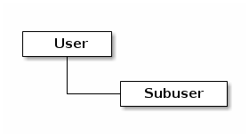

# RADOSGW 用户管理

Ceph 对象网关的用户管理不是 Ceph 存储集群的用户管理。

## 用户类型



| 用户类型    | 对应的默认密钥类型 | 描述                                                                                                                                                                            |
| ----------- | ------------------ | ------------------------------------------------------------------------------------------------------------------------------------------------------------------------------- |
| **user**    | s3                 | * 其密钥仅用于 S3 API                                                                                                                                                           |
| **subuser** | swift              | * 其密钥默认用于 Swift API（亦可设置成用于 S3 API） <br> * 一个 _user_ 可以包含多个 _subuser_，每个 _subuser_ 只属于一个 _user_ <br> * _subuser_ 的生命周期完全由该 _user_ 决定 |

## 基本管理

```sh
# 查询用户列表
$ radosgw-admin user list
[
    "cephnfs",
    "s3demo"
]
```

```sh
# 获取用户信息
$ radosgw-admin user info --uid="s3demo"
```

```sh
# 修改用户信息
$ radosgw-admin user modify --uid="s3demo" --display-name="S3 Demo User" # user
$ radosgw-admin subuser modify --subuser="s3demo:swiftdemo" --access=full
```

```sh
# 启/停用户
$ radosgw-admin user suspend --uid="s3demo" # 停用（子用户当然也会被停用）
$ radosgw-admin user enable --uid="s3demo" # 启用
```

```sh
# 移除用户
# --purge-data 选项清除与 UID 相关的所有数据
# --purge-keys 选项清除与 UID 相关的所有 key
$ radosgw-admin user rm --uid="s3demo" # 子用户全部都会被移除
```

```sh
# 移除某个子用户
# --purge-keys 选项清除与 UID 相关的所有 key
$ radosgw-admin user rm --subuser="s3demo:swifitdemo"
```

## 创建用户

### 创建 S3 用户（即 `user`）

```sh
$ radosgw-admin user create --uid="s3demo" --display-name="S3 Demo User" --email="s3demo@gmail.com"
{
    "user_id": "s3demo",
    "display_name": "S3 Demo User",
    "email": "s3demo@gmail.com",
    "suspended": 0,
    "max_buckets": 1000,
    "auid": 0,
    "subusers": [],
    "keys": [
        {
            "user": "s3demo",
            "access_key": "2PGA536VQV3CYJFR4XEK", # S3 Access Key
            "secret_key": "xmqMUqTVNBwlBlXkkoUIzbcuHws9itS2Y0hkQzBt" # S3 Secret Key
        }
    ],
    "swift_keys": [],
    "caps": [],
    "op_mask": "read, write, delete",
    "default_placement": "",
    "placement_tags": [],
    "bucket_quota": {
        "enabled": false,
        "check_on_raw": false,
        "max_size": -1,
        "max_size_kb": 0,
        "max_objects": -1
    },
    "user_quota": {
        "enabled": false,
        "check_on_raw": false,
        "max_size": -1,
        "max_size_kb": 0,
        "max_objects": -1
    },
    "temp_url_keys": [],
    "type": "rgw",
    "mfa_ids": []
}
```

### 创建一个 Swift 用户（即 `subuser`）

* 必须指定 user ID、subuser ID，以及 subuser 的访问级别
* subuser 的默认命名规则是 `<user-name>:<subuser-name>`（创建时如果指定了 `--uid` 可以省略 user-name）

```syntax
# 语法（full 除了 readwrite，还包括访问控制策略）
$ radosgw-admin subuser create --uid=<user_name> --subuser=<user_name>:<subuser_name> --access=[read | write | readwrite | full]
```

```sh
# 方式一
$ radosgw-admin subuser create --uid="s3demo" --subuser="s3demo:swiftdemo" --access=full

# 方式二
$ radosgw-admin subuser create --uid="s3demo" --subuser="swiftdemo" --access=full

# 方式三
$ radosgw-admin subuser create --subuser="s3demo:swiftdemo" --access=full

# 子用户用于 s3 接口
> radosgw-admin user create --gen-access-key --gen-secret --uid=user_a
> --display_name="User A"
> radosgw-admin subuser create --gen-access-key --gen-secret
> --access={read,write,readwrite,full} --key-type=s3 --uid=user_a
> --subuser=subuser_1

{
    "user_id": "s3demo",
    "display_name": "S3 demo user",
    "email": "",
    "suspended": 0,
    "max_buckets": 1000,
    "auid": 0,
    "subusers": [
        {
            "id": "s3demo:swiftdemo", # <user-name>:<subuser-name>
            "permissions": "full-control"
        }
    ],
    "keys": [
        {
            "user": "s3demo",
            "access_key": "AAYGBK6N0VVIIS5Y87ZX",
            "secret_key": "UoPBZliTWyQdtnOy3we1MCuKNbmrkcOu5ofzg2mV"
        }
    ],
    "swift_keys": [
        {
            "user": "s3demo:swiftdemo",
            "secret_key": "knwtVJYMyybNHVlnr0FncCYOijn0V9nWwWZ2mTGA"
        }
    ],
    "caps": [],
    "op_mask": "read, write, delete",
    "default_placement": "",
    "placement_tags": [],
    "bucket_quota": {
        "enabled": false,
        "check_on_raw": false,
        "max_size": -1,
        "max_size_kb": 0,
        "max_objects": -1
    },
    "user_quota": {
        "enabled": false,
        "check_on_raw": false,
        "max_size": -1,
        "max_size_kb": 0,
        "max_objects": -1
    },
    "temp_url_keys": [],
    "type": "rgw",
    "mfa_ids": []
}
```


## 修改用户信息

```sh
# 修改 S3 user 信息
$ radosgw-admin user modify --uid="s3demo" --display-name="Jins Yin"

# 修改 Swift subuser 信息
$ radosgw-admin user modify --uid="s3demo" --subuser="s3demo:swiftdemo" --access=readwrite
```

## 启用/暂停用户

* 默认是启用的

```sh
# 暂停
$ radosgw-admin user suspend --uid='s3demo'

# 验证
$ radosgw-admin user info --uid='s3demo' | grep 'suspended'
  "suspended": 1,

# 启用
$ radosgw-admin user enable --uid='s3demo'
```

## 用户 key 管理

* 一个 _user_ 可以有多对 key
*

| 参数选项             | 描述                                       |
| -------------------- | ------------------------------------------ |
| `--key-type=<type>`  | 指定秘钥类型；可选值：`s3`、`swift`        |
| `--access-key=<key>` | 手动指定 S3 Access Key                     |
| `--secret-key=<key>` | 手动指定 S3 Secret Key 或 Swift Secret Key |
| `--gen-access-key`   | 自动生成 S3 Access Key                     |
| `--gen-secret`       | 自动生成 S3 Secret Key 或 Swift Secret Key |

S3 API - access key、secret key
Swift API - secret key（password）

```sh
# 为 S3 user 创建一对 access-key、secret-key（每个 S3 user 可以创建多个密钥对）
# 密钥对必须 5 位数及以上
$ radosgw-admin key create --uid="s3demo" --key-type=s3 --access-key="s3jjyy" --secret-key="s3jjyy" # 要求 s3demo 已创建

# 为 Swift subuser 创建一个 secret-key（每个 Swift subuser 只能有一个 secret-key）
$ radosgw-admin key create --subuser="s3demo:swiftdemo" --key-type=swift --secret-key="jjyy"
```

```sh
# 移除 S3 密钥对（指定 Access Key 即可）
$ radosgw-admin key rm --uid='s3demo' --key-type=s3 --access-key="s3jjyy"

# 移除 Swift Secret Key
$ radosgw-admin key rm --subuser="s3demo:swiftdemo" --key-type=swift
```

## 添加/删除管理功能（Administrative Capabilities）

Ceph 集群提供了一个管理 API，使用户能够通过 REST API 执行管理功能。默认不能访问该 API 。

```plaintext
// '*' == 'read,write'
--caps="[users|buckets|metadata|usage|zone]=[*|read|write|read,write]"
```

```sh
# 为 S3 user 添加管理功能
$ radosgw-admin caps add --uid="s3demo" --caps="buckets=*"
```

```sh
# 移除管理功能
$ radosgw-admin caps rm --uid="s3demo" --caps="buckets=write"
```

## 多租户管理

* [RGW MULTI-TENANCY](http://docs.ceph.com/docs/master/radosgw/multitenancy/)

## 用户能力管理

> * [ADD A USER CAPABILITY](http://docs.ceph.com/docs/mimic/radosgw/adminops/#add-a-user-capability)

## 参考

* [USER MANAGEMENT](http://docs.ceph.com/docs/master/radosgw/admin/#user-management)
