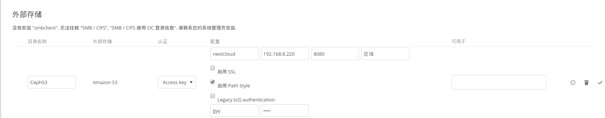

# NextCloud

* NextCloud Server
* NextCloud Desktop Client

## OwnCloud & NextCloud

* [云存储 | 再见 ownCloud，你好 nextCloud！](https://www.getnas.com/2017/06/2222.html)

## 默认配置

```php
<?php
$CONFIG = array (
  'htaccess.RewriteBase' => '/',
  'memcache.local' => '\\OC\\Memcache\\APCu',
  'apps_paths' =>
  array (
    0 =>
    array (
      'path' => '/var/www/html/apps',
      'url' => '/apps',
      'writable' => false,
    ),
    1 =>
    array (
      'path' => '/var/www/html/custom_apps',
      'url' => '/custom_apps',
      'writable' => true,
    ),
  ),
  'instanceid' => 'ocksw668v7zn',
  // 'datadirectory' => '/var/www/html/data', // 默认的存储方式是数据目录
);
```

```php
$ cat /var/www/html/config/config.php
<?php
$CONFIG = array (
  'htaccess.RewriteBase' => '/',
  'memcache.local' => '\\OC\\Memcache\\APCu',
  'apps_paths' =>
  array (
    0 =>
    array (
      'path' => '/var/www/html/apps',
      'url' => '/apps',
      'writable' => false,
    ),
    1 =>
    array (
      'path' => '/var/www/html/custom_apps',
      'url' => '/custom_apps',
      'writable' => true,
    ),
  ),
  'instanceid' => 'och9f7tewhrc',
  'passwordsalt' => 'zDH68a3TGZMSKv3g7gvrWkUECGMk2O',
  'secret' => 'NRbcwEmoLAWqtU9aIy2+d4zcurVG3cFIgBG8iCvaqN7NE+Ng',
  'trusted_domains' =>
  array (
    0 => 'localhost:8888',
  ),
  'datadirectory' => '/var/www/html/data',
  'overwrite.cli.url' => 'http://localhost:8888',
  'dbtype' => 'sqlite3',
  'version' => '13.0.4.0',
  'installed' => true,
  'ldapIgnoreNamingRules' => false,
  'ldapProviderFactory' => '\\OCA\\User_LDAP\\LDAPProviderFactory',
);
```

## 对象存储作为主存储：S3

NextCloud 默认使用 `数据目录`（默认路径：`/var/www/html/data`） 作为主存储（默认的后端存储），如果是生产环境建议使用 `对象存储` 作为主存储。

```php
  // change
  'objectstore' => array(
    'class' => 'OC\\Files\\ObjectStore\\S3',
    'arguments' => array(
      'bucket' => 'nextcloud',
      'autocreate' => true,
      'key'    => 'jjyy',
      'secret' => 'jjyy',
      'hostname' => '192.168.8.220',
      'port' => 8080,
      'use_ssl' => false,
      'region' => 'optional',
      // required for some non amazon s3 implementations
      'use_path_style' => true
    ),
  ),
```

```php
$ cat /tmp/config.php
<?php
$CONFIG = array (
  'htaccess.RewriteBase' => '/',
  'memcache.local' => '\\OC\\Memcache\\APCu',
  'apps_paths' =>
  array (
    0 =>
    array (
      'path' => '/var/www/html/apps',
      'url' => '/apps',
      'writable' => false,
    ),
    1 =>
    array (
      'path' => '/var/www/html/custom_apps',
      'url' => '/custom_apps',
      'writable' => true,
    ),
  ),
  'instanceid' => 'ocksw668v7zn',
  'objectstore' => array (
    'class' => 'OC\\Files\\ObjectStore\\S3',
    'arguments' => array (
      'bucket' => 'nextcloud',
      'autocreate' => true,
      'key' => 'jjyy',
      'secret' => 'jjyy',
      'hostname' => '192.168.8.220',
      'port' => 8080,
      'use_ssl' => false,
      'region' => 'optional',
      'use_path_style' => true,
    ),
  ),
  'passwordsalt' => '1rcloW71avZ0Osb9cPEVPAdWZRS8k5',
  'secret' => 'VIQO6382li0Wln76mRyhityFZeE7AUYVV4uLGZCx276GmNDm',
  'trusted_domains' =>
  array (
    0 => 'localhost:7777',
  ),
  //'datadirectory' => '/var/www/html/data',
  'overwrite.cli.url' => 'http://localhost:7777',
  'dbtype' => 'sqlite3',
  'version' => '13.0.4.0',
  'installed' => true,
);
```



### Multibucket Object Store

```php
'objectstore_multibucket' => array(
        'class' => 'Object\\Storage\\Backend\\Class',
        'arguments' => array(
                // optional, defaults to 64
                'num_buckets' => 64,
                // will be prefixed by an integer in the range from 0 to (num_nuckets-1)
                'bucket' => 'nextcloud_',
                ...
        ),
),
```

## 外部存储：S3

1. 进入 `应用页面`（settings/apps），启用 `External storage support`
2. 进入 `外部存储页面`（/settings/admin/externalstorages），设置 Amazon S3

> `Enable Path Style` 启用后，请求由 `http://hostname.domain/bucket` 代替 `http://bucket.hostname.bucket`。
> required for some non amazon s3 implementations

## S3

```sh
# 创建存放对象的 S3 Bucket
$ s3cmd mb s3://nextcloud
```

## 配置数据库

* SQLite（默认）
* MySQL/MariaDB
* PostgreSQL

> SQLite 将被作为数据库使用.
> 在更大的环境下, 我们建议选择一个不同的数据库后端.
> 特别当使用桌面客户端来同步文件时, 不鼓励使用 SQLite.

## 容器部署

1. 先使用 datadirectory 的方式启动

```sh
% docker run -d --name nextcloud --restart=always -p 8888:80 -e TZ="Asia/Shanghai" \
 -v /opt/nextcloud/config:/var/www/html/config:rw nextcloud:latest
```

2. 访问页面并设置管理员账号密码

```sh
% google-chrome 192.168.8.220:8888
```

3. 改变存储方式

单个 Bucket

```php
$ vi /opt/nextcloud/config/config.php
<?php
$CONFIG = array (
  ......
  'objectstore' => array(
    'class' => 'OC\\Files\\ObjectStore\\S3',
    'arguments' => array(
      'bucket' => 'nextcloud',
      'autocreate' => true,
      'key'    => 'jjyy',
      'secret' => 'jjyy',
      'hostname' => '192.168.8.220',
      'port' => 8080,
      'use_ssl' => false,
      'region' => '',
      // required for some non amazon s3 implementations
      'use_path_style' => true
    ),
  ),
  ......
);
```

> 貌似不能自动创建，只能手动 s3cmd mb s3://nextcloud

多个 Bucket：

```php
<?php
$CONFIG = array (
  'objectstore_multibucket' => array(
    'class' => 'Object\\Storage\\Backend\\Class',
    'arguments' => array(
      // optional, defaults to 64
      'num_buckets' => 64,
      // will be prefixed by an integer in the range from 0 to (num_nuckets-1)
      'bucket' => 'nextcloud_',
      'autocreate' => true,
      'key'    => 'jjyy',
      'secret' => 'jjyy',
      'hostname' => '192.168.8.220',
      'port' => 8080,
      'use_ssl' => false,
      'region' => 'optional',
      // required for some non amazon s3 implementations
      'use_path_style' => true
    ),
  ),
);
```


$CONFIG = [
  'objectstore_multibucket' => [
    'class' => 'OC\\Files\\ObjectStore\\S3',
    'arguments' => [
      'bucket' => 'ncloud',
      'num_buckets' => 64,
      'key' => 'jjyy',
      'secret' => 'jjyy',
      'hostname' => '192.168.8.220',
      'port' => '8080',
      'use_ssl' => false,
      'use_path_style' => true,
    ],
  ],
];

1. 重启容器

```sh
% docker restart nextcloud
```

## 在线 Demon

* <https://demo.nextcloud.com/>

## 插件

| APP                 | 类别          | 描述                                           |
| ------------------- | ------------- | ---------------------------------------------- |
| Files Right Click   |               | 支持文件右键点击                               |
| Group folders       | Files         | 可以创建只有相应组才能访问（写、分享）的文件夹 |
| External sites      |               |                                                |
| File access control | Files         |                                                |
| Passwords           | Security      |
| Collabora Online    | Office & text | Office 在线编辑                                |
| ocdownloader        |               | \                                              |

## MultiBucket

> https://github.com/nextcloud/server/issues/5865#issuecomment-332827521

```php
<?php
$CONFIG = [
  'objectstore_multibucket' => [
    'class' => 'OC\\Files\\ObjectStore\\S3',
    'arguments' => [
      'bucket' => 'ncloud',
      'num_buckets' => 64,
      'key' => 'jjyy',
      'secret' => 'jjyy',
      'hostname' => '192.168.8.220',
      'port' => '8080',
      'use_ssl' => false,
      'use_path_style' => true,
    ],
  ],
];
```

## 参考

* [NextCloud - Primary Storge](https://docs.nextcloud.com/server/11/admin_manual/configuration_files/primary_storage.html)
* [NextCloud - Amazon S3](https://docs.nextcloud.com/server/13/admin_manual/configuration_files/external_storage/amazons3.html)
* [nextcloud/server](https://github.com/nextcloud/server)
