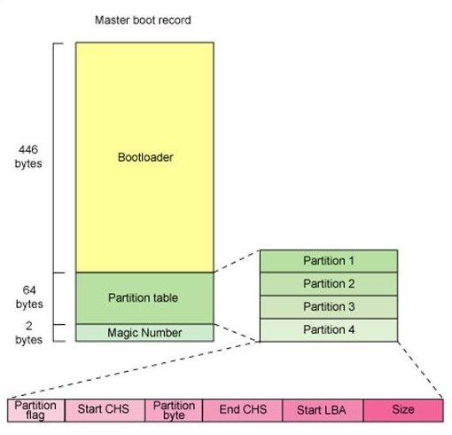

# MBR（Master Boot Record）

_主引导记录_（Master Boot Record，即 MBR），又称之为 _主引导扇区_，是计算机开机后访问磁盘时必须读取的首个扇区。

## MBR 组成



| 组成部分                   | 大小（字节） | 描述                                                                                                                                                         |
| -------------------------- | ------------ | ------------------------------------------------------------------------------------------------------------------------------------------------------------ |
| 引导加载程序（Bootloader） | 446          | 检查分区表是否正常，并在硬件完成自检后将控制权交给硬盘上的引导程序（如：GNU GRUB）。其不依赖于任何操作系统，且启动代码也是可以改变的，从而能够实现多系统引导 |
| 分区表（Partition table）  | 64           |                                                                                                                                                              |
| 结束标志字（Magic Number） | 2            | 检查主引导记录是否有效的标志                                                                                                                                 |

主引导扇区记录着硬盘本身的相关信息和硬盘各个分区的大小以及位置信息，是数据信息的重要入口。

因此，在使用“主引导记录”（MBR）这个术语的时候，需要根据具体情况判断其到底是指整个主引导扇区，还是主引导扇区的前446字节。

* MBR 不位于分区，而是位于磁盘的第一个扇区，在第一个分区之前
* 未分区设备或单个分区内的引导扇区称为 volume boot record (VBR)

## MBR 的读取流程

* 系统开机或重启
  1. BIOS 引导自检（Power On Self Test -- POST）；BIOS 执行内存地址为 `FFFF:0000H` 处的跳转指令，跳转到固化在 ROM 中的自检程序处，对系统硬件（包括内存）进行检查
  2. 读取主引导记录（MBR）；

### 分区表示例

某个分区在分区表中的信息如下：

```plain
80 01 01 00 0B FE BF FC 3F 00 00 00 7E 86 BB 00
```

* `80`：分区的激活标志，表示系统可引导
* `01 01 00`：分区开始的 `(磁头号, 扇区号, 柱面号)` 为 `(1, 1, 0)`
* `0B`：分区的系统类型是 `FAT32`；常用的还有 `04(FAT16)`、`07(NTFS)`
* `FE BF FC`：分区结束的 `(磁头号, 扇区好, 柱面号)` 为 `(254, 63, 764)`
* `3F 00 00 00`：首扇区的相对扇区为 `63`
* `7E 86 BB 00`：总扇区数为 12289662

对于大于8.4G的现代硬盘，CHS已经无法表示, BIOS使用LBA模式，对于超出的部分，CHS值通常设为0xFEFFFF，并加以忽略，直接使用Offset 0x08-0x0c的4字节相对值，再进行内部转换。

## 分区类型

MBR 分区表有三种分区类型：

* Primary
* Extended
    * Logical


```equals
MBR = 446 bytes of boot code + 4 * 16 partition entris + boot signature(0x55AA)
```
