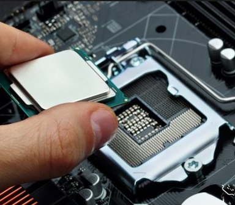
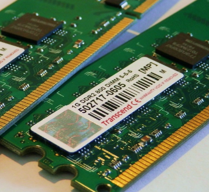
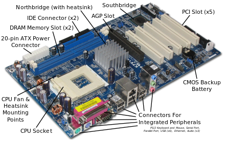
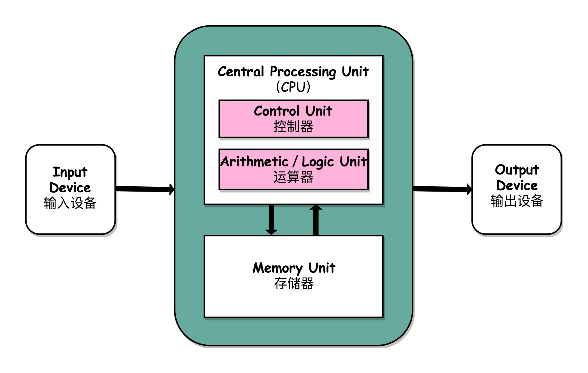

# 冯 · 诺依曼体系结构（Von Neumann architecture）

任何一台计算机的任何一个部件都可以归到运算器、控制器、存储器、输入设备和输出设备中，而所有的现代计算机也都是基于这个基础架构来设计开发的。

而所有的计算机程序，也都可以抽象为从 **输入设备** 读取输入信息，通过 **运算器** 和 **控制器** 来执行存储在 **存储器** 中的程序，最终把结果输出到 **输出设备** 中。

## 计算机核心硬件设备

| 核心硬件                       | 功能、描述                                                                                                                                                                                                                                                                  | 示例图                                                                    |
| ------------------------------ | --------------------------------------------------------------------------------------------------------------------------------------------------------------------------------------------------------------------------------------------------------------------------- | ------------------------------------------------------------------------- |
| CPU（Central Processing Unit） | * 中央处理器完成计算机的所有计算任务                                                                                                                                                                                                                                        |          |
| 内存（Memory）                 | * 存放运行的程序、程序读取的数据、程序计算的结果等 <br> * CPU 计算时需要读取内存中的程序和数据，计算完成后再写回内存                                                                                                                                                        |       |
| 主板（Motherboard）            | * 拥有几十上百个插槽（Slot），CPU 和内存均插在主板上 <br> * 主板的 **芯片组**（Chipset）和 **总线**（Bus）解决 CPU 和内存之间的通信问题 <br> * **芯片组** 控制了数据传输的流转，即数据从哪里到哪里的问题 <br> * **总线** 即数据传输的高速公路，总线速度决定了数据的传输速度 |  |

三大件配上电源供电后，计算机差不多可以跑起来。不过还缺少各类 **I/O 设备**。

输出设备：显示器、打印机
输入设备：鼠标、键盘、扫描仪、触摸板
存储设备：硬盘、SSD
其他设备：显卡（Graphics Card）
    * 组装机器时没有显卡带图形界面的计算机也能跑起来，有两种可能：主板集成了一块显卡，即 **板载显卡**（过时）；CPU 继承了一个 GPU 芯片，即 **核心显卡**。如果是单独的一块显卡，则叫做 **独立显卡**

## 冯 · 诺依曼体系结构



```c
                        +-------------------------------------+
                        |                                     |
                        |   +-----------------------------+   |
                        |   |   Central Processing Unit   |   |
                        |   |  +-----------------------+  |   |
                        |   |  |      Control Unit     |  |   |
                        |   |  +-----------------------+  |   |
                        |   |                             |   |
+--------------+        |   |  +-----------------------+  |   |        +---------------+
| Input Device | -----> |   |  | Arithmetic/Logic Unit |  |   | -----> | Output Device |
+--------------+        |   |  +-----------------------+  |   |        +---------------+
                        |   +-----------------------------+   |
                        |               |       ^             |
                        |               |       |             |
                        |               v       |             |
                        |   +-----------------------------+   |
                        |   |         Memory Unit         |   |
                        |   +-----------------------------+   |
                        |                                     |
                        +-------------------------------------+
```

## 参考

* [First Draft Of a Report on the EDVAC](https://en.wikipedia.org/wiki/First_Draft_of_a_Report_on_the_EDVAC)
