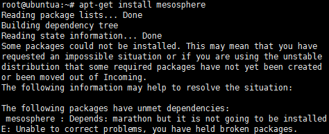
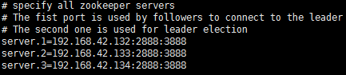
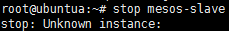
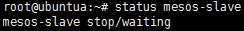
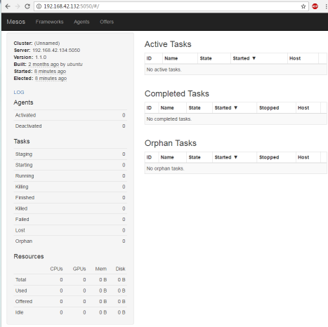
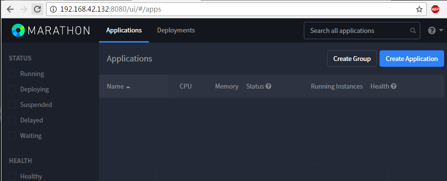
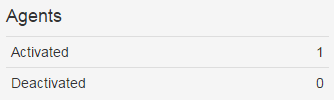
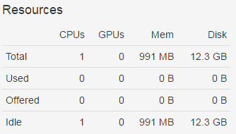
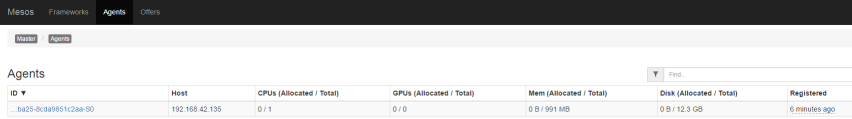

# 搭建 Mesosphere 集群（测试环境）

## 系统准备

本文使用四台装有 Ubuntu 14.04.5 的虚拟机进行搭建，其中三台为主节点，另外一台为从节点，这四台虚拟机的 IP 地址分别是：

| 主机名  | IP             |
| ------- | -------------- |
| Master1 | 192.168.42.132 |
| Master1 | 192.168.42.133 |
| Master1 | 192.168.42.134 |
| Slave1  | 192.168.42.135 |

## 环境搭建

### 安装 Mesosphere

首先，在所有节点的 APT 源中（主节点与从节点）加入 Mesosphere 的库地址。执行以下命令：

```sh
# Debian/Ubuntu
$ sudo apt-key adv --keyserver keyserver.ubuntu.com --recv E56151BF
$ DISTRO=$(lsb_release -is | tr '[:upper:]' '[:lower:]')
$ CODENAME=$(lsb_release -cs)
$ echo "deb http://repos.mesosphere.io/${DISTRO} ${CODENAME} main" | sudo tee /etc/apt/sources.list.d/mesosphere.list
```

执行上述命令后，执行 APT 更新命令：

```sh
# Debian/Ubuntu
$ sudo apt-get -y update
```

现在需要按照节点的角色安装不同的包。对于主节点而言，需要安装 Mesosphere 包，这个包中集成了 zookeeper，mesos，marathon 和 chronos 应用：

```sh
# 最新版本
$ sudo apt-get install -y mesosphere
```

对于从节点而言，只需要安装 mesos 包：

```sh
# 最新版本
$ sudo apt-get install -y mesos
```

在安装过程中，有可能遇到以下错误：



出现此问题的原因是 Marathon 的安装需要依赖一个名为 java8-runtime-headless 的插件，此插件只能在版本号大于 14.10 的 ubuntu 系统中运行。解决方法是：首先检查系统的 Java 环境是否配置正确，其次安装一个名为 equivs 的插件，利用此插件可以创建一个空的 deb 包，并在配置文件中申明该 deb 包含有 java8-runtime-headless 环境。
首先，安装 equivs ，执行以下命令：

```sh
sudo apt-get install -y equivs
```

安装完成后，创建一个带有模板的配置文件，若系统的 jdk 版本为 1.8.111，则文件名可以命名为 dummy-jdk-8u111。执行命令为：

```sh
$ sudo equivs-control dummy-jdk-8u111
```

创建完成后使用 vi 打开该文件，将该文件中自 Package 一栏以下的内容更改为：

```plaintext
Package: dummy-oracle-jdk
Version: 1.8.111
Provides: java8-runtime-headless,default-jre-headless,java-runtime-headless
Description: dummy package to satisfy java8-runtime-headless dep for manual install
 long description and info
 .
 second paragraph
```

更改完成后，执行以下命令进行编译并安装：

```sh
equivs-build dummy-jdk-8u111
dpkg -i dummy-oracle-jdk_1.8.111_all.deb
```

完成以上命令后，即可成功安装 Mesosphere。

### 为 Mesos 配置 Zookeeper 连接信息

在所有节点（主节点与从节点）中，使用 vi 命令打开 /etc/mesos 中名为 zk 的文件：

```sh
sudo vi /etc/mesos/zk
```

在该文件中可以看到 zk://localhost:2181/mesos 一行内容，现将其中的 localhost 替换为所有 master 节点的 IP 地址，开头的 zk:// 不变，末尾的 /mesos 不变，端口号 2181 为 zookeeper 的默认端口号，同样不变。以本文为例，更改内容为：

```sh
zk://192.168.42.132:2181,192.168.42.133:2181,192.168.42.134:2181/mesos
```

保存后即完成了配置 Zookeeper 连接信息的操作。

### 配置主节点的 Zookeeper

本节仅针对主节点。
zookeeper 的目的是在众多 master 节点中选举一个 leader。首先为每个主节点分配一个独一无二的 ID 号码，范围从 1 到 255 均可。现在打开此文件：

```sh
$ sudo vi /etc/zookeeper/conf/myid
```
删除该文件中所有内容并指定改节点的 ID，以文本为例，master1 指定为 1，master2 指定为 2，master3 指定为 3。
接下来我们需要修改 zookeeper 配置文件，将 ID 与主机匹配。打开以下文件：

```sh
$ sudo vi /etc/zookeeper/conf/zoo.cfg
```

将首行为#specify all zookeeper servers 的注释块下，加入 master 的 IP 地址，注意地址需与 ID 对应。以本文为例：

```plaintext
server.1=192.168.42.132:2888:3888
server.2=192.168.42.133:2888:3888
server.3=192.168.42.134:2888:3888
```

如图所示：


在所有主节点中执行以上命令后，zookeeper 配置完成，接下来配置 mesos 与 marathon

### 配置主节点的 Mesos

本节仅针对主节点。
首先，我们需要配置集群的 Quorum，Quorum 为一个数字，它决定了集群正常工作所需的最小主机数量，该数字的值需要大于主节点数量的一半。现在打开以下文件：

```sh
sudo vi /etc/mesos-master/quorum
```

修改其中的值，以本文为例，该值修改为 2。

### 配置主机名与 IP 地址

本节仅针对主节点。
现在需要在每个主节点的以下文件中设置各自的IP地址：
/etc/mesos-master/ip
/etc/mesos-master/hostname
为了防止出现地址解析错误，我们直接用IP地址作为hostname。现在对每个主节点分别执行以下命令：
```sh
echo IP | sudo tee /etc/mesos-master/ip
sudo cp /etc/mesos-master/ip /etc/mesos-master/hostname
```
命令中的 IP 为节点的 IP 地址，以本文的 master1 为例，该命令为：
```sh
echo 192.168.42.132 | sudo tee /etc/mesos-master/ip
sudo cp /etc/mesos-master/ip /etc/mesos-master/hostname
```
注意需在所有主节点中执行这些命令。

### 在主节点中配置 Marathon

本节仅针对主节点。
Mesos 配置完成后，现在开始对 Marathon 进行配置。Marathon 会运行在各个主节点，但是只有主节点中的 leader才可以担当安排工作的任务，其它 Marathon 实体只担当将请求代理至 leader 的角色。首先我们需要为每个 Marathon 实体配置它们的 hostname，由于在上文中我们已经进行过相似的配置，所以在本节中我们只需要执行一些复制操作。
首先我们需要创建配置文件所在的文件夹，将之前配置过的 hostname 复制到此文件夹中：
```sh
sudo mkdir –p /etc/marathon/conf
sudo cp /etc/mesos-master/hostname /etc/marathon/conf
```
接下来为了方便 Marathon 连接，我们需要定义 zookeeper masters 列表，这个列表就是我们之前配置 Mesos 过程中名为的 zk 的文件，现在我们只需将它复制过来：
```sh
sudo cp /etc/mesos/zk /etc/marathon/conf/master
```
以上命令将会允许 Marathon 服务连接到 Mesos 集群。然而我们任然希望 Marathon 可以在 zookeeper 中存储自己的主节点信息，为了达成这个目标，我们只需将之前的 zk 文件复制到对应目录，并进行一些小改动。
首先将之前复制过来的文件复制到 Marathon zookeeper 的位置：
```sh
sudo cp /etc/marathon/conf/master /etc/marathon/conf/zk
```
接下来对其进行修改：
```sh
sudo vi /etc/marathon/conf/zk
```
所谓的改动就是将 /mesos 替换为 /marathon。至此完成主节点配置。

### 配置从节点

从节点的配置相对较为简单，只需配置 IP 地址与 hostname 即可。执行以下命令：
```sh
echo IP | sudo tee /etc/mesos-slave/ip
sudo cp /etc/mesos-slave/ip /etc/mesos-slave/hostname
```
以本文为例，slave1 的配置命令如下：
```sh
echo 192.168.42.135 | sudo tee /etc/mesos-slave/ip
sudo cp /etc/mesos-slave/ip /etc/mesos-slave/hostname
```

## 集群测试

### 测试主节点

本节仅针对主节点。
首先需要确保主节点只运行 mesos-master 进程，因此需要停止 mesos-slave 进程，并将自动启动改为手动启动。执行命令如下：

```sh
sudo stop mesos-slave
echo manual | sudo tee /etc/init/mesos-slave.override
```



执行停止命令后，系统有可能出现以上提示信息，我们可以忽略此信息，只要确保 slave 进程没有运行即可。
或者也可以尝试 status 命令查看进程是否正在运行：

```sh
sudo status mesos-slave
```


接下来执行以下命令，重启 zookeeper，启动 mesos-master，marathon。

```sh
sudo restart zookeeper
sudo start mesos-master
sudo start marathon
```

完成之后打开 Chrome 浏览器输入任意 master 节点的 IP 地址并加上 5050 端口号。以本文 master1 节点为例：
<http://192.168.42.132:5050>
打开后，浏览器应可以显示如下页面：



接下来输入 marathon 的地址进行测试：
<http://192.168.42.132:8080>



### 测试从节点

接下来测试从节点，对于从节点而言，需要停止 zookeeper 与 mesos-master 进程，并且设置为手动启动。

```sh
sudo stop zookeeper
echo manual | sudo tee /etc/init/zookeeper.override
sudo stop mesos-master
echo manual | sudo tee /etc/init/mesos-master.override
```

之后启动 mesos-slave 进程：

```sh
sudo start mesos-slave
```

接下来我们仍然打开主节点 mesos 页面，以本文 master1 为例：
<http://192.168.42.132:5050>
可以看到如下变化：





至此，Mesosphere 集群配置完成。
