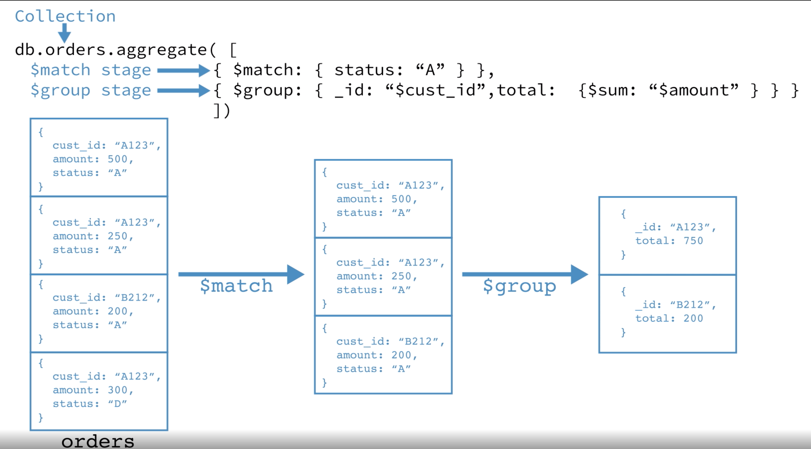

# 聚合（Aggreagte）

## 定义

聚合操作将来自多个 Document 的值进行分组，然后对分组的数据执行各种操作，最后返回单个结果。

## 聚合方式

* Pipeline
* Map-Reduce
* 单一目的聚合方法（Single purpose aggregation methods）

### Pipeline（管道）

Documents 进入多阶段（multi-stage）的管道，管道最终把 Documents 转换成聚合结果。



```mongodb
db.orders.aggregate([
   { $match: { status: "A" } },
   { $group: { _id: "$cust_id", total: { $sum: "$amount" } } }
])
```

* `$match` Stage - 过滤出 status == 'A' 的文档，然后将其传递到下一个 Stage
* `$group` Stage - 根据 cust_id 字段对文档进行分组

Pipeline 的 Stage 提供类似 _过滤_、_转换_、_分组_、_排序_、_汇总_ 等操作。

实现：Pipeline 使用 MongoDB 原生 API 来执行有效的数据聚合，作为 MongoDB 数据聚合的首选方法。

特点：

1. Pipeline 支持操作分片集合（Sharded Collection）
2. Pipeline 可以在某些 Stage 使用索引来提升性能
   * [Pipeline 操作](https://docs.mongodb.com/manual/reference/operator/aggregation/#aggregation-expression-operators)
   * [Pipeline 优化](https://docs.mongodb.com/manual/core/aggregation-pipeline-optimization/)

### Map-Reduce

Map-Reduce 有 2 ~ 3 个阶段：

* **map 阶段** - 输入一个 Document，输出一个或多个对象
* **reduce 阶段** - 组合 Map 的输出
* **finalize 阶段（可选）** - 对结果做最终的修改

Map 操作之前可以指定查询条件来选择输入的文档并对其进行排序（sort）和限制（limit）。

实现：Map-Reduce 使用自定义的 JS 函数来执行 map、reduce 和 finalize 操作。

对比：Map-Reduce 比 Pipeline 更加灵活，但效率低下、复杂性更高。

特点：

* Map-Reduce 可以操作分片集合，也可以输出到分片集合。<https://docs.mongodb.com/manual/core/map-reduce-sharded-collections/>


### 单一目的的聚合操作

* [db.collection.count()](https://docs.mongodb.com/manual/reference/method/db.collection.count/#db.collection.count)
* [db.collection.distinct()](https://docs.mongodb.com/manual/reference/method/db.collection.count/#db.collection.count)
* [db.collection.estimatedDocumentCount()](https://docs.mongodb.com/manual/reference/method/db.collection.estimatedDocumentCount/#db.collection.estimatedDocumentCount)

对比：灵活性和性能不如 Pipeline 和 Map-Reduce

特点：简单


## 聚合命令比较

* [Aggregation Commands Comparison](https://docs.mongodb.com/manual/reference/aggregation-commands-comparison/)

## 参考

* [Aggregation Commands Comparison](https://docs.mongodb.com/manual/reference/aggregation-commands-comparison/)
