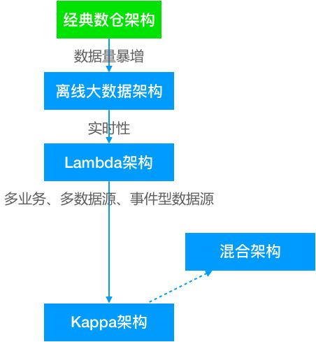
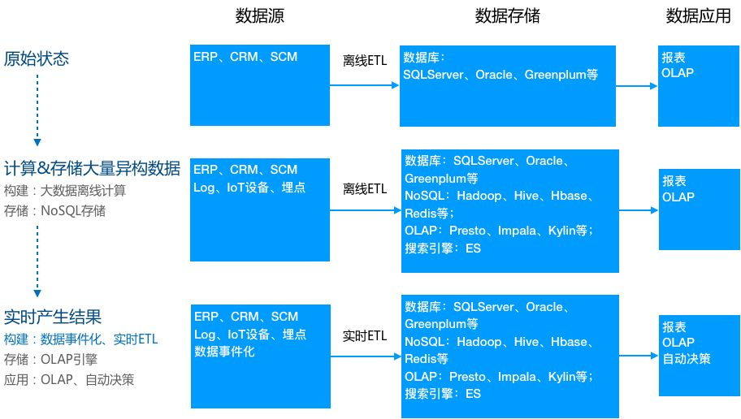

# 数据仓库

* 数据库
  * OLAP/OLTP
  * 行式存储/列式存储
  * SMP/MMP
  * RDBMS（关系数据库）- 建立在实体-关系模型（E-R图）上的数据库，最终得到的是关系表
  * ORDBMS（对象关系数据库）- 面向对象技术与传统的关系数据库相结合
  * OODBMS（面向对象数据库）- 将所有实体看作对象，并对对象进行封装
* 数据仓库（广义）
  * 设计目的：分析（挖掘数据的价值）
  * 设计宗旨：支持决策（DSS）
  * 面向对象：主题（如供应商主题、客户主题、商品主题、仓库主题）
  * 数据来源：事务/业务系统（ERP、CRM、SCM）或关系数据库（多源、分散） -> 数据仓库（中央仓库；狭义）
    * 基本元素：事实表 + 维表（时间维度、地域维度等等）
  * 数据访问人员：决策者、业务分析师、数据科学家
  * 数据访问方式：BI 工具、SQL 客户端、分析程序
* 数据湖
* Greenplum
* Hive
* Kylin
* Impala

## 数仓架构

架构演变：

* 离线大数据架构：
  * 时间线：
    * Inmon 于 1990 年提出数据仓库概念并给出了完整的建设方法
    * 谷歌于 2003 年发表了 GFS 论文
    * 谷歌于 2004 年发表了 MapReduce 论文
    * 2004 年 DFS、MapReduce 被实现到 Nutch 项目
    * Yahoo! 于 2006 年将 DFS、MapReduce 从 Ntuch 中分离出 Hadoop 项目
  * 伴随着互联网的发展（数据量剧增）、大数据技术的成熟，开始使用大数据工具替代经典数仓
  * 数仓存储：HDFS/Hive
  * ETL：Sqoop、MapReduce 脚本、HiveSQL
* Lambda 架构：
  * 业务实时性要求提高，使用流处理技术完成实时性要求较高的性能指标
  * 在离线数仓的基础上对数据源做链路改造，增加一条实时计算的链路；
    * 数据发送到 MQ
    * 实时计算订阅 MQ，直接完成指标增量计算
    * 推送到下游数据服务，由数据服务层完成离线 & 实时结果的合并
  * 特点：流处理计算的指标批处理依然计算，最终以批处理为准，即每次批处理计算后会覆盖流处理的结果
  * 问题：
    * 同样的需求需要开发两套代码
    * 资源消耗增多：同样的逻辑计算两次，整体资源占用会增多
* Kappa 架构：
  * 实时业务增多、数据源增多
  * 实时处理由次要任务转变为主要任务，开始以实时处理为核心

物理层级结构：

* 最上层：客户端 - 通过报表、分析、数据挖掘等工具呈现结果
* 中间层：分析引擎 - 访问和分析数据
* 最底层：DB Server - 存储和加载数据

逻辑层次结构（模型层面）：

* ODS（操作数据层）：保存原始数据
* DWD（数据明细层）：根据主题定义事实表和维度表，保存最细粒度的数据
* DM（数据集市层） ：在 DWD 的基础上根据不同的业务需求做轻度汇总

我们：

* 实时性：离线数仓 -> 实时数仓 -> 数据湖
* 扩展性：单一数仓 -> 分布式数仓（支持水平扩展）-> 数据湖
* 架构选型：经典数仓架构 -> Lambda 架构

## 数仓好处

* 做更好的决策
* 整合多源数据
* 数据质量、一致性、正确性
* 历史情报（Historical intelligence）
* 将分析处理从事务型数据库中分离，提升两个系统的性能

## 数仓发展

* 两个环节：数仓的构建、应用
* 结构化 -> 非结构化（IoT 数据、网站日志、埋点、图片、音频、视频）
* 离线 -> 实时

## 数据仓库 vs 数据库

|          | 数据仓库                | 事务型数据库 |
| -------- | ----------------------- | ------------ |
| 数据存储 |                         |              |
| 数据访问 | 最大化吞吐量、最小化 IO | 最大化 IOPS  |

数据仓库是专门为数据分析而设计的，需要读取大量数据以分析数据间的关系。数据库用于读取和存储数据。

## 数据仓库 vs 数据湖

数据湖是所有数据的中央仓库，包括结构化数据和非结构化数据。数据仓库采用一个预定义的 Schema，该 Schema 针对分析进行了优化。数据湖没有定义 Schema，因此可以支持其他类型的分析。

## ETL

* Extract   - 抽取
* Transform - 转换
* Load      - 加载

ETL 与 数据仓库：

* ETL 操作的对象主要是数据仓库，但不限于此。
* ETL 对应于建立数仓的三个步骤：
  * Extract   - 从业务系统或关系数据库中提取数据
  * Transform - 对抽取的数据进行清洗、转换、集成
  * Load      - 将处理的数据存储到中央数据仓库

## 数据湖

* Apache Hudi

## Greenplum

* <https://cloud.tencent.com/developer/article/1066766>
* <https://cloud.tencent.com/developer/article/1401490>
* <https://www.alibabacloud.com/zh/product/hybriddb-postgresql>

## 数仓方案

* 基于数据库的数仓
* 基于文件系统的数据（本质上还是基于数据库）
  1. 关系数据库    ---导入--> 分布式文件系统
  2. 分布式文件系统 ---映射--> 数据库

---

* Hive
* Impala
* Kylin

## PostgreSQL

* 对象-关系数据库（ORDBMS）
* 世界上最先进的开源关系数据库

## 参考

* [Data Warehouse Concepts](https://aws.amazon.com/data-warehouse/)
* [PostgreSQL 数据库快速入门](https://edu.aliyun.com/course/52)
* [数据仓库介绍与实时数仓案例](https://zhuanlan.zhihu.com/p/68666354)
* [MMP 架构数据库](https://blog.csdn.net/weixin_38799368/article/details/83573271)
* [服务器三种体系架构：NUMA、SMP和MMP](https://www.cnblogs.com/dxnbd/articles/3101523.html)
