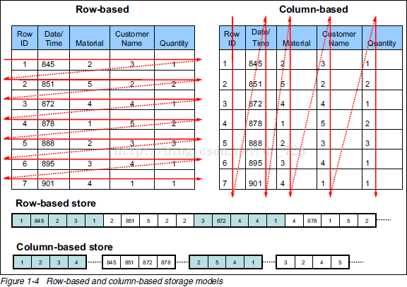

# 行式存储 & 列式存储

列存储的数据库更适合 OLAP
行存储的数据库更适合 OLTP

## 对比

|      | 列式存储                                                    | 行式存储                                                                                    |
| ---- | ----------------------------------------------------------- | ------------------------------------------------------------------------------------------- |
| 优势 | * 数据被保存在一起   * INSERT/UPDATE 容易               | * 查询时只有涉及到的列会被读取   *  投影（Projection）很高效   * 任何列都能作为索引 |
| 劣势 | * 选择（Selection）时即使只涉及某几列，所有数据也都会被读取 | * 选择完成时，被选择的列要重新组装   INSERT/UPDATE 比较麻烦                             |

## 使用场景

| 类型       | 核心业务 |
| ---------- | -------- |
| 行式数据库 | OLTP     |
| 列式数据库 | OLAP     |

## 参考

* [几张图看懂列式存储](https://blog.csdn.net/dc_726/article/details/41143175)
* [Column-oriented DBMS](https://en.wikipedia.org/wiki/Column-oriented_DBMS)
* [Wide column store](https://en.wikipedia.org/wiki/Wide_column_store)
* [为什么列存储数据库读取速度会比传统的行数据库快？](https://www.zhihu.com/question/29380943)