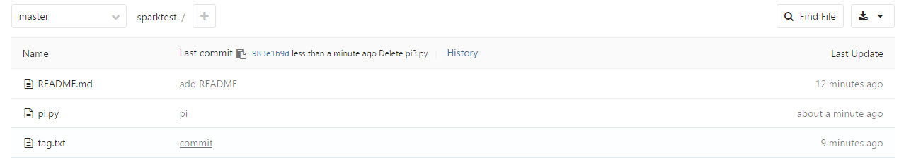
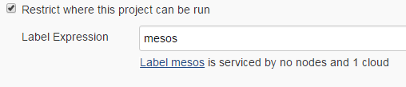
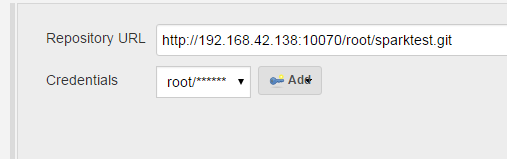
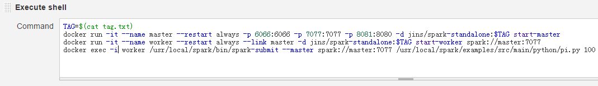
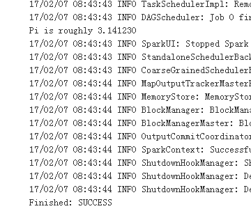
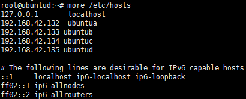

# 搭建 Jenkins 自动部署
### 一.版本更新信息
2017年2月7日星期二
沈建实

### 二.关键点
  使用 Gitlab，Marathon-lb 镜像
  配置 Jenkins

### 三.正文
1.系统流程介绍

   本文以 Jenkins 部署 Spark 环境为例。开发人员首先将 Spark 版本号存入 TXT 格式文件中上传至 Gitlab，同时上传的还有将要在 Spark 环境中运行的 Python代码。Jenkins首先从Gitlab中取出代码与版本号，通过版本号从Docker镜像仓库中取出对应版本的Spark镜像，然后运行镜像并将本地目录与容器目录实现挂载，之后在容器中执行Python代码，完成自动部署。

2.启动 Marathon-lb 镜像
   该镜像的作用是实现服务发现，默认情况下Docker容器的端口是随机分配的，利用该镜像就可以自行指定容器端口。
   首先在所有Mesos Slave节点中输入docker pull mesosphere/marathon-lb，下载Marathon-lb镜像。
   之后进入Marathon界面，创建应用，JSON文件内容如下：
```sh
{
  "id": "/marathon-lb",
  "cmd": null,
  "cpus": 0.2,
  "mem": 512,
  "disk": 0,
  "instances": 0,
  "constraints": [
    [
      "hostname",
      "LIKE",
      "192.168.42.135"
    ]
  ],
  "container": {
    "type": "DOCKER",
    "volumes": [],
    "docker": {
      "image": "mesosphere/marathon-lb",
      "network": "HOST",
      "portMappings": null,
      "privileged": false,
      "parameters": [],
      "forcePullImage": false
    }
  },
  "env": {
    "PORTS": "9090"
  },
  "healthChecks": [
    {
      "path": "/haproxy?stats",
      "protocol": "HTTP",
      "gracePeriodSeconds": 300,
      "intervalSeconds": 60,
      "timeoutSeconds": 20,
      "maxConsecutiveFailures": 3,
      "ignoreHttp1xx": false,
      "port": 9090
    }
  ],
  "portDefinitions": [
    {
      "port": 10000,
      "protocol": "tcp",
      "labels": {}
    }
  ],
  "args": [
    "sse",
    "--marathon",
    "http://192.168.42.132:8080",
    "--marathon",
    "http://192.168.42.133:8080",
    "--marathon",
    "http://192.168.42.134:8080",
    "--group",
    "external",
    "--haproxy-map"
  ]
}
```
   以上是 JSON 文件内容，红色字段中的参数根据实际情况修改。现在启动应用。（遇到问题见问题总结1）

3.启动 Gitlab 镜像
   Gitlab 用于存储代码与版本号。首先在所有 Mesos Slave 节点中执行 docker pull gitlab/gitlab-ce，下载 gitlab 镜像。

   之后进入 Marathon 界面，创建应用，JSON 文件内容如下：
```sh
{
  "id": "/gitlab",
  "cmd": null,
  "cpus": 0.3,
  "mem": 1024,
  "disk": 0,  "instances": 0,
  "container": {
    "type": "DOCKER",
    "volumes": [
      {
        "containerPath": "/etc/gitlab",
        "hostPath": "/root/data/gitlab/config",
        "mode": "RW"
      },
      {
        "containerPath": "/var/log/gitlab",        "hostPath": "/root/data/gitlab/logs",
        "mode": "RW"
      },
      {
        "containerPath": "/var/opt/gitlab",
        "hostPath": "/root/data/gitlab/data",
        "mode": "RW"
      }
    ],
    "docker": {
      "image": "gitlab/gitlab-ce",      "network": "BRIDGE",
      "portMappings": [
        {
          "containerPort": 80,
          "hostPort": 0,
          "servicePort": 10070,
          "protocol": "tcp",
          "labels": {}
        },
{
        "containerPort": 22,
        "hostPort": 0,
        "servicePort": 10071,
        "protocol": "tcp",
        "labels": {}
      }
      ],
      "privileged": false,
      "parameters": [],
      "forcePullImage": false
    }
h  },
  "labels": {
    "HAPROXY_GROUP": "external"
  },
  "portDefinitions": [
    {
      "port": 10070,
      "protocol": "tcp",
      "labels": {}
},
{
    "port": 10071,
    "protocol": "tcp",
    "labels": {}
}

]
}
```
   启动 Gitlab 后，将 Python 代码以及版本号传入 Gitlab。

  
zu
   另外 Gitlab 的启动速度取决于分配内存大小，所以遇到下图时应重复点击“刷新”。  


4.启动Jenkins镜像

   参考《搭建 Jenkins on Mesos 》一文。注意确保整个集群节点可以互相连通（见问题总结2）。

5.测试开始

   创建项目，配置参考下图。
   选择集群。





   配置Github Repository地址。



   添加shell命令，本文省略了从镜像仓库拉取镜像的命令，其他命令视情况而定。（使用docker exec命令时，注意参数中不能加入-t）



   保存后开始构建。结果如下图：



   求得pi值。

四.常见问题总结

1.若Marathon无法启动容器可以尝试以下步骤

配置mesos支持Docker容器
echo 'docker,mesos' > /etc/mesos-slave/containerizers
配置注册超时时间为10分钟
echo '10mins' > /etc/mesos-slave/executor_registration_timeout
然后重启mesos
restart mesos-slave

2. 确保整个集群所有机器可以互相连通

即/etc/hosts中的IP地址与hostname互相匹配。可以以下图为参考：



### 作者  
本文档由沈建实创建，由王若凡整理
