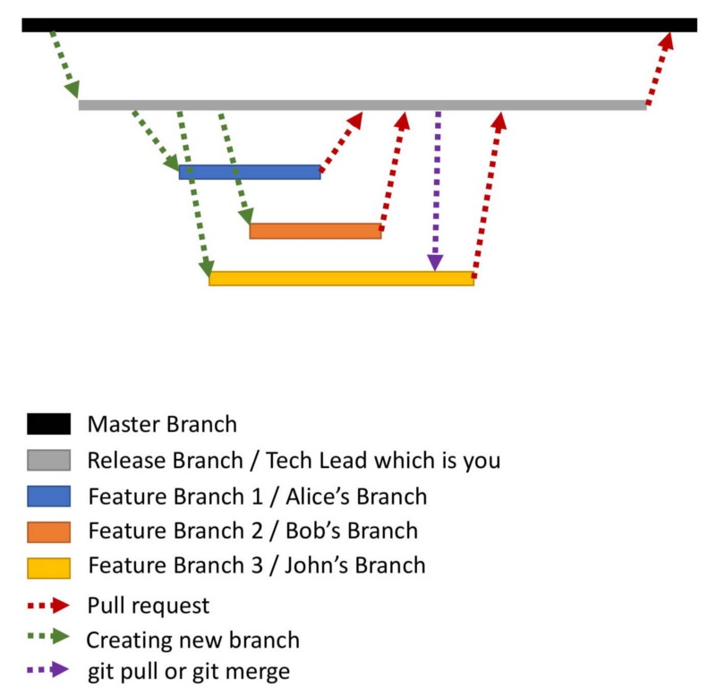

# Git 工作流

## Git flow

## Github flow

## Gitlab flow

## 参考

* [Git 使用规范流程](http://www.ruanyifeng.com/blog/2015/08/git-use-process.html)
* [Git 分支开发工作流](https://git-scm.com/book/zh/v2/Git-%E5%88%86%E6%94%AF-%E5%88%86%E6%94%AF%E5%BC%80%E5%8F%91%E5%B7%A5%E4%BD%9C%E6%B5%81)
* [分布式 Git - 分布式工作流程](https://git-scm.com/book/zh/v2/%E5%88%86%E5%B8%83%E5%BC%8F-Git-%E5%88%86%E5%B8%83%E5%BC%8F%E5%B7%A5%E4%BD%9C%E6%B5%81%E7%A8%8B)
