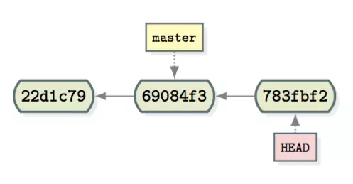

# GIT-CHECKOUT

切换分支或恢复工作区文件

## 用法

```sh
git checkout [-q] [-f] [-m] [<branch>]
git checkout [-q] [-f] [-m] --detach [<branch>]
git checkout [-q] [-f] [-m] [--detach] <commit>
git checkout [-q] [-f] [-m] [[-b|-B|--orphan] <new_branch>] [<start_point>]
git checkout [-f|--ours|--theirs|-m|--conflict=<style>] [<tree-ish>] [--] <paths>...
git checkout [<tree-ish>] [--] <pathspec>...
git checkout (-p|--patch) [<tree-ish>] [--] [<paths>...]
```

## 选项

| 参数            | 说明                                                   |
| --------------- | ------------------------------------------------------ |
| `-- [filename]` | 用暂存区文件覆盖工作区文件                             |
| `.`             | 相当于 `git add .` 的反动作，取消暂存区的所有 add 内容 |

## 分离头指针（Detached HEAD）



分离头指针，即 HEAD 指针没有指向分支引用，而是指向（checkout）了某个具体的 commit 。

哪些操作会导致分离头指针

```sh
# 1
$ git checkout [commit_id]

# 2
$ git rebase
```

切换到 master 前的解决办法：

```sh
# 强制将 master 分支执行头指针的位置（如果 master 分支还有新提交的话慎用）
$ git branch -f master HEAD && git checkout master
```

```sh
# 使用新分支来保存分离的提交
$ git branch v001 [commit-id]
```

切换到 master 后的解决办法：

```sh
# 查看最近的提交 ID，然后再 checkout 回来；不过如果不管它，过段时间会作为垃圾回收掉
$ git reflog
```

## 实验一 · 分离头指针

```sh
git init e1 && cd e1/

echo 'print("Hello,world")' > main.py
echo '# Python Document' > README.md

git add main.py && git commit -m 'Python Code'
git add README.md && git commit -m 'Python Document'
```

```sh
# 提交历史
$ git log --oneline
c155d2e (HEAD -> master) Python Document
9e89670 Python Code

# 分离头指针
$ git checkout 9e89670

Note: checking out '9e89670'.

You are in 'detached HEAD' state. You can look around, make experimental
changes and commit them, and you can discard any commits you make in this
state without impacting any branches by performing another checkout.

If you want to create a new branch to retain commits you create, you may
do so (now or later) by using -b with the checkout command again. Example:

  git checkout -b <new-branch-name>

HEAD is now at 9e89670 Python Code
```

* 分离头指针后做一些提交

```sh
echo "# Test Code" > test.py

git add test.py && git commit -m "Test Code"
```

```sh
$ git branch
* (HEAD detached from 9e89670)
  master

$ git log --online
57309b9 (HEAD) Test Code
9e89670 Python Code

$ git log master --oneline
c155d2e (master) Python Document
9e89670 Python Code
```

* 若没有此时还未绑定到具体分支

```sh
$ git checkout -b fix-1
```

* 尝试切换到 master 分支

```sh
$ git checkout master
```

因此，**切换 HEAD 最好在分支引用之间**！好的一面是，分离头指针可以用作提交实验。