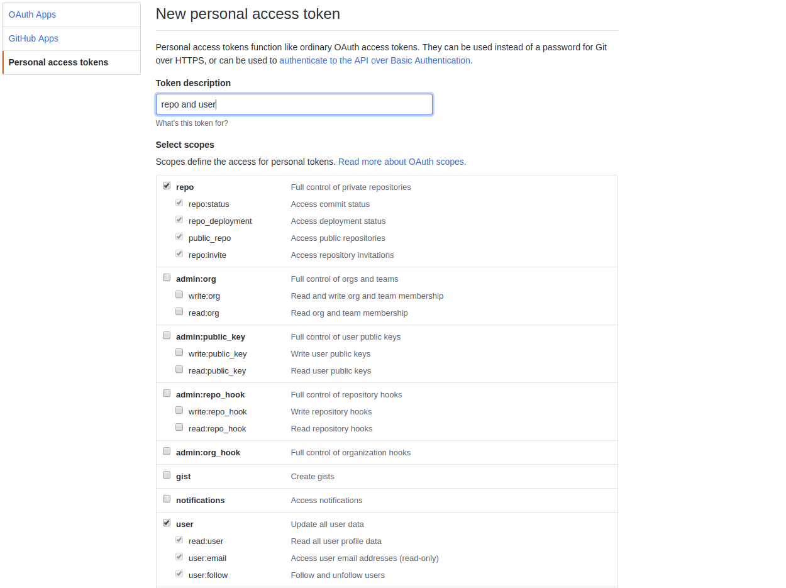

# GitHub APIs

## 目录

* v3（RESTful）
* v4（GraphQL）

## 基本认证

### 用户名和密码

```sh
curl -u <username>:<password> https://api.github.com/user
```

### OAUTH Token

不同于直接使用用户名和密码来获取 Github 所有权限，使用 Token 可以根据需要仅开放部分权限。访问 <https://github.com/settings/tokens/new> 页面创建一个 Token 。



* 方式一

```sh
curl -u <username>:<token> https://api.github.com/user
```

* 方式二（推荐）

这种方式最简单且不需要用户名。

```sh
curl https://<token>@api.github.com/user
```

* 方式三

```sh
# HTTP header
$ curl -H "Authorization: token <token>" https://api.github.com/user -I
HTTP/1.1 200 OK
X-OAuth-Scopes: repo, user
X-Accepted-OAuth-Scopes: user
```

## 命令行为个人创建新的 Github 仓库

```sh
#!/bin/sh

repo_name="test"

curl -u 'jinsyin' https://api.github.com/user/repos -d "{\"name\":\"$repo_name\"}"

```

```sh
curl -u ${USER:-${GITHUBUSER}} https://api.github.com/user/repos -d "{\"name\": \"${REPONAME:-${CURRENTDIR}}\", \"description\": \"${DESCRIPTION}\", \"private\": false, \"has_issues\": true, \"has_downloads\": true, \"has_wiki\": false}"

# Set the freshly created repo to the origin and push
# You'll need to have added your public key to your github account
git remote set-url origin git@github.com:${USER:-${GITHUBUSER}}/${REPONAME:-${CURRENTDIR}}.git
git push --set-upstream origin master

```

## 命令行为组织自动创建 Github 仓库

```sh
#!/bin/sh

GITHUB_USERNAME="jinsyin"
GITHUB_PASSWORD="xxxx"
GITHUB_ORG="k8sio"
GITHUB_REPO="k8stest"

curl -u 'jinsyin' -X POST https://api.github.com/orgs/${GITHUB_ORG}/repos -d "{\"name\":\"$GITHUB_REPO\"}"
```

## 获取所有 tag

```sh
$ GITHUB_OWNER="kubernetes" # user or organization
$ GITHUB_REPO="kubernetes"

# https://developer.github.com/v3/git/refs/#get-all-references
$ curl -ks "https://api.github.com/repos/${GITHUB_OWNER}/${GITHUB_REPO}/git/refs/tags" | grep '"ref":.*' | cut -d '"' -f4 | cut -d '/' -f3
```

## 常用

* 获取用户头像：`github.com/<username>.png`

## 参考

* [Create a new repository for the authenticated user](https://developer.github.com/v3/repos/#create)
* [Create new github repo from command line](https://coderwall.com/p/mnwcog/create-new-github-repo-from-command-line)
