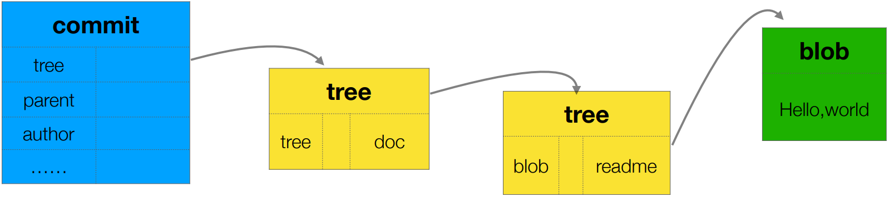

# Git 对象

Git 是一个「内容寻址文件系统（content-addressed filesystem）」，其核心部分是一个简单的健值对数据库（key-value data store）。当向数据库插入任意类型的内容时，它会返回一个健值，通过该健值可以在任意时刻再次检索（retrieve）该内容。另外，所有 Git 对象都存储在当前仓库的 `.git/objects` 目录中。

| 对象   | 描述                             |
| ------ | -------------------------------- |
| commit |                                  |
| tree   | 目录                             |
| blob   | 常规文件（regular file）、软连接 |

* 一个 commit 对象有且只包含一个 tree 对象
* 一个目录对应一个 tree 对象，而 commit 则相当于根目录

## commit 对象

* 格式

```plain
tree [CommitID] // ①
author [用户名] [邮箱] [时间戳] [时差]
committer [用户名] [邮箱] [时间戳] [时差]

[提交的信息]
```

> ① 的对象类型总是 `tree`，Git 使用一个总的 tree 存储提交的第一级内容（目录或文件），换句话说，每个 commit 下必然包含一个 tree

* 示例

```plain
tree b17a09b164f5f1ffc8b31ca5980934ffa39faca3
author jinsyin <jinsyin@gmail.com> 1550736153 +0800
committer jinsyin <jinsyin@gmail.com> 1550736153 +0800

Add README
```

## tree 对象

* 格式

```plain
[文件类型+文件权限] [对象类型] [对象 ID] [对象名称]
```

文件类型：`100`（regluar file）、`101`（symbolic link）、`111`（gitlink）
文件权限：（略）

* 示例

```plain
040000 tree 78d61e987a3dadc0f28434bf7241c5f5f90cc2c0    doc
```

```plain
100644 blob c25857953927ed759aa024b43432a278e1fb163d    readme
```

## blob 对象

blob 对象的内容其实就是文件自身的内容。需要注意的是，查看二进制文件（图片、视频、Word、PPT 等）的内容会显示乱码。

## 常用命令

```sh
# 查看对象类型
$ git cat-file -t [ObjectID]

# 查看对象内容
$ git cat-file -p [ObjectID]
```

## 实验一 · 理解 Git 对象

1. 新建 Git 版本库

```sh
$ git init gitobj && cd gitobj/

# 添加项目内容
$ mkdir doc && echo 'Hello,world' > doc/readme

# 空（此时并无对象文件）
$ find .git/objects -type f
```

2. 添加到暂存区

```sh
$ git add .

# Git 创建了一个对象文件
$ find .git/objects -type f
.git/objects/c2/5857953927ed759aa024b43432a278e1fb163d

# 查看对象文件的类型
$ git cat-file -t c25857 # blob

# 查看对象文件的内容
$ git cat-file -p c25857 # Hello,world
```

3. 提交到版本库

```sh
$ git commit -m 'Document'

# Git 创建了 4 个对象文件
$ find .git/objects -type f
.git/objects/d8/6e7d889a04bcead0654efeaea4dd819dd5ef96
.git/objects/78/d61e987a3dadc0f28434bf7241c5f5f90cc2c0
.git/objects/c2/5857953927ed759aa024b43432a278e1fb163d
.git/objects/96/42a9eb10b8fce3ec11e3d17ccba83825a256f6

# 对象类型
$ git cat-file -t d86e7d # commit
$ git cat-file -t 9642a9 # tree
$ git cat-file -t 78d61e # tree
$ git cat-file -t c25857 # blob

# 提交日志（可以获取入口的对象 ID）
$ git log --oneline -1
d86e7d (HEAD) Document
```

```sh
# 对象内容
$ git cat-file -p d86e7d
tree 9642a9eb10b8fce3ec11e3d17ccba83825a256f6
author jinsyin <jinsyin@gmail.com> 1550733848 +0800
committer jinsyin <jinsyin@gmail.com> 1550733848 +0800

Document

$ git cat-file -p 9642a9
040000 tree 78d61e987a3dadc0f28434bf7241c5f5f90cc2c0    doc

$ git cat-file -p 78d61e
100644 blob c25857953927ed759aa024b43432a278e1fb163d    readme

$ git cat-file -p c25857
Hello,world
```



整个数据结构类似于关系型数据库中主键和外键之间的关系。

## 实验二 · 玩转 Git 对象

通过底层命令 `hash-object` 可以将任意数据保存到 `.git` 目录，并返回相应的健值。

```sh
$ echo 'test content' | git hash-object -w --stdin
d670460b4b4aece5915caf5c68d12f560a9fe3e4
```

```sh
$ find .git/objects -type f
.git/objects/d6/70460b4b4aece5915caf5c68d12f560a9fe3e4

$ git cat-file -p d670460b4b4aece5915caf5c68d12f560a9fe3e4
test content
```

## 实验三 · 内容寻址

相同内容的 blob 文件，其 blob 的 hash 值也相同。

1. 新建 Git 仓库

```sh
$ git init G3 && cd G3/

# 添加相同的项目内容的三个不同文件
$ echo "Hello" | tee README.md README.rst README.txt
```

2. 提交到版本库

```sh
$ git add .

# Git 只创建了一个对象
$ find .git/objects/ -type f
.git/objects/c2/5857953927ed759aa024b43432a278e1fb163d

$ git cat-file -t c25857 # blob
$ git cat-file -p c25857 # Hello,world
```

添加多个内容相同的文件到版本库，Git 仅存储一份。

## 参考

* [Git 内部原理 - Git 对象](https://git-scm.com/book/zh/v2/Git-%E5%86%85%E9%83%A8%E5%8E%9F%E7%90%86-Git-%E5%AF%B9%E8%B1%A1)
* [Git 由浅入深之存储原理](https://zhuanlan.zhihu.com/p/25989135)
