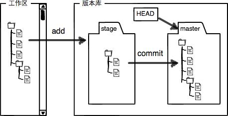
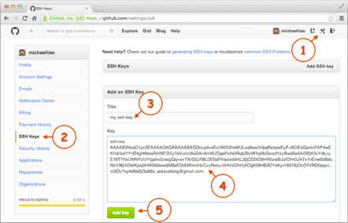
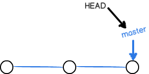
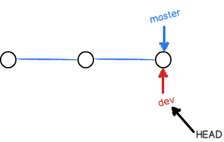
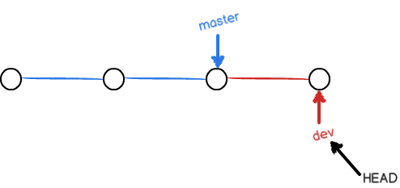
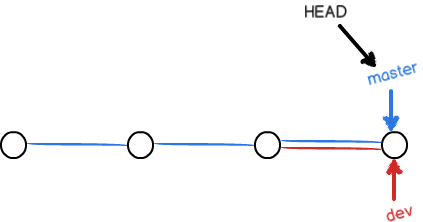
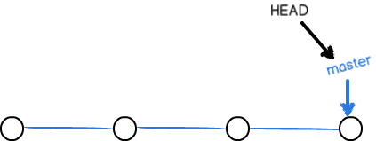
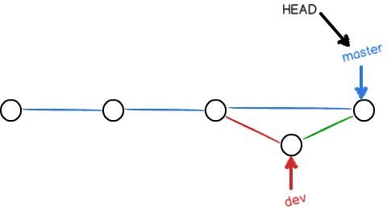
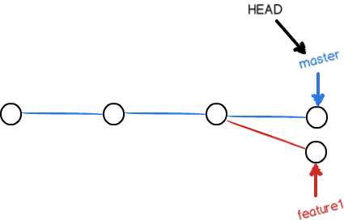
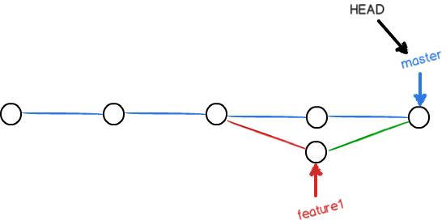

# Git 入门


> [图片来源](http://www.ruanyifeng.com/blog/2015/12/git-cheat-sheet.html)

- Workspace：工作区
- Index / Stage：暂存区
- Repository：仓库区（或本地仓库）
- Remote：远程仓库

## Ubuntu 安装 Git
```bash
$ sudo apt-get install git
```

---

## 初始化一个空的本地仓库
```bash
# 也可以简写成: git init learn-git
$ mkdir learn-git && cd learn-git
$ git init
$ ls -alh
```

## 设置个人账户信息
```bash
# --global 表示所有本地仓库都使用这个用户名和邮箱，也可以针对某个仓库使用不同的用户名和邮箱
$ git config --global user.name "JinsYin"
$ git config --global user.email "jinsyin@gmail.com"
```

## 把工作区文件提交到本地仓库（当前分支）

HEAD 指向当前分支的最新版本

> [图片来源]( http://www.liaoxuefeng.com/wiki/0013739516305929606dd18361248578c67b8067c8c017b000/0013745374151782eb658c5a5ca454eaa451661275886c6000)

暂存区就像是购物车，看到喜欢的商品可以先加入购物车（git add），在没付款前其实你是不确定购物车里的东西都想买，如果不想要了你可以直接删除购物车里的商品（git reset），确定好后再一次性下单（git commit）; 当然，你也可能看到某个喜欢的商品就直接下单了（git commit -a），而不是先加入购物车。

```bash
$ echo "Git is a version control system." > README.md
$ git add README.md
$ git commit -m "Create README.md"
```

```bash
# Git 添加文件到仓库需要 add，commit 两步，可以多次 add 不同的文件或目录，commit 可以一次提交很多文件
$ git add f1.md
$ git add f2.md f3.md
$ git add dir1
$ git add dir2 dir3
$ git commit -m "Add three files and one dirctory." # 提交暂存区所有修改版本库
$ git commit [file1] [file2] ... -m [message] # 提交暂存区指定文件到版本库
```

## 关于 git add

```bash
$ git add -A # 添加所有改动，包括所有新增、修改和删除；等价于 git add --all，可以只针对目录： git add --all /dir
$ git add .  # 添加所有新增和修改，但不包括删除 （会添加隐藏文件）
$ git add *  # 添加所有新增和修改，但不包括删除 （不会添加隐藏文件，不建议使用）
$ git add -u # 添加所有修改和删除，但不包括新增
```

## 代码提交

```bash
# 也可以不 add，直接提交工作区自上次 commit 后的新的变化到版本仓库
$ git commit -a -m "msg" # 等价于 git add * && git commit -m "msg" （并不会添加隐藏文件）
```

```bash
# 使用新的提交代替上一次提交，可以用来修改上一次的提交信息
$ git commit --amend -m [message]
```

```bash
# 重做上一次提交，并包括指定文件的新变化
$ git commit --amend [file1] ... [fileN] -m [message]
```

## 撤销（unstage）暂存区的修改？

撤销暂存区的修改之后，暂存区默认会回到最近一次 commit 的状态

```bash
$ git reset HEAD f1.md # 可以简写成 git reset f1.md
$ git reset # 撤销所有暂存区的所有文件追踪
```

## add 到暂存区后如何改名

```bash
$ git mv new.md old.md # 工作区也会跟着改名
```

## add 到暂存区后如何删除？

删除暂存区中文件相当于从购物车中删除添加的商品. 另外,如果一个文件已经被提交到了版本库, 突然又不想提交到远程仓库,可以先从暂存区删除再重新提交到版本库.

```bash
# 同时删除工作区和暂存区中的 f1.md
$ git rm (-f) f1.md # 等价于 git rm (-f) f1.md && git rm --cached f1.md
```

```bash
# 仅删除暂存区中的 f1.md，而工作区中的 f1.md 会继续保留
# 如果删除前工作区中的 f1.md 还作了修改，则需要先丢弃工作区的修改 git checkout -- f1.md
$ git rm --cached f1.md
$ git rm -r --cached dir # 从暂存区删除某个目录
```

如果删错了可以再丢弃工作区的修改（git checkout -- f1.md）。

## 丢弃（discard）工作区的修改

工作区的文件发生修改后，要么`添加`（git add f1.md）到暂存区，要么`丢弃`（git checkout -- f1.md）工作区的修改。

情况1：f1.md 作了修改但还没有被添加到暂存区，撤销修改会回到和版本库最近一次 commit 的状态（前提是至少 commit 过一次）  
情况2：f1.md 作了第一次修改后被添加到暂存区，之后又作了第二次修改，撤销修改会回到暂存区时的状态。如果想回到版本库的状态，可以指定 commit id。  

总之，撤销工作区的修改会回到最近近一次`git commit`或`git add`时的状态

```bash
$ git status
$ git checkout -- f1.md # 撤销工作区某个文件的修改
$ git checkout . # 撤销工作区的所有修改
$ git checkout HEAD f1.md # 直接回到版本库状态（工作区和暂存区都会回到版本库状态）
$ git status
```

## 查看`工作区`以及`暂存区`的状态

```bash
# 查看有哪些文件被添加、删除、修改（但不能查看具体修改了什么内容）
$ git status
```

## 查看 difference

查看文本在`工作区`和`暂存区`的 difference

```bash
$ git diff # 对比所有文件 （git diff --shortstat）
$ git diff README.md # 对比某个文件
```

查看文本在`暂存区`和`本地仓库`的 difference
对比的是暂存区和本地仓库的最近一次 commit 的不同

```bash
$ git diff --cached # 对比所有文件（等价于 git diff --staged）
$ git diff --cached README.md # 对比某个文件
```

查看文本在`工作区`和`本地仓库`的 difference

```bash
$ git diff HEAD # 对比所有文件
$ git diff HEAD -- README.md # 对比某个文件
$ git diff test # 对比当前目录与 test 分支最新版本的不同，延伸： git diff master 等价于 git diff HEAD
```

查看文本在`版本库`和`版本库`的 difference

```bash
$ git diff HEAD^ HEAD # 比较最近一次提交 commit 和上次提交
$ git diff SHA1 SHA2 # 比较两个历史版本之间的差异
```

对比分支的 difference

```bash
$ git diff master dev # 对比 dev 分支和 master 分支最近一次 commit 时所有文件的不同 （dev 分支相对于 master 分支）
$ git diff master dev > master-dev.diff # 将所有 difference 输出重定向
```

```bash
# 输出自 dev 和 master 分别开发以来，dev 分支上的 changed
$ git diff master...dev
```

查看简单的 diff 结果，可以加上 --stat 参数

```bash
$ git diff --stat
$ git diff --cached --stat
...
$ git diff master...dev --stat
```

## 查看 commit 日志

```bash
# 第一列为 commit id
$ git log
$ git log --pretty=oneline # 一行显示
```

```bash
# 查看最新的3条 commit 日志
$ git log -3
```

```bash
# 建议使用 git lg 代替 git log
$ git log dev # 查看 dev 分支的 commit 日志
$ git log master dev # 查看 master 分支和 dev 分支的 commit 日志
$ git log master ^dev # 查看 master 分支有，而 dev 分支没有的 commit 日志（对应：git log dev ^master）
$ git log master..dev # 查看 dev 分支比 master 分支多提交了哪些内容（对应：git log master ^dev）
$ git log master...dev # 不确定谁提交的多谁提交的少，单纯想看看有什么不一样（等同于 git log dev...master）
$ git log --left-right master...dev # 查看每次提交都在哪个分支上（master 对应左箭头 <，dev 对应右箭头 >）
```

---

## 版本回退

HEAD 指向的是当前分支的最新版本，HEAD^ 指向的是当前分支的上一个版本，HEAD~10 指向的是当前分支的上 100 个版本。

```bash
# 也可以按 commit id 来回退版本
$ git reset --hard HEAD^ # 回退到上一个版本，工作区和暂存区会被重置到回退版本的状态
$ git reset --keep HEAD^ # 仅版本库回退，工作区和暂存区不变
$ git revert [commit] # 回退到指定版本，并新建一个 commit，但工作区和暂存区会被覆盖，可以先赞存本地修改（git stash）
```

## 查看 commit 日志和版本回退日志

如果版本回退之后又想回到未来，可以用该命令获取回退前的 commit id。
```bash
$ git reflog
```

## 缓存工作区和暂存区

主要会在两个地方用到 stash 功能：

1. 合并分支之前，如果工作区和暂存区存在修改后并未提交的文件（不包括新增的），这时要么 commit 要么 stash；
2. 当切换分支进行开发时，如果当前分支并未完成（即还没到 commit 的时候），可以先 stash 在切换分支开发。

```bash
$ git stash # 缓存
$ git stash --list # 列出所有缓存
$ git stash pop # 还原并删除 （== git stash apply stash@{0} && git stash drop stash@{0}）
$ git stash clear # 清除所有
```

## 上传项目到 GitHub
Git 支持 SSH 协议，本地 Git 仓库和 GitHub 仓库之间要建立加密连接需要将本地 SSH 公钥（id_rsa.pub）添加到远程 GitHub。  


上传项目到 GitHub 需要3步：

第1步： 在 GitHub 中创建一个空的仓库（helloworld）。

第2步： 添加远程库`origin`，origin 是 Git 默认的叫法，也可以取别的名字。

```bash
$ git remote add origin git@github.com:jinsyin/helloworld.git
```

第3步： 把本地仓库的所有内容推送到远程库。实际上是把当前`master`分支推送到远程。
对于参数`-u`，Git 不但会把本地的`master`分支内容推送到远程新的`master`分支，还会把本地的`master`分支和远程的`master`分支关联起来，在以后的推送或者拉取时可以简化命令。之后再提交不用再加`-u`（git push origin master）

```bash
$ git push -u origin master # 推送 master 分支
$ git push -u origin dev # 推送 dev 分支
```

## 从 GitHub 克隆项目

从远程仓库克隆时，实际上 Git 自动把本地的`master`分支和远程的`master`分支对应起来了，并且，远程仓库的默认名称是`origin`

```bash
$ git remote
$ git remote -v # 显示可以 fetch 和 push 的 origin 地址，如果没有 push 权限，就看不到 push 地址
```

Git 支持多种协议，包括 https，但使用 ssh 支持的原生 git 协议速度最快。

```
$ git clone https://github.com/jinsyin/helloworld.git
$ git clone git@github.com/jinsyin/helloworld.git
```

克隆某个指定的分支

```bash
$ git clone -b registry-v2.6.1 https://github.com/docker/distribution-library-image.git
```

---

## 分支管理
`HEAD`严格来说不是指向提交，而是指向`master`（默认），`master`才是指向提交的，所以，`HEAD`指向的是当前分支。  
  


创建 dev 分支，然后切换到 dev 分支

```bash
$ git checkout -b dev # 等价于 git branch dev && git checkout dev
$ git branch # 查看分支
```

当创建新分支`dev`（git branch dev）时，Git 会新建一个指针`dev`，指向和`master`相同的提交。切换到`dev`分支（git checkout dev）后，`HEAD`会指向`dev`。 另外，`多个分支是共用工作区和暂存区的`，如果在`master`分支中工作区或暂存区有修改，切换到`dev`分支依然可以看到修改。



在`dev`分支上作修改并提交，`dev`指针会往前移动一步，而`master`指针不变。



把`dev`合并到`master`上，实际上是把`master`指向`dev`的当前提交。


合并完分支后，甚至可以删除dev分支。


`git merge`命令用于合并指定分支到当前分支。如果提示`Fast-forward`信息，表示这次合并是“快进模式”，也就是直接把`master`指向`dev`的当前提交，所以合并速度非常快。

```bash
$ git merge dev
```

使用`Fast-forward`模式来合并分支的话，删除分支后，会丢掉分支信息。不过可以禁用`Fast forward`模式，这样在 merge 时就会生成一个新的 commit，并且分支历史上也可以看出分支信息。

```bash
$ git merge --no-ff -m "merge with no-ff" dev
```



```bash
$ git branch -d dev # dev 分支被合并后可以直接删除，如果没有合并，使用这个命令删除会提示错误，但还是推荐优先使用这个命令删除分支
$ git branch -D dev # 如果 dev 分支没有被合并也可以使用这个命令来强删
```

## 解决冲突

当`master`分支和`feature1`分支各自都分别有新的提交（有冲突的提交），例如：

```plain
# master: Creating a new branch is quick & simple.
# feature1: Creating a new branch is quick AND simple.
```


  
因为两个分支的提交存在冲突，所以合并会出错，修改冲突文件后在`add`、`commit`后即可解决冲突。

```bash
$ git merge feature1
$ git status
```



```bash
# 查看分支的合并情况
$ git log --graph --pretty=oneline --abbrev-commit
```

```bash
# 合并分支之后也可以撤销
$ git merge -abort
```

分支策略


## .gitigonre 忽略特殊文件

> .gitignore 模板 [github/gitignore](https://github.com/github/gitignore)
> .gitignore 自动生成网站 [gitignore.io](https://www.gitignore.io)

```bash
$ git check-ignore -v App.class # 检查忽视规则
```

## 配置别名

```bash
$ git config --global alias.st status
$ git config --global alias.co checkout
$ git config --global alias.ci commit
$ git config --global alias.br branch
```

```bash
# 命令 git reset HEAD file 可以把暂存区的修改撤销掉（unstage），重新放回工作区
$ git config --global alias.unstage 'reset HEAD'
$ git unstage test.py
```

```bash
# 跟踪 commit、合并日志
$ git config --global alias.lg "log --color --graph --pretty=format:'%Cred%h%Creset -%C(yellow)%d%Creset %s %Cgreen(%cr) %C(bold blue)<%an>%Creset' --abbrev-commit"
$ git lg -5
```

```bash
# 查看本地仓库配置
$ cat .git/config
```

```bash
# 查看当前用户配置（--global），注： system 是整台电脑，global 是当前用户
$ cat ~/.gitconfig
```

## 搭建 Git 服务器

[Docker Gitlab image](https://hub.docker.com/r/gitlab/gitlab-ce/)

---

## 参考文章

> [廖雪峰的 Git 教程](http://www.liaoxuefeng.com/wiki/0013739516305929606dd18361248578c67b8067c8c017b000)
> [阮一峰的常用 Git 命令清单](http://www.ruanyifeng.com/blog/2015/12/git-cheat-sheet.html)