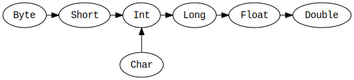

# Scala 数据类型

Scala 中所有的数据类型都是 `对象`，并且没有 Java 中的 `基本数据类型` 和 `引用数据类型` 之分。


## 类型层次结构


## Any

`Any` 是所有类型的父类，它包含的通用的方法： `equals`、`hashCode` 和 `toString`。`Any` 有两个直接的子类 `AnyVal` 和 `AnyRef`。

* AnyVal

`AnyVal` 代表数值类型，包含 9 个预定义的数值类型： `Double`、`Float`、`Long`、`Int`、`Short`、`Byte`、`Char`、`Unit` 和 `Boolean`，它们都是不可为空的（non-nullable）。

* AnyRef

`AnyRef` 代表引用类型，所有的非数值类型被定义为引用类型。另外，所有自定义类型都是 `AnyRef` 的子类。如果 Scala 程序在 Java 运行时环境被使用，那 `AnyRef` 对应与 `java.lang.Object`

```scala
val list: List[Any] = List(
    "a string",
    732, // an integer
    'c', // a character
    true, // a boolean value
    () => "an anonymous function returning a string"
)

list.foreach(element => println(element))
```

输出：

```plain
a string
732
c
true
<function>
```

## Unit

Scala 中的 `Unit` 相当于 Java 中的 `void`，表示无值。有一点不同的是，由于每个 Scala 的表达式必须有一些值，所以实际返回的是 `Unit` 类型的单例值（singleton value），写作 `()`。

* Java

```java
public static void main(String[] args) {
    System.out.println("Hello, world");
    return; // 可以忽略
}
```

* Scala

```scala
def main(args: Array[String]): Unit = {
    println("Hello, world")
    return () // 可以忽略
}
```

## 类型转换（Type Casting）

数值类型可以按以下的方式进行转换：



```scala
val x: Long = 987654321
val y: Float = x // 9.8765434E8 （有些精度丢失了）

val face: Char = '☺'
val number: Int = face  // 9786
```

## Nothing 和 Null

* Nothing

`Nothing` 是所有类型的子类，常见的用法是发送非终止（non-termination）信号，例如：抛出异常、程序退出，或者无限循环。

* Null

Null 是所有引用类型的子类，它有一个单例值 `null`。

## String

## Int、Long

## Float、Double

## Some

## 类型推断（Type Inference）
