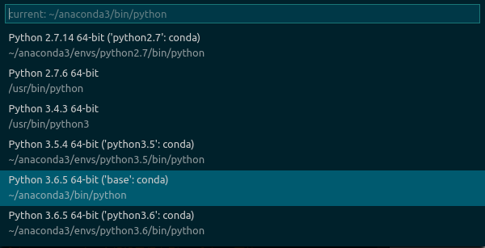
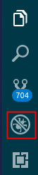
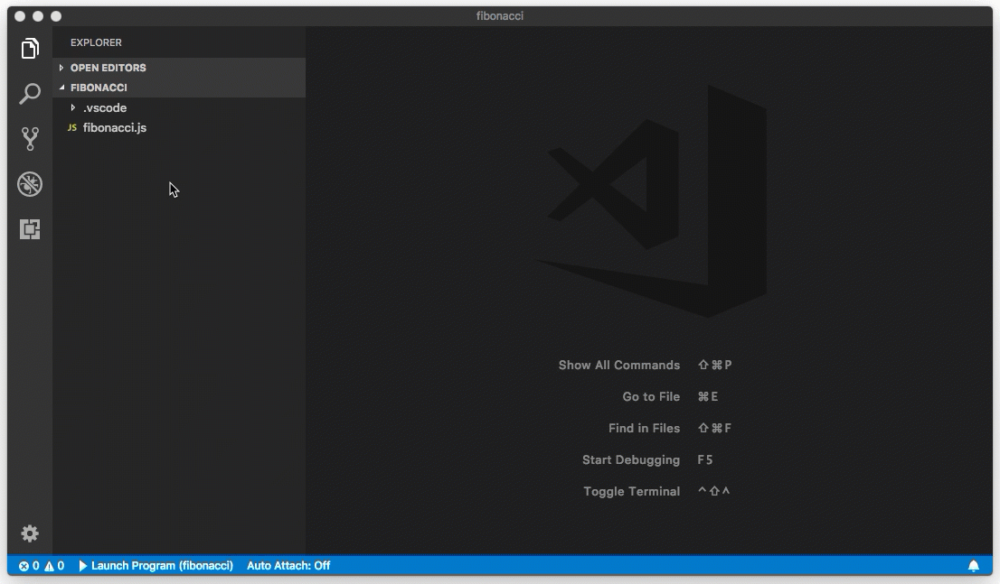

# VS Code 集成 Python

## 前提

1. 安装 [Python 插件](https://marketplace.visualstudio.com/items?itemName=ms-python.python) - 已内置
2. 安装 Python 3，并将 Python 解释器的位置添加到 `PATH` 环境变量中
3. MacOS 需要将 VS Code 的安装位置添加到 `PATH` 环境变量中

## 配置 Python 解释器

0. VS Code 默认使用系统当前的 Python 环境，即 `"python.pythonPath": "python"`
1. 按下 <kbd>Ctrl + Shift + P</kbd> ，键入 `Python: Select Interpreter`
2. 从自动查找到的解释器中选择一个（如果打开的是 Workspace 且含多个 Folder，需要先确定 Folder），这会覆盖默认用户设置中 `python.pythonPath` 参数的值，最终配置保存在该 Folder 下的`.vscode/settings.json` 文件中



```json
// .vscode/settings.json
{
    "python.pythonPath": "/home/yin/anaconda3/bin/python"
}
```

## 编辑和运行

* 编辑


* 运行


## 调试


1. 设置断点（Breakpoint） - <kbd>F9</kbd>


2. 侧边栏选择 Debug



3. 在 **Debug 工具栏** 选择设置按钮（或：`Debug` > `Open configurations`）


4. 稍等片刻后会自动创建 `.vscode/launch.json` 调试配置文件，然后在 **Debug 工具栏** 选择配置条目 `Python：Current File（Integrated Terminal）`


```json
// .vscode/launch.json
{
    "name": "Python: Current File (Integrated Terminal)",
    "type": "python",
    "request": "launch",
    "program": "${file}",
    "console": "integratedTerminal",
    "stopOnEntry": true, // 如果想程序启动时在第一行停止调试器（默认在断点处停止） -- 黄箭头
    "pythonPath": "${workspaceFolder}/.venv", // 如果想使用项目虚拟环境中用于调试的解释器（默认使用 setting.json 中的配置）

},
```

5. 在编辑区打开要调试的代码文件，然后选择 **Debug 工具栏** 中的 `右箭头` 或按 `F5` 运行调试器


6. 编辑区顶部会显示调试工具栏


从左到右依次是：continue（<kbd>F5</kbd>），step over（<kbd>F10</kbd>），step into（<kbd>F10</kbd>），step out（<kbd>Shift + F11</kbd>），restart（<kbd>Ctrl + Shift + F5</kbd>） 和 stop（<kbd>Shift + F5</kbd>）

调试时状态栏会改变颜色（多呈 `黄色`）；另外，`Python Debug Console` 也会自动出现在右下方的面板中，以显示正在运行的命令以及程序输出。

按 <kbd>F5</kbd> 后调试器将继续运行程序到下一个断点，此时定义的 `msg` 变量出现在了 `Local` 面板中：


7. Debug Console

在右下角的 **Debug Console** 底部的 **>** 提示处逐个输入以下信息：

```python
msg
msg.capitalize()
msg.split()
```


### Logpoint



Logpoint 是断点的变体，它不会 "中断（break）" 到调试器中，而是将消息记录到控制台。

> 使用 **Logpoint** 代替 print 语句：开发人员经常使用 print 语句快速检查变量，而不是逐行调试调试器中的代码，这会使代码很凌乱。在 VS Code 中，可以改用 **Logpoint**。Logpoint 就像一个断点，除了将消息记录到控制台外不会停止程序。

### 故障排除（Troubleshooting）

调试时如果是切换到了 `launch.json` 而不是 `hello.py`，会提示：

```plain
// Use IntelliSense to learn about possible attributes.
     ^
SyntaxError: invalid syntax
```

这是因为调试的不是 Python 代码，如果想专门为某个 Python 文件创建调试配置：

```jons
// launch.json
{
    "name": "Python: hello.py", # 自行定义，最终会出现在 Debug 工具栏
    "type": "python",
    "request": "launch",
    "program": "${workspaceFolder}/hello.py", # -_-
    "console": "integratedTerminal"
},
```

## 参考

* [Getting Started with Python in VS Code](https://code.visualstudio.com/docs/python/python-tutorial)
* [Debugging](https://code.visualstudio.com/docs/editor/debugging#_logpoints)
* [Python debug configurations in Visual Studio Code](https://code.visualstudio.com/docs/python/debugging)
