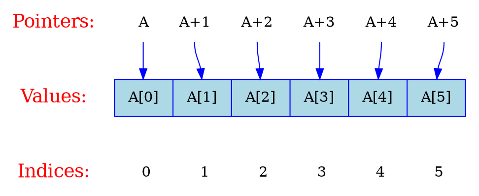

# Graphviz

Graphviz 是 Graph Visualization Software（图形可视化软件）的简称。

## 布局器（Layout）

* dot - 默认布局方式，主要用于有向图
* neato - 基于spring-model(又称force-based)算法
* twopi - 径向布局
* circo - 圆环布局
* fdp - 用于无向图

```bash
$ dot x.dot -Tpng -o x.png
```



## 用途

* 关系图
* 流程图
* 决策树
* 数据结构
* 代码调用图（Call Graph）
* （编译原理）有限自动机

## 参考

* [Drawing graphs with dot](https://www.graphviz.org/pdf/dotguide.pdf)