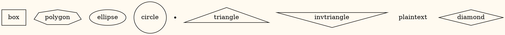

# 属性

## 形状

```dot
digraph G {
    bgcolor="floralwhite"
    "box"[shape=box]
    "polygon"[shape=polygon,sides=7]
    "ellipse"[shape=ellipse]
    "circle"[shape=circle]
    "point"[shape=point]
    "triangle"[shape=triangle]
    "invtriangle"[shape=invtriangle]
    "plaintext"[shape=plaintext]
    "diamond"[shape=diamond]
}
```