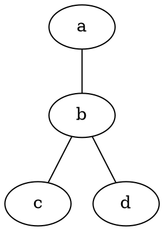
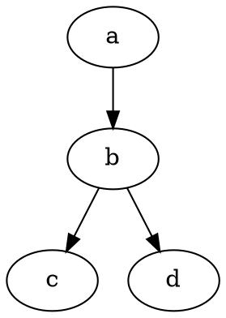
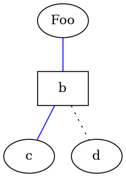
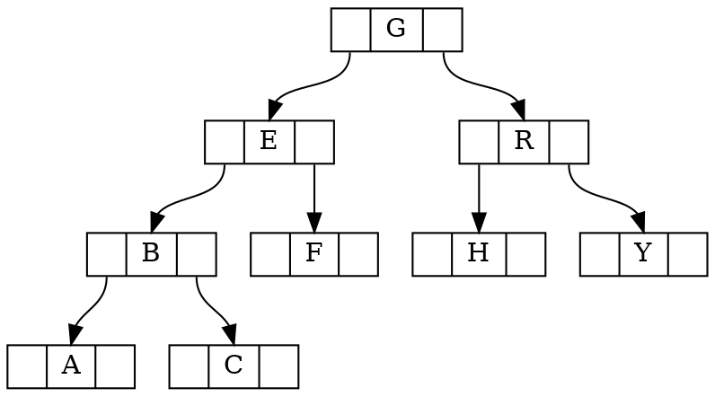
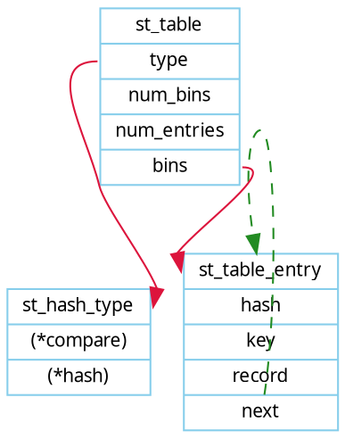

# Dot 语言

Dot 语言用于定义图形（Graph），但不提供渲染图形的工具。Graphviz 中的 `dot` 程序可以用来渲染图形。

## 无向图（Undirected graphs）



## 有向图（Directed graphs）



## 属性（Attributes）



## 注释（Comments）

```plain
// 单行注释

/*
多
行
注
释
*/

# 单行注释
```

## 示例





## 参考

* [DOT (graph description language)](https://en.wikipedia.org/wiki/DOT_(graph_description_language))