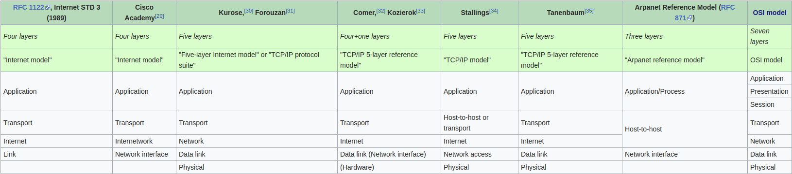

# 网络模型层

## 网络模型（Network model）

| 模型                                     | 层数 |
| ---------------------------------------- | ---- |
| OSI 模型（`OSI model`）                  | 七层 |
| TCP/IP 模型（`Internet Protocol Suite`） | 五层 |

## 五层协议

| 层         | 描述                                                               |
| ---------- | ------------------------------------------------------------------ |
| 应用层     | 为应用程序提供数据传输服务                                         |
| 传输层     | 为进程提供数据传输服务                                             |
| 网络层     | 为主机提供数据传输服务                                             |
| 数据链路层 | 为同一链路的主机提供数据传输服务（因为主机之间可能有多条链路）     |
| 物理层     | 负责屏蔽传输媒介和通信方式的差异，使得最终可以传输媒介上传输比特流 |

## 网络分层的意义

* 降低了网络系统的复杂度（参考 _分层架构_），明确了每一层载体（应用程序、进程、主机、链路、传输媒介）的职责与分工，各层不需要关心其他层是如何工作的，也不需要知道其他层的存在
* 对每一层屏蔽了其他层（或者说屏蔽了层与层之间的差异）。比如，有了应用层协议，应用 A 可以 “直接” 传输数据给应用 B， 根本不知道也不同关心其他层的存在；同理，传输层协议使得进程 A “直接” 传输数据给进程 B

## 层与层之间的传递过程

向下：添加下层协议的首部和尾部
向上：拆解下层协议的首部和尾部

##　参考

* [IP 头，TCP 头，UDP 头，MAC 帧头定义](https://www.cnblogs.com/li-hao/archive/2011/12/07/2279912.html)
* [《TCP/IP详解卷1：协议》读书笔记](https://www.cnblogs.com/mengwang024/p/4442370.html)