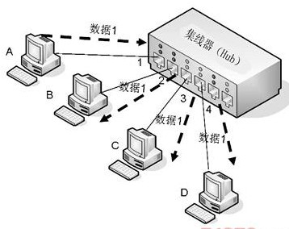

# 集线器（Hub）

集线器（Hub）具备中继器的信号放大及延迟物理线路的特性，但端口数量比中继器密集，所以有时也把集线器叫做 “有更多端口的中继器”。

* 与交换机不同，集线器没有大脑，完全工作在物理层
* 集线器收到的每一个字节都会广播到其他端口上去

## 工作原理

1. PC-A 向 PC-D 发送网络包，集线器会将包广播到除 1 号端口以外的其他所有端口
2. PC-B、PC-C 解开广播包，发现目标 MAC 地址不是自己网卡的，所以将数据帧丢弃
3. PC-D 解开广播包，发现目标 MAC 地址是自己网卡的，所以将数据帧从网卡复制到内存，再由内存交给 CPU 处理
4. 与此同时，如果 PC-B、PC-C 或 PC-D 要向其他集群发送消息，必须等待 PC-A 先发送完成才能工作（半双工）

## 优缺点

优点：

* 放大信号
* 延长链路

缺点：

* 集线器收到的网络包会广播到其他所有端口，无法实现精确转发
* 集线器是半双工设备，接受消息的同时不能发送消息，所以传输速率极低，导致其端口不可能太多（越多越慢）
