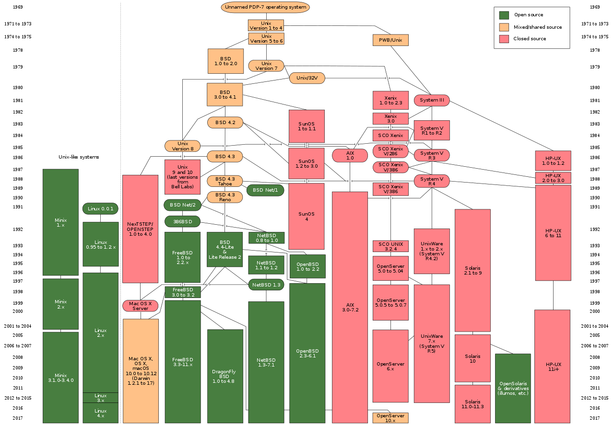

# Unix

Uinx，一个强大的多用户、多任务的操作系统，支持多处理器架构，按照操作系统的分类，属于 `分时操作系统`。

## 简述

* 时间： 1969 年（B 语言和汇编语言编写；发明 C 语言后重写）

* 地点： 美国 AT&T 公司的贝尔实验室（Bell Labs）

* 起因： 由麻省理工学院、通用电气和 AT&T 底下的贝尔实验室合作研发的 `Multics` 操作系统（分时多任务操作系统，针对大型机），因目标过大且进度缓慢，最终贝尔实验室退出该计划，由贝尔实验室的两位软件工程师 `肯·汤普逊` 与 `丹尼斯·里奇` 发展出 UNIX

* 人物

| 人名           | 标签                                                                              |
| -------------- | --------------------------------------------------------------------------------- |
| Dennis Ritchie | `图灵奖`(1983年,1/2)、`Unix`(1/2) 、`B`(1/2)、`C`(1/2)                            |
| Ken Thompson   | `图灵奖`(1983年,1/2)、`Unix`(1/2) 、`B`(1/2) 、`C`(1/2) 、`Go`(1/3)、`UTF-8`(1/2) |

## 历史

UNIX 的商标权由 `国际开放标准组织（The Open Group，TOG）` 所拥有，只有匹配单一 UNIX 规范的 UNIX 系统才能使用 UNIX 这个名称，否则只能称为类 UNIX（`UNIX-like`），即 Unix 的派生系统。

## 架构

## 参考

* [UNIX](https://zh.wikipedia.org/wiki/UNIX)
* [类 Unix 系统](https://zh.wikipedia.org/wiki/%E7%B1%BBUnix%E7%B3%BB%E7%BB%9F)
* [LINUX/UNIX 新手和专家教程](https://coolshell.cn/articles/1042.html)
* [UNIX Tutorial for Beginners](http://www.ee.surrey.ac.uk/Teaching/Unix/index.html)