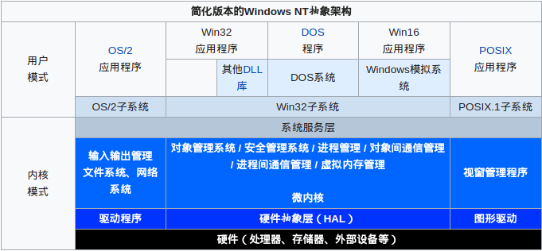

# Windows

## 历史

| 时间   | 系统        | 内核   |
| ------ | ----------- | ------ |
|        | MS-DOS      | MS-DOS |
| 1993.7 | Windows 3.1 | MS-DOS |
| 1995.8 | Windows 95  | MS-DOS |
| 1993   | Windows NT  | NT     |

## 架构

* [操作系统](https://zh.wikipedia.org/wiki/%E6%93%8D%E4%BD%9C%E7%B3%BB%E7%BB%9F)