# 手动安装 CentOS

## 1. 刻录系统到 U 盘

推荐使用 `UltraISO`（仅支持 Windows），尽管 Linux 也有一些工具可以用于刻录，但总是会遇到找不到启动项的问题。参考文章 [用 UltraISO 轻松制作 CentOS 7.5 U盘引导安装盘](https://www.jianshu.com/p/3f2f60de67c3)。

## 2. 组建 RAID

装机之前需要组建好 RAID，推荐使用 `RAID1`，下面以 DELL R730 机器为例进行演示。

### 2.1 进入安装菜单

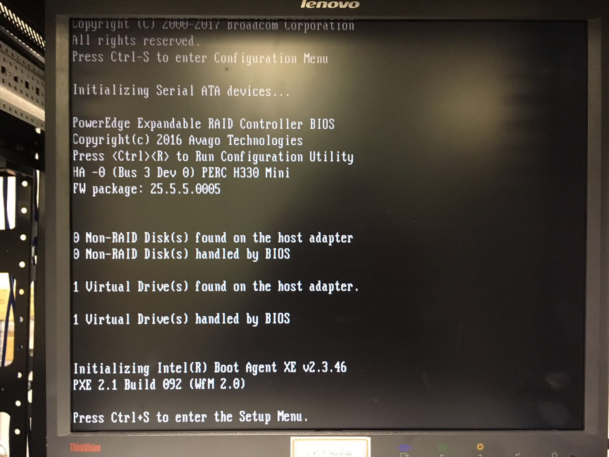

系统启动后，按住 `Ctrl + S` 快捷键进入安装菜单。

### 2.2 组件 RAID

（暂时略）

### 2.3 重启

插入刻录好的 U 盘，然后按住 `Ctrl + Alt + End` 快捷键重启机器。

## 3. 引导项管理

按住 `F11` 进入引导菜单，选择 U 盘启动。

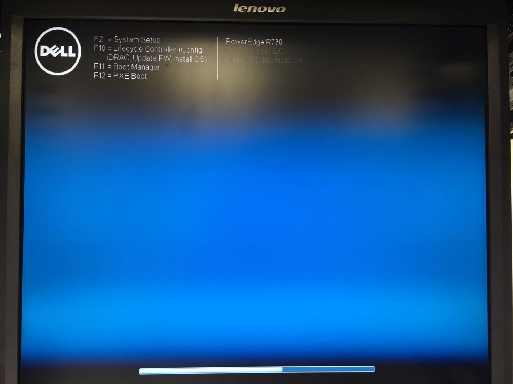
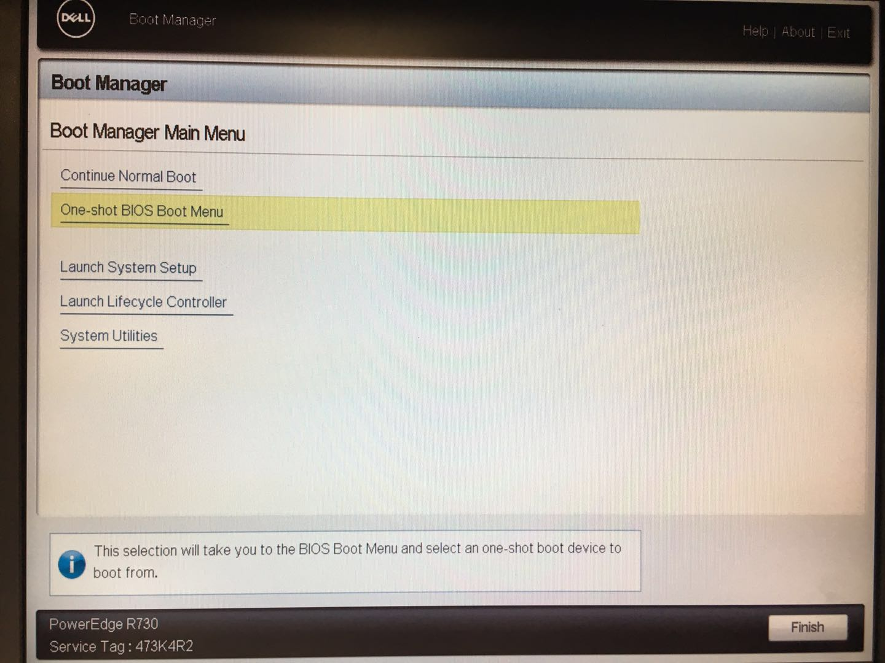
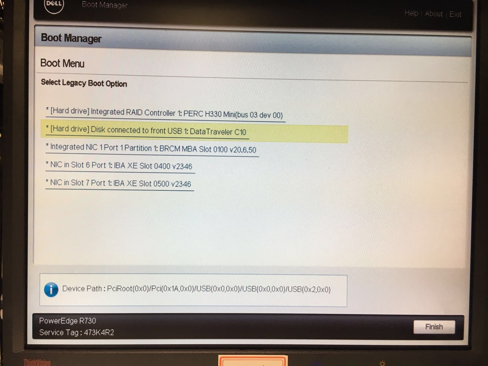

## 4. 安装系统

### 4.1 选择 Install CentOS

### 4.2 选择语言 - 英语

### 4.3 设置时钟 - 上海

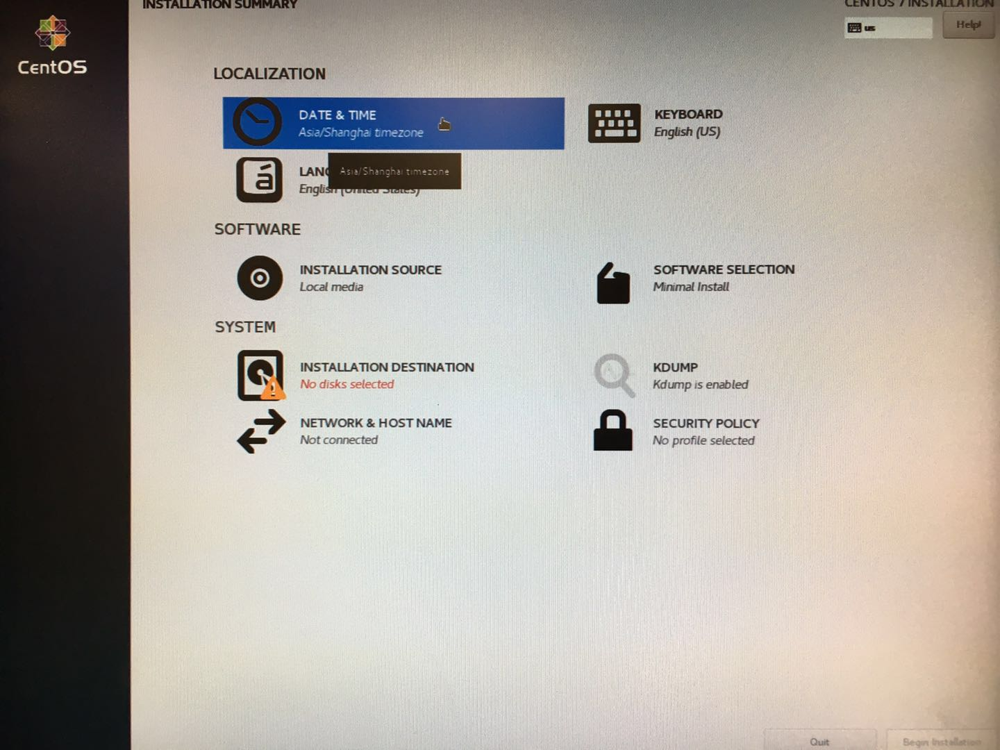
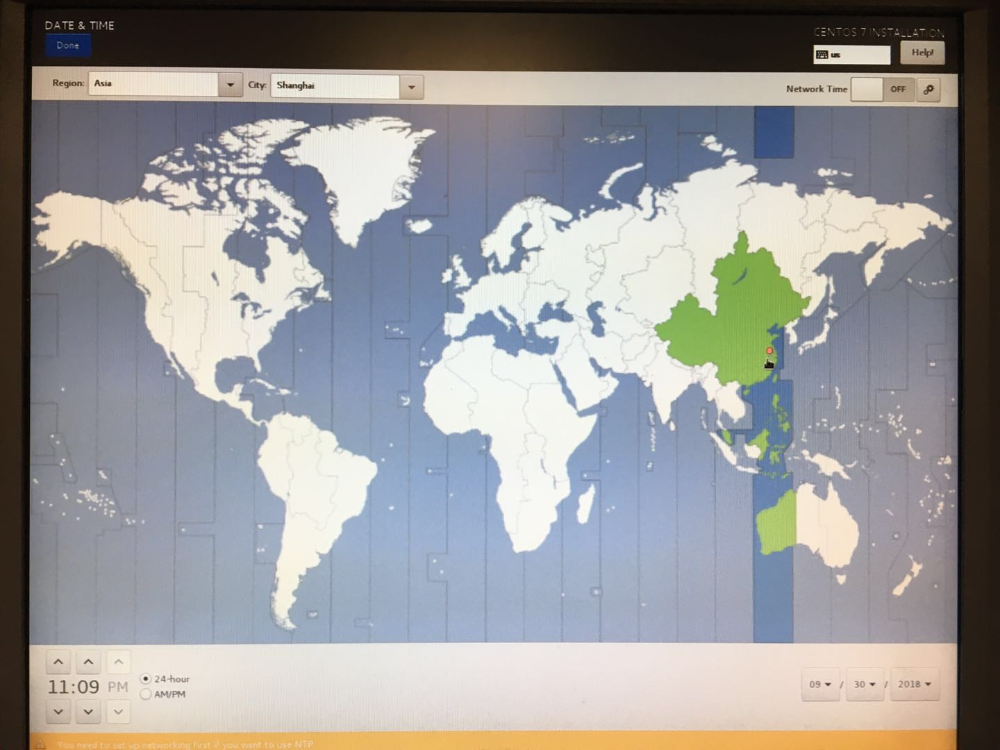

## 5. 进入 INSTALLATION DESTINATION

### 5.1 指定系统盘，自行分区

选择组好 RAID 的系统盘，选择 `I will configure partitioning` 自行配置分区。

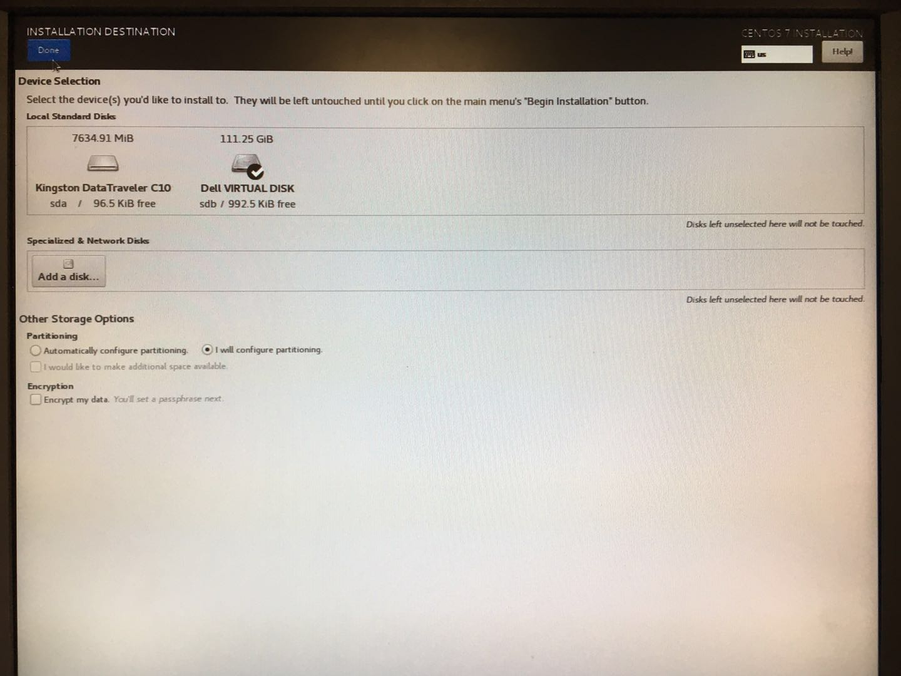

### 5.2 设置分区大小

点击 `Click here to create them automatically` 自动创建分区，先删除 `/` 和 `/home` 分区，调整 `swap` 分区为内存大小或者 1/2，然后重新创建 `/` 分区为最大容量。需要注意的是，除了 `/boot` 采用标准安装方式外，其他分区都使用 `LVM` 分区。

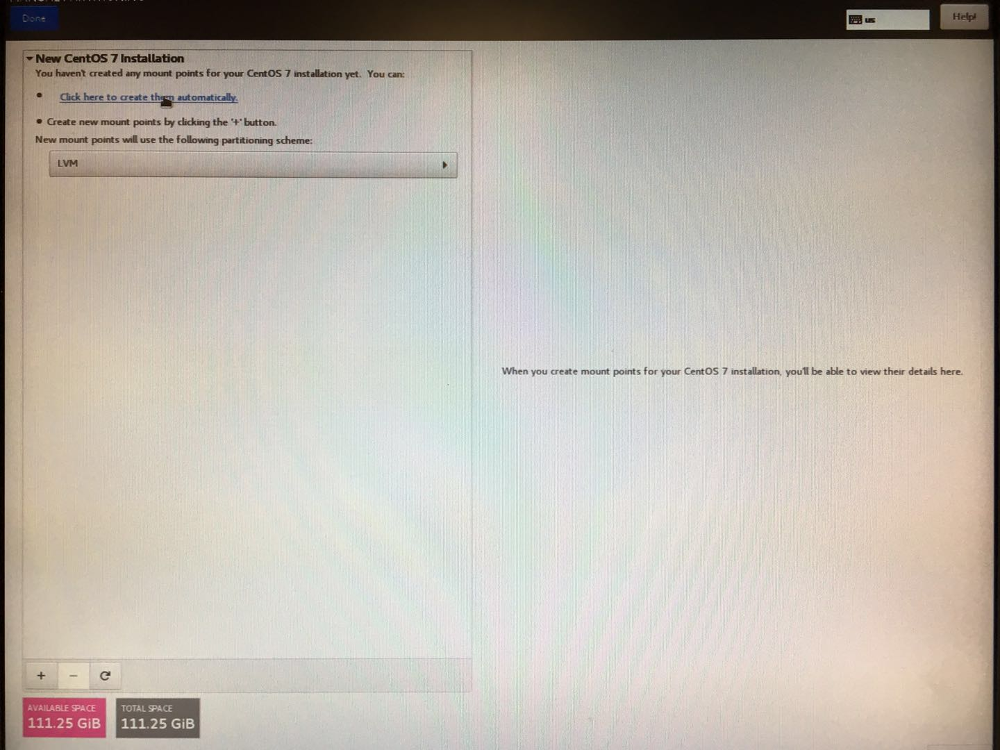
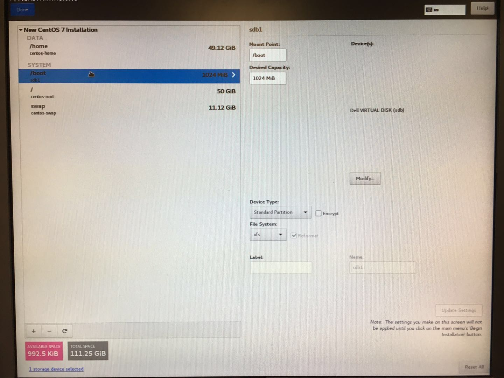
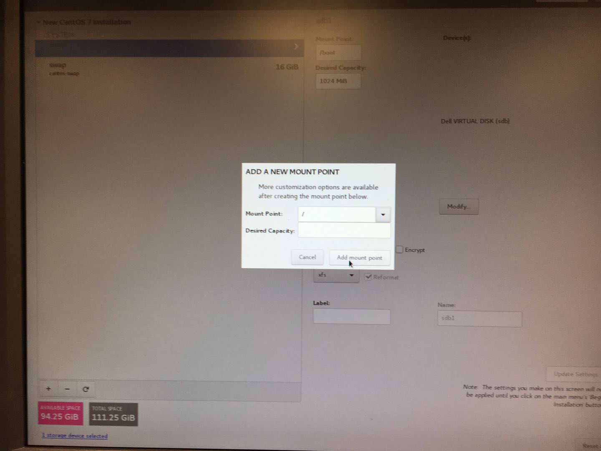

## 6. 配置网络（可选）

网络设置可以进入操作系统后再自行配置，如果嫌麻烦可以在安装的时候进行配置。

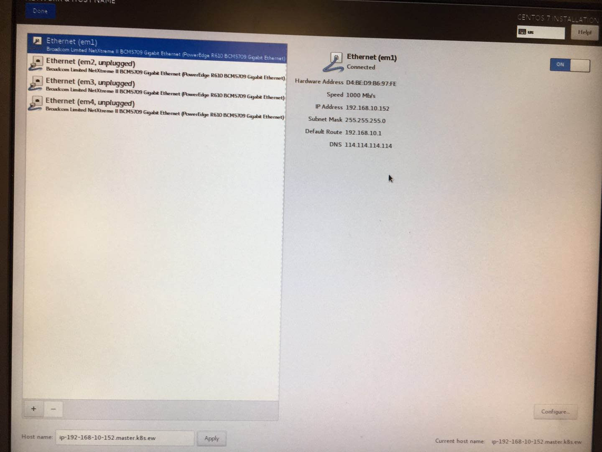

## 7. 设置 root 密码，待安装完成后重启系统

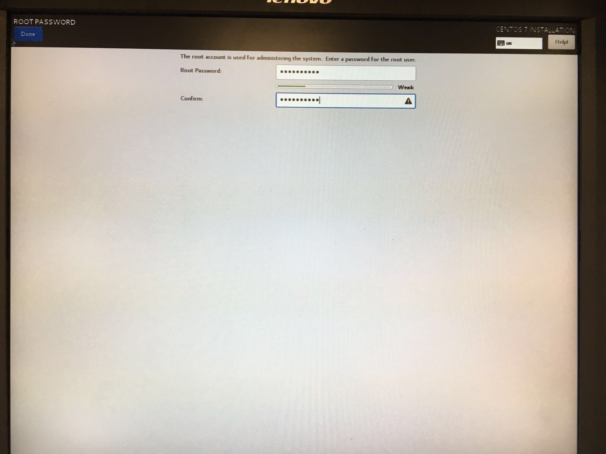
