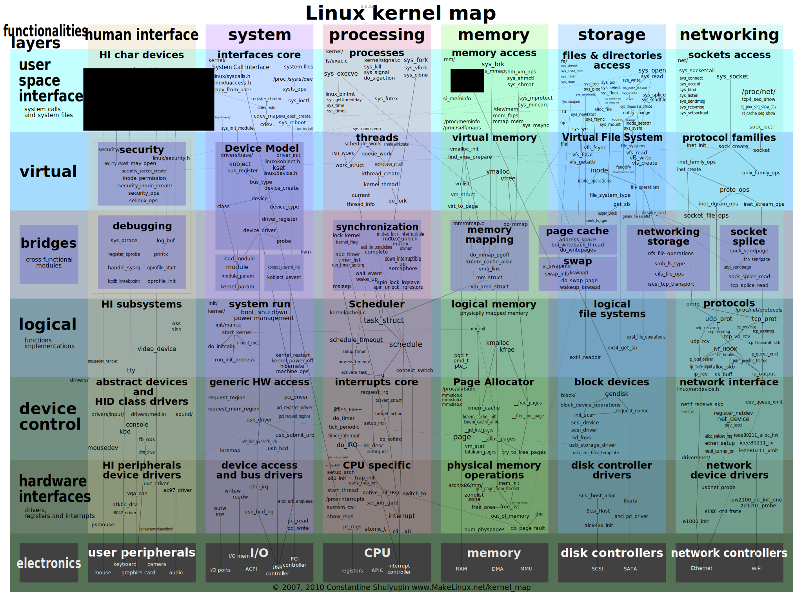

# Linux 内核（Kernel）



## 操作系统

操作系统有两层含义：

1. 广义：管理计算机资源的核心层软件，以及附带的所有标准软件工具（诸如命令行解释器、GUI、文本编辑器等）
2. 狭义：管理计算机资源（CPU、RAM 等）的核心层软件 ———— 内核

## 可执行文件

一般情况下，会将 Linux 内核可执行文件命名为 `/boot/vmlinuz` 或与之相似的文件命令。

```bash
# Ubuntu 14.04
$ ll /boot/vmlinuz-4.4.0-121-generic
-rw------- 1 root root 7045024  4月 17  2018 /boot/vmlinuz-4.4.0-121-generic
```

## 内核的职责

* 进程调度：
  * 计算机均配备一个或多个 CPU，以执行程序指令
  * Linux 属于分时多任务操作系统
    * 多任务 - 多个进程（即运行中的程序）可以同时驻留在内存，且每个进程都能获得对 CPU 的使用权
    * 分时（抢占式）- 一组规则：控制哪些进程使用 CPU，以及每个进程能使用的时长
* 内存管理
  * 内核必须以公平、高效的方式在进程间共享物理内存（RAM）
  * Linux 同大多数现代操作系统一样，采用了虚拟内存管理机制，优势如下：
    * 进程与进程之间、进程与内核之间相互隔离，无法修改彼此的内存内容
    * 每个进程只需将一个部分保存在内存中即可，降低了对内存的需求量，意味着能在 RAM 中加载更多的进程。同时，提高了 CPU 的资源利用率 ———— 在任一时刻 CPU 都有至少一个进程可以执行
* 提供文件系统 - 内核在磁盘之上提供有文件系统，允许对文件执行增删改查等操作
* 创建和终止进程
  * 内核可将新程序载入内存，为其提供运行所需的资源（CPU、内存以及对文件的访问）。这一 `运行中的程序` 我们称之为 “进程”
  * 一旦进程执行完毕，内核还要确保释放其占用资源，以供后续程序重新使用
* 对设备的访问
  * 内核既为程序访问设备提供了简化版的标准接口，同时还要仲裁多个进程对同一设备的访问
* 联网
  * 内核以用户进程的名义收发网络数据包，包括将网络数据包路由到目标系统。
* 提供 “系统调用” API
  * 进程可利用内核入口点（即 “系统调用”）请求内核去执行各种任务
* 多用户管理

## 用户态和内核态

现代处理器架构一般允许 CPU 至少在两种状态下运行，即：**用户态**（User Mode） 和 **内核态**（Kernel Mode）。执行硬件指令可使 CPU 在两种状态间来回切换。与之对应，可将虚拟内存区域划分（标记）为 **用户空间**（User Space） 和 **内核空间**（Kernel Space）。

* 在用户态下运行时，CPU 只能访问被标记为用户空间的内存，试图访问属于内核空间的内存会引发硬件异常。
* 当运行于内核态时，CPU 既能访问用户空间内存，也能访问内核空间内存。

## 目录

* 高效读写文件
* 对信号、时钟和定时器的运用
* 创建进程、执行程序
* 编写安全的应用程序
* 运用 POSIX 线程技术编写多线程程序
* 创建和使用共享库
* 运用管道、消息队列、共享内存和信号量技术来进行进程间通信
* 运用套接字 API 编写网络应用
* Linux 专有特性：epoll、inotify、/proc

## 内核结构分类

* 单内核
* 微内核
* 超微内核
* 外核

## 参考

* [Kernels](https://wiki.archlinux.org/index.php/Kernels_(%E7%AE%80%E4%BD%93%E4%B8%AD%E6%96%87))
* [The Linux Kernel documentation](https://www.kernel.org/doc/html/latest/index.html)