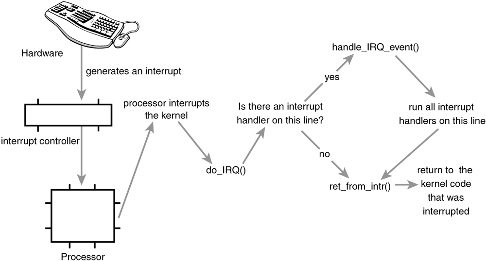

# 中断和中断处理

## 什么是中断？

前因：内核要管理硬件设备，就必须与其进行通信。

由于处理器的速度与硬件设备的速度不在一个数量级，所以如果内核采取让处理器向硬件设备发送请求来进行通信（从而达到管理硬件设备的目的），那处理器必将经历一个漫长的等待响应时间，而这段时间内核就应该去处理其他事务，待硬件设备完成请求操作后再回过头来进行处理。可能的解决办法是 **轮询（polling）**，即内核定期对设备的状态进行查询，看看硬件是正忙碌中还是已经完成任务，缺点是内核会做大量无用功。

中断（interrupt）：硬件触发某个事件时向处理器发送一个电信号，打断处理其的执行，继而打断内核的执行（由处理器通知内核），从而实现硬件主动与内核通信。

## 中断原理

中断本质上是一种特殊的电信号，由硬件设备产生，直接送入 **中断控制器** 的输入引脚，接着中断控制器会向处理器发送一个电信号。处理器接收到中断信号后，立即打断当前工作转而处理中断，然后通知内核处理新到来的数据。

中断控制器是一个简单的电子芯片，其作用是将多路中断管线，采用复用技术仅通过一条和处理器相连接的管线与处理器通信。


## 中断处理机制



1. 设备产生一个中断，并通过总线把电信号发送给中断控制器
2. 如果中断线是激活的（允许被禁止），中断控制器会把中断发送给处理器
3. 处理器中断内核
4. 内核调用 do_IRQ() 函数

## IRQ 线

一个设备可能产生多个不同的中断，每个中断对应一个唯一的中断值（中断号），也称之为 _中断请求（IRQ）线_ 或 _中断线_。内核通过中断线查找相应的中断处理程序，并调用该程序以响应和处理中断。

在经典的 PC 机上，IRQ 0 表示时钟中断，而 IRQ 1 表示键盘中断，但并未如此严格定义。对于连接到 PCI 总线上的设备而言，中断是动态分配的。重点在于特定的中断总是与特定的设备相关联，并且内核需要知道这些信息。

中断请求先 == 中断线 == 中断值 == 中断号

```sh
# 查询系统已注册的中断线
$ ls /proc/irq
0  1  10  11  12  13  14  15  16  17  2  23  25  26  27  28  29  3  30  4  5  6  7  8  9  default_smp_affinity
```

## 中断与异常

什么时候产生异常：在处理器执行到由于编程错误而导致的错误指令（如被 0 除）时，或者在执行期间出现特殊情况（如缺页），必须靠内核来处理的时候，处理器会产生一个异常。许多处理器处理异常和处理中断的方式类似，因此内核对它们的处理也很类似。

* 中断不与处理器的时钟同步（即中断随时可能产生，而处理器随时可能因新到来的中断而被打断），而异常产生时必须与处理器的时钟同步，所以异常常常被称为 _同步中断_
* 中断由硬件产生，而异常由处理器产生、由软件引起

中断：由硬件产生的异步中断
异常：由处理器产生（由软件引起）的同步中断

## 中断事件

* 敲击键盘
* 点击鼠标
* 块设备传输数据到内存
* 网卡接收到一个网络数据包


