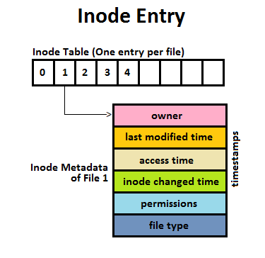

# inode

（来源：“index node” -> “i-node” -> “inode”）

_inode_ 又称之为 “index node” 或 “i-node”，即索引节点。驻留于文件系统之上的每个文件（查看文件定义），在 inode 表中都有一个 inode 。

## inode 表



> 注：起始编号应该是 1

## inode 编号

对 inode 的标识，采用的是其在 inode 表中的位置（即数组索引）来表示。inode 表的起始编号是 1（用于记录文件系统的坏块），而非 0 ，因为 0 表明该 inode 尚未被使用。

inode 编号的查看方式：`ls -li` 命令显示的第一列。

## inode 元数据

* 文件类型：常规文件、目录...
* 文件所有者：即 UID
* 文件所属组：即 GID
* 文件模式/文件权限
  * “用户”（文件所有者）
  * “组”（文件所属组）
  * “其他人”（所属组之外的用户）
* 文件时间戳（其他命令：`stat`、`touch`）
  * mtime：文件的最后修改时间（通过 `ls -l` 命令查看）
  * atime：文件的最后访问时间（通过 `ls -lu` 命令查看）
  * ctime：文件状态信息（权限等）的最后改动时间（通过 `ls -lc` 命令查看），大多数 Linux 文件系统不会记录文件的创建时间
* 指向文件的硬链接数量
* 文件大小：以字节为单位
* 分配给文件的数据块数量：以 512 字节一个块为单位；考虑到文件空洞，分配给文件的块数可能会低于根据文件正常大小所计算出来的块数
* 指向文件数据块（简称 _文件块_）的指针

> inode 不存储文件名，而是通过目录列表内的映射来定义文件名（即在目录的 inode 中存放文件名称），好处是可以在相同或不同目录中创建多个不同的硬链接（其 inode 相同）

## 示例

```sh
# ubuntu & centos
$ ls -li / | awk '$1==1'
1 dr-xr-xr-x 320 root root      0  7月 22 10:09 proc
1 dr-xr-xr-x  13 root root      0  7月 23 08:41 sys
```

```sh
# ubuntu
$ ls -li / | awk '$1==2'
2 drwxr-xr-x  19 root root   4460  7月 22 02:10 dev
2 drwxr-xr-x  38 root root   1340  7月 23 08:29 run
```

```sh
# ubuntu
$ ls -lid /
2 drwxr-xr-x 31 root root 4096  6月 21 09:17 /
```

```sh
$ df -i
Filesystem   Inodes   IUsed   IFree   IUse%   Mounted on
/dev/vda1   7331840 1712167 5619673     24%   /
```

## 参考

* [理解 inode](http://www.ruanyifeng.com/blog/2011/12/inode.html)
