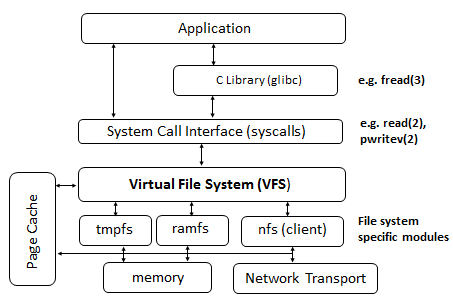

# 虚拟文件系统（Virtual File System）

「虚拟文件系统」（Virtual File System，简称 VFS）也称之为「虚拟文件系统开关」（Virtual Filesystem Switch，亦称 VFS），是具体文件系统之上的一个抽象层，允许用户空间程序以 **统一的系统调用接口** 访问不同的文件系统，而无需关注具体文件系统的实现细节，使得不同文件系统可以共存。VFS 弥合了 Windows、macOS 和 Unix 之间的文件系统差异。



VFS 针对各类文件系统定义了一套通用接口，所有文件系统必须实现该接口，与此同时应用程序能够按照该接口（通过系统调用）访问文件系统功能。

## VFS 系统调用

* `open()`
* `stat()`
* `read()`
* `write()`
* `chmod()`

## 内核存储堆栈

VFS 层在 Linux 内核存储堆栈各个部分中的位置：


## 注册和注销文件系统

```c
#include <linux/fs.h>

extern int register_filesystem(struct file_system_type *);
extern int unregister_filesystem(struct file_system_type *);
```

## 参考

* Documentation/filesystems/vfs.txt
* [Linux 虚拟文件系统（VFS）介绍](https://blog.csdn.net/jasonchen_gbd/article/details/51511261)
* [Linux 虚拟文件系统](http://www.ilinuxkernel.com/files/Linux.Virtual.Filesystem.pdf)