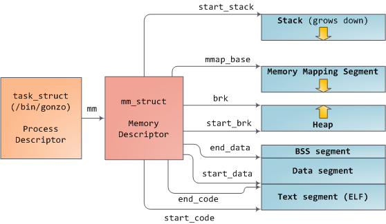

# 内存描述符（Memory Descriptor）

**struct mm_struct** 结构体又称之为 「进程描述符 Memory Descriptor」，用来表示进程的整个虚拟地址空间。每个进程都有自己独立的 **struct mm_struct**，即自己独立的地址空间。当进程之间共享地址空间时，即为线程。

## 参考

* [The Memory Descriptor](http://books.gigatux.nl/mirror/kerneldevelopment/0672327201/ch14lev1sec1.html)