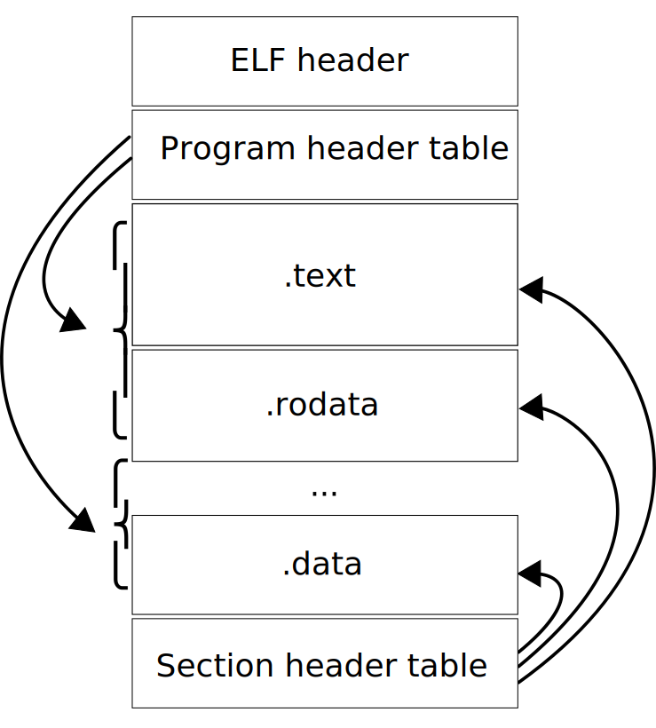

# ELF

_ELF_ 即 Executable and Linkable Format（以前称为 Extensible Linking Format），是 _可执行文件（executable file）_、_目标代码（object code）_、_共享库（ shared library）_、_核心转储（core dump）_ 的通用标准文件格式。

## 特点

* 灵活
* 可扩展
* 跨平台

## 文件布局

每个 ELF 文件由一个 _ELF 头_ 以及紧随其后的 _文件数据_ 组成。文件数据可以包括：

* 程序头表（program header table）- 描述零个或多个内存段
* Section header table - 描述零个或多个 section
* program header table 或 section header table 中的条目所引用的数据

段（segment）包含运行时所需的信息，而 section 包含用于连接和重新定位的重要数据。整个文件中的任何字节最多只能由一个 section 拥有，并且可能出现任何 section 都不拥有的孤立字节（orphan byte）。

## ELF header

## Program header

## Section header

## 参考

* [Executable and Linkable Format](https://en.wikipedia.org/wiki/Executable_and_Linkable_Format)
