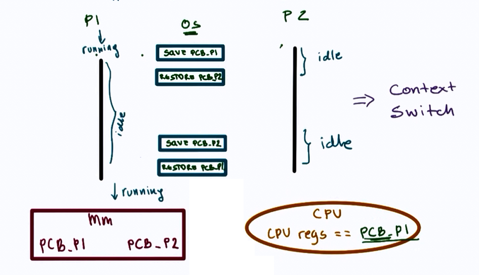
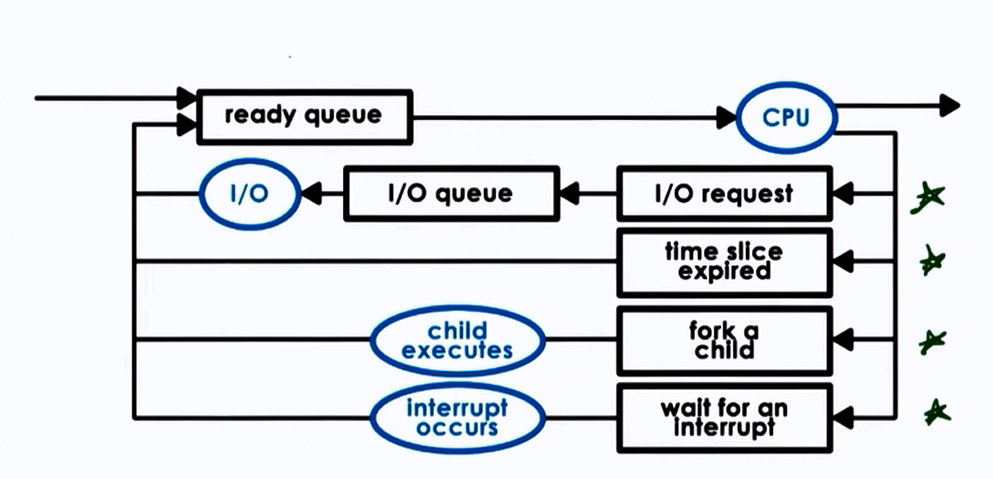

# Linux 进程管理和调度

进程（也称为任务）是程序执行和加载到内存时的状态。进程是资源分配的基本单位

* 进程凭证
* 进程的创建
* 进程的终止
* 监控子进程
* 程序的执行
* 详述进程创建和程序执行

---

* 进程组、会话和作业控制
* 进程优先级和调度
* 进程资源
* 进程间通信（IPC）简介
* POSIX IPC 介绍
* POSIX 消息队列

---

* Signal handling
* Process/thread creation & termination
* Process Scheduler

## 目录

* 进程标识符

## 进程与线程

内核调度的对象是线程，资源分配的对象是线程。

Linux 并不特别区分线程和进程，对 Linux 而言，线程只不过是一种特殊的进程而已。

进程提供两种虚拟机制：

* 虚拟处理器 —— 给进程一种假象，让进程感觉自己在独显处理器
* 虚拟内存 —— 让进程在分配和管理内存时感觉自己拥有整个系统的所有内存资源

尽管同一进程的线程之间可以共享虚拟内存，但每个线程都拥有各自的虚拟处理器。

## 上下文切换

## I/O

## 层次结构

Linux 内核启动 init 程序（`/sbin/init`）作为第一个进程，该进程负责进一步的系统初始化操作，并显示登录提示符或图形登录界面。

## 并发与并行

在多处理器系统中，可以真正并行运行的进程数目，取决于物理 CPU 的数目。

## 参考

* [Process state](https://en.wikipedia.org/wiki/Process_state)
* [Process State Definition](http://www.linfo.org/process_state.html)
* [Linux 进程状态](https://www.cnblogs.com/diegodu/p/9167671.html)
