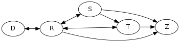

# 进程生命周期（Process Lifecycle）

## 进程状态

常见状态：

| 状态码（宏定义）                     | 状态                                                                     | 查询命令                             | 描述                                                                                                                                                                                                                                                                                                                                                                                                               |
| ------------------------------------ | ------------------------------------------------------------------------ | ------------------------------------ | ------------------------------------------------------------------------------------------------------------------------------------------------------------------------------------------------------------------------------------------------------------------------------------------------------------------------------------------------------------------------------------------------------------------ |
| **R**（TASK_RUNNING）                | 正在运行（Running）或可运行（Runnable，即在 _run queue_ 中等待运行）状态 | `ps aux | awk '$8=="R"'`（尝试多次） | 对应于教科书中的 **运行**（RUNNING）和 **就绪**（READY）/ **等待（WAIT）** 状态：<br> * 运行：进程获得 CPU 时间片 <br> * 就绪：进程已获得除 CPU 以外的其他系统资源（意味着也会消耗内存等资源）                                                                                                                                                                                                                     |
| **S**（TASK_INTERRUPTIBLE）          | 可中断的睡眠（Interruptible Sleep）状态                                  | `ps aux | awk '$8=="S"'`             | 进程等待某些条件存在、某些事件发生或某些 [信号](../signal/README.md) 到达（亦称 _阻塞_），比如程序中调用 `sleep()` 函数；当内核发送信号给该进程表明事件已经发生时，进程状态变为 TASK_RUNNING                                                                                                                                                                                                                       |
| **D**（TASK_UNINTERRUPTIBLE）        | 不可中断的睡眠（Uninterruptible Sleep，亦称 Disk Sleep）状态             | `ps aux | awk '$8=="D"'`             | 类似于 _可中断睡眠_，不同的是接收到信号时，进程不会被唤醒并切换为 _可运行_，即不可阻塞，通常是 I/O 操作，意味着无法杀死（`kill -9`）该进程                                                                                                                                                                                                                                                                         |
| **Z**（EXIT_DEAD or EXIT_ZOMBIE）    | 僵尸（Zombie）状态                                                       | `ps aux | awk '$8=="Z"'`             | 进程已被父进程终止，但父进程尚未发出 `wait4()` 系统调用进行回收；资源已被释放，但进程表中仍有该进程项；进程终止的两个事件（同时发生）：1. 进程被另一个进程或一个用户杀死；2. 父进程在子进程终止时调用或已经调用 `wait4()` 系统调用（相当于告知内核可以释放为子进程保留的资源）。当条件一发生而条件二未发生时，才会出现 “僵尸” 状态。实际上，在进程终止之后、其数据从进程表中删除之前，进程总是暂时处于 “僵尸” 状态 |
| **T**（TASK_STOPPED or TASK_TRACED） | 终止（Terminated）状态                                                   | `ps aux | awk '$8=="T"'`             | 如果进程收到 SIGSTOP、SIGTSTP、SIGTTIN 或 SIGTTOU 信号（其默认行为是停止发送它们的进程）或者调试器暂停时收到任何信号，则会出现此状态                                                                                                                                                                                                                                                                               |

状态查询：

```sh
$ STATUS_CODE="R" && ps aux | awk '$8=="$STATUS_CODE"' # R 状态需要尝试多次
```

特殊标志：

|     | 描述             |
| --- | ---------------- |
| `<` | 高优先级         |
| `N` | 低优先级         |
| `l` | 多线程，克隆线程 |
| `L` | 有些页被锁进内存 |
| `s` | 包含子进程       |
| `+` | 位于后台的进程组 |

## 内核代码

`include/linux/sched.h`：

```c
/* Used in tsk->state: */
#define TASK_RUNNING			0x0000
#define TASK_INTERRUPTIBLE		0x0001
#define TASK_UNINTERRUPTIBLE	0x0002
#define __TASK_STOPPED			0x0004
#define __TASK_TRACED			0x0008
/* Used in tsk->exit_state: */
#define EXIT_DEAD			0x0010
#define EXIT_ZOMBIE			0x0020
#define EXIT_TRACE			(EXIT_ZOMBIE | EXIT_DEAD)
/* Used in tsk->state again: */
#define TASK_PARKED			0x0040
#define TASK_DEAD			0x0080
#define TASK_WAKEKILL		0x0100
#define TASK_WAKING			0x0200
#define TASK_NOLOAD			0x0400
#define TASK_NEW			0x0800
#define TASK_STATE_MAX			0x1000

/* Convenience macros for the sake of set_current_state: */
#define TASK_KILLABLE			(TASK_WAKEKILL | TASK_UNINTERRUPTIBLE)
#define TASK_STOPPED			(TASK_WAKEKILL | __TASK_STOPPED)
#define TASK_TRACED			(TASK_WAKEKILL | __TASK_TRACED)

#define TASK_IDLE			(TASK_UNINTERRUPTIBLE | TASK_NOLOAD)

/* Convenience macros for the sake of wake_up(): */
#define TASK_NORMAL			(TASK_INTERRUPTIBLE | TASK_UNINTERRUPTIBLE)

/* get_task_state(): */
#define TASK_REPORT			(TASK_RUNNING | TASK_INTERRUPTIBLE | \
					 TASK_UNINTERRUPTIBLE | __TASK_STOPPED | \
					 __TASK_TRACED | EXIT_DEAD | EXIT_ZOMBIE | \
					 TASK_PARKED)
```

## 状态切换



| 切换过程      | 切换缘由                               | 示例                             |
| ------------- | -------------------------------------- | -------------------------------- |
| 就绪 --> 运行 | 进程获得 CPU 时间                      | 编辑器接收到了等待已久的键盘输入 |
| 运行 --> 就绪 |                                        |                                  |
| 运行 --> 终止 | 1. 进程执行完成 <br> 2. 明确杀死该进程 |                                  |

## 术语

* 就绪（ready） == 等待（waiting）== 可运行（runnable）
* 就绪队列（ready queue）== 运行队列（run queue）
* 可中断的睡眠（interruptible sleep） == 阻塞（block） ~= 睡眠（sleep）

> Uninterruptible sleep 不可阻塞

## 相关命令

* `ps` - 报告当前进程的快照

## 示例

* 模拟可中断的睡眠状态

```sh
# 窗口 1
$ sleep 100

# 窗口 2
$ ps aux | grep "[s]leep"
root       50793  0.0  0.0  11404   656 pts/9    S+   15:20   0:00 sleep 100
```

* 模拟不可中断的睡眠状态（D）

```sh
# 窗口 1
$ cat uninterruptible.c
int main() {
    vfork();
    sleep(60);
    return 0;
}

$ gcc uninterruptible.c -o uninterruptible

$ ./uninterruptible

#
```

## 参考

* [TASK_KILLABLE: New process state in Linux](https://www.ibm.com/developerworks/linux/library/l-task-killable/)
* [Process state](https://en.wikipedia.org/wiki/Process_state)
* [Linux 进程状态](https://www.cnblogs.com/diegodu/p/9167671.html)