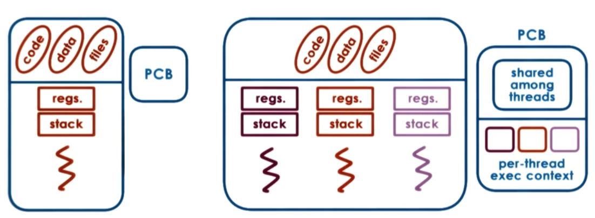

# 线程（Thread）

线程机制是现代编程技术中常用的一种抽象概念，该机制提供了在同一程序内共享内存地址空间而运行的一组线程。线程机制支持并发编程技术（concurrent programming），在多处理器上还能保证真正的并行处理（parallelism）。

Linux 内核并没有「线程」的概念，而是把所有线程统一当做「进程」来实现，所谓的「线程」仅仅是一个与其他进程共享某些资源的进程而已。

Linux 的线程机制完全不同与 Windows 等操作系统，这些系统都在内核提供了专门支持线程的机制，常常把线程称作「轻量级进程」（lightweight process）。假如我们有一个包含四个线程的进程，在提供专门线程支持的系统中，通常会有一个包含指向四个不同线程的指针的进程描述符，该描述符还负责描述像地址空间、打开文件等共享资源，线程本身再去描述它独占的资源。而 Linux 仅仅创建了四个进程并分配四个普通的 task_struct 结构，在创建这四个进程时指定它们共享某些资源。

----

Linux 中的「线程」也称之为「轻量级进程」（light weight process，缩写：LWP），可以通过命令 `ps -eLf` 分析。

## 目录

* 介绍
* 线程同步
* 线程安全和线程存储
* 线程取消
* 更多细节

## 定义


## 进程与线程



## 并发控制和协调

* 相互排斥（mutual exclusion）
  * 一次只能访问一个线程
  * 互斥（mutex）
* 等待其他线程
  * 进行前的具体情况
  * 条件变量（condition variable）
* 从等待状态唤醒其他线程

## 线程数据结构

* 线程类型（Thread type）
* 线程 ID（Thread ID）
* PC
* SP
* 寄存器（Registers）
* 栈（Stack）
* 属性（Attributes）

## 互斥

```c
lock(mutex){
    //Critical Section
    //Only one thread can access at a time
}
unlock(mutex)
```

## 死锁（Deadlocks）

## 内核线程