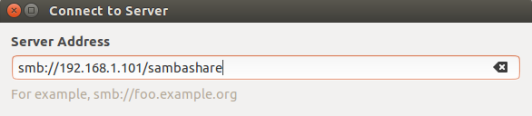

# SMB 客户端

## Ubuntu -> Windows/Ubuntu

* 【使用 Nautilus 文件浏览器】



1. 打开 “Files” 应用（来自 Nautilus 软件包）
2. 找到 “Network” 栏，选择 “Connect to server...”
3. 输入 “smb://<ip_address>” 或 “smb://<ip_address>/sambashare”
4. 输入用户名密码浏览共享目录

* 【使用 smbclient】

`smbclient` 是一个类似于 FTP 连接的命令行工具，依赖 smbfs 驱动便可以安装 SMB 文件共享，其行为类似于本地硬盘。

```bash
# 列出公共的 SMB 共享
$ smbclient -L //<server> -U <user> --option="ntlmssp_client:force_old_spnego = yes"

# 连接 SMB 共享
$ smbclient //<server>/<share> -U <user>%<password> --option="ntlmssp_client:force_old_spnego = yes"
```

## Ubuntu -> MacOS

经测试发现，Ubuntu 客户端无论使用 `smbclient`（SMB 协议）还是使用 `afpfs-ng`（AFP 协议），始终无法成功连接 MacOS 服务端。

* 【使用 CIFS】

```bash
# 安装 cifs
$ sudo apt-get install cifs-utils

# 为当前用户创建挂载目录
$ mkdir ~/mac

# 挂载远程共享到当前登录用户（UID=1000，GID=1000）的 ~/mac 目录下
# 挂载必须具有 root 权限，但为了能在当前用户下访问必须指定相关选项
$ sudo mount -t cifs //<mac_ip_address>/<mac_smb_share_dir> ~/mac -o gid=1000,uid=1000,username=<mac_smb_user>,password=<mac_smb_pwd>,nounix,sec=ntlmssp
```

```bash
# 卸载同样需要 root 权限
$ sudo umount -t cifs ~/mac
```

## MacOS -> Ubuntu

『Finder』 -> `command + k` -> `smb://192.168.1.101/sambashare`

## Windows -> *

打开文件管理器，编辑文件路径 `\\<ip_address>\sambashare`。

## 参考

* [Client Access - Browsing SMB shares](https://help.ubuntu.com/community/Samba/SambaClientGuide)
* [MountWindowsSharesPermanently](https://help.ubuntu.com/community/MountWindowsSharesPermanently)