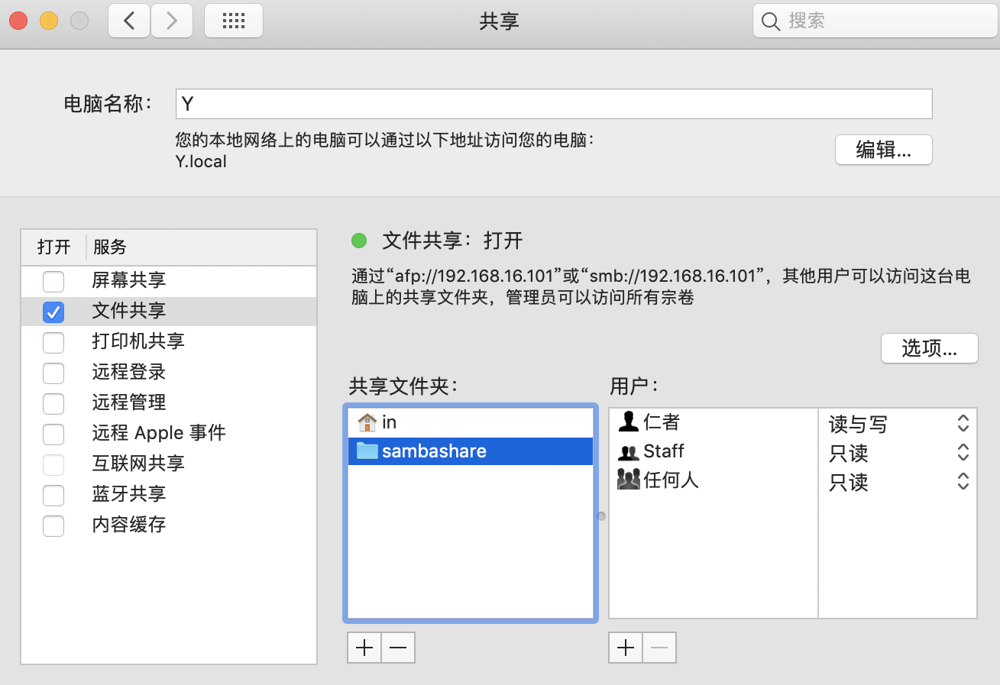

# SMB 服务端

## Ubuntu

Ubuntu 针对 SMB Server 提供了 `samba` 软件包，不过 Ubuntu 客户端连接 SMB Server 时不需要安装此软件包，只需要 smbfs 插件。

```sh
# 安装 samba
$ sudo apt install samba

# 创建共享目录
$ mkdir /home/username/sambashare

# 修改配置文件
$ sudo vi /etc/samba/smb.conf
[sambashare]
    comment = Samba on Ubuntu
    path = /home/username/sambashare
    read only = no
    browsable = yes

# 启动 smbd 服务
$ sudo service smbd restart

# 创建 SMB 用户（该用户必须是系统用户，可以使用 useradd 新创建一个）
$ sudo smbpasswd -a username
```

## MacOS

1. 『系统偏好设置』 -> 『共享』 -> 『文件共享』 -> 『选项』 -> 勾选『使用 SMB 来共享文件和文件夹』（建议也打开 AFP）
2. 添加 『共享文件夹』并设置用户权限



## Windows

（Mark）
