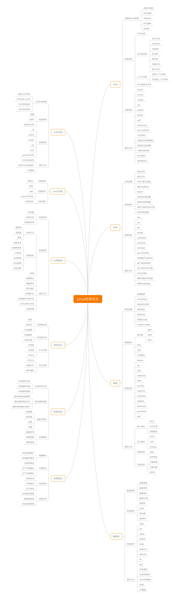

# Linux 性能调优（Linux Performance Tuning）

现在大多数CPU有 `超线程` 能力，在计算和评估平均负载的时候，CPU的核数是指物理核数，还是超线程功能的逻辑核数。

## 性能工具

## 知识体系

## 目录

* [CPU 性能](cpu/README.md)
* [内存性能](memory/README.md)
* [I/O 性能](io/README.md)
* [网络性能](network/README.md)

