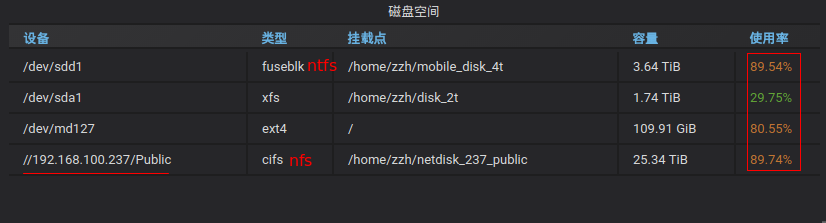
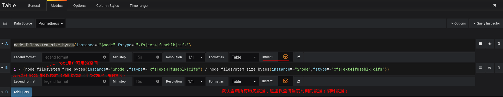
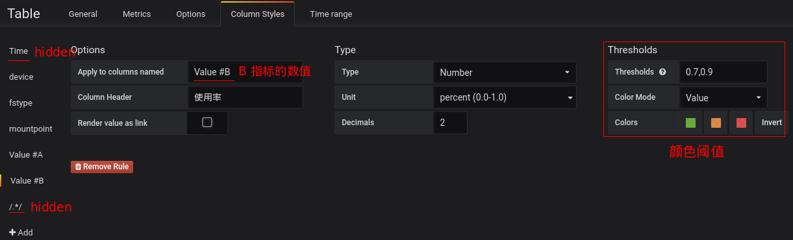

# 磁盘使用情况（Prometheus + Node Exporter）

## 监控指标

| Name                        | 描述                                                                                  |
| --------------------------- | ------------------------------------------------------------------------------------- |
| node_filesystem_size_bytes  | 磁盘容量                                                                              |
| node_filesystem_avail_bytes | 非 `root` 用户可以使用的磁盘剩余空间                                                  |
| node_filesystem_free_bytes  | `root` 用户可以使用的磁盘剩余空间（大于上一行数值；为了避免磁盘被其他用户 100% 用完） |

## 监控

* 实验环境

| Prometheus | Node Exporter | Grafana | Grafana |
| ---------- | ------------- | ------- | ------- |
| 2.2.1      | 0.17.0        | 5.0.1   | Table   |

* Grafana Dashboard

* Garana 配置

某些文件系统（如 `tmpfs`、`proc`）可能没有必要监控，所以目前只监控了 `xfs`、`ext4`、`fuseblk（nfs）`、`cifs（nfs）` 等文件系统。
