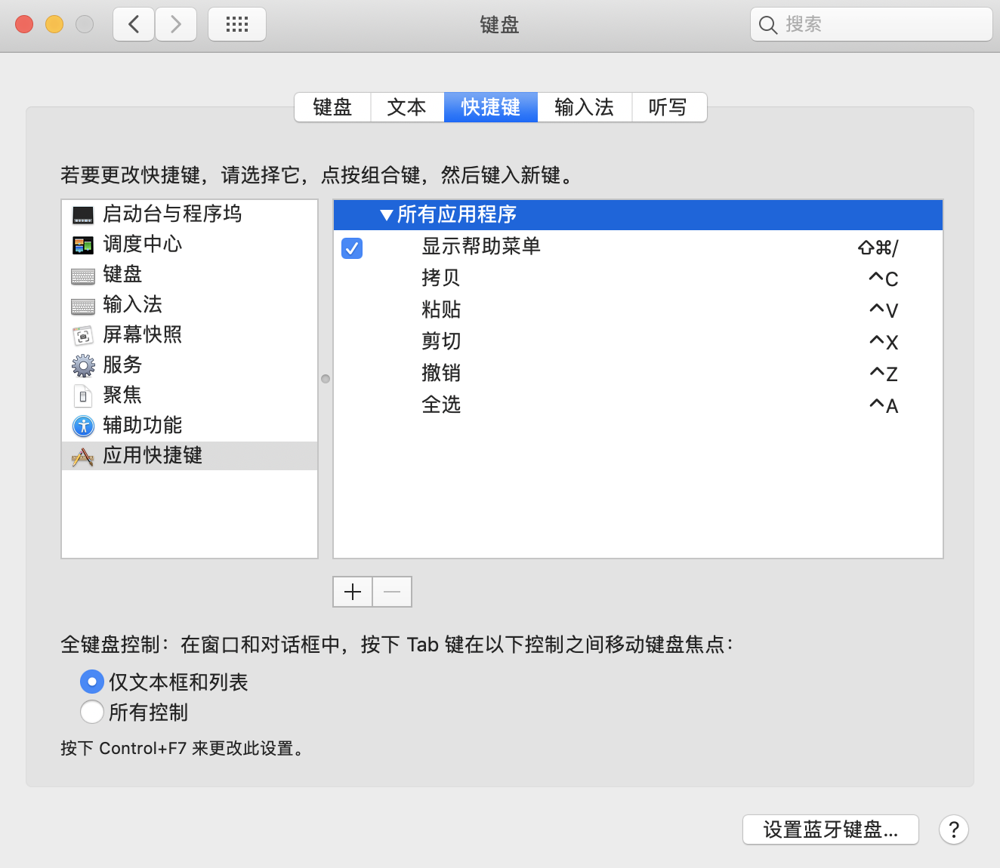

# MacOS 快捷键

## 增加应用快捷键

**添加的快捷键名称必须和应用程序内置的快捷键名称一致，否则快捷键将无法生效。** 通常可以在应用程序的 “Edit” 或 “编辑” 菜单栏找到相应的快捷键名称。为了将快捷键应用到更多的应用程序，应该在设置中英文快捷键名称的同时增加更多的快捷键名称。

| 快捷键        | 快捷键名称                   | 简述           |
| ------------- | ---------------------------- | -------------- |
| <kbd>^C</kbd> | `Copy`、`复制`、`拷贝`       | ~              |
| <kbd>^V</kbd> | `Paste`、`粘贴`              |                |
| <kbd>^S</kbd> | `Save`、`保存`               |                |
| <kbd>^A</kbd> | `Select All`、`全选`         |                |
| <kbd>^Z</kbd> | `Undo`、`Undo Paste`、`撤销` |                |
| <kbd>^Y</kbd> | `Redo`、`重做`               | 撤销后重新恢复 |
| <kbd>^F</kbd> | `Find`、`查找`               |                |
| <kbd>^H</kbd> | `Replace`、`替换`            |                |

MacOS 的大部分快捷键仅仅是用 <kbd>command</kbd> 代替了 <kbd>control</kbd>。
