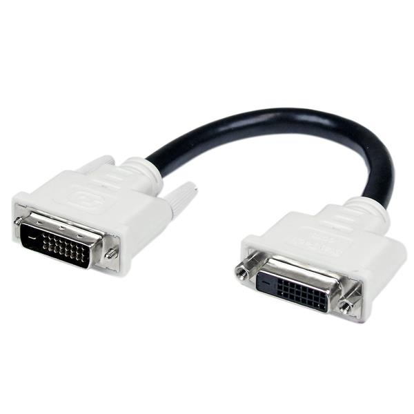
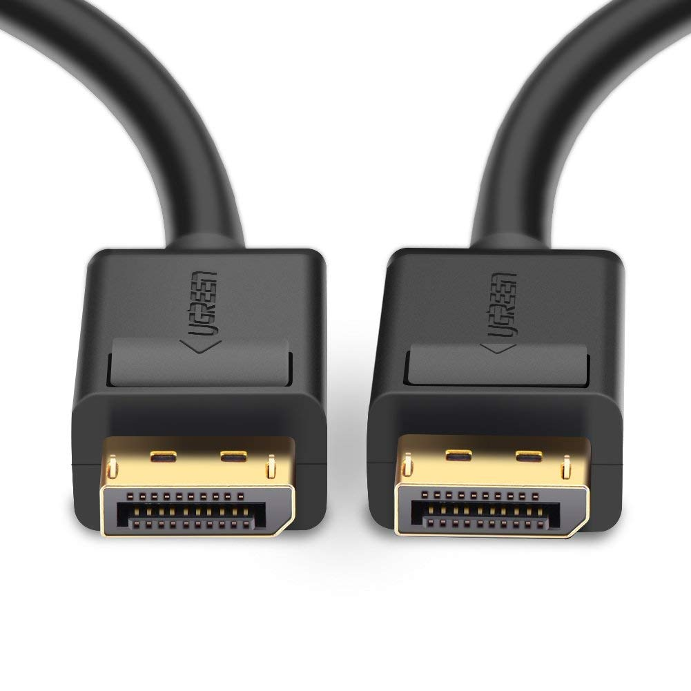

# 显示

## 显示器/显卡接口

| 接口 | 信号     | 主流/淘汰 | 描述                                                   |
| ---- | -------- | --------- | ------------------------------------------------------ |
| VGA  | 模拟信号 | 淘汰      | 视频传输标准（Video Graphics Array）                   |
| DVI  | 数字信号 | 主流      | 数字视频接口（Digital Visual Interface）               |
| HDMI | 数字信号 | 主流      | 高清多媒体接口（High Definition Multimedia Interface） |
| DP   | 数字信号 | 主流      | DisplayPort                                            |

性能对比：`DP > HDMI > DVI > VGA`

---

* VGA

---

* DVI

---

* HDMI

---

* DP

