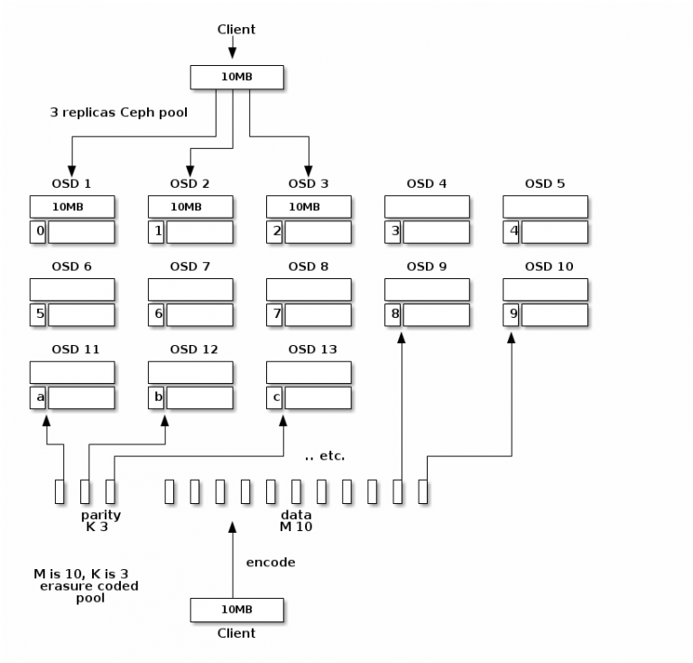

# CRUSH Rule



## replicated rule

```bash
# 创建一个 'replicated' rule
# ceph osd crush rule create-replicated {name} {root} {failure-domain-type} [{class}]
$ ceph osd crush rule create-replicated ssd_rule default host ssd
```

## erasure code

## 参考

