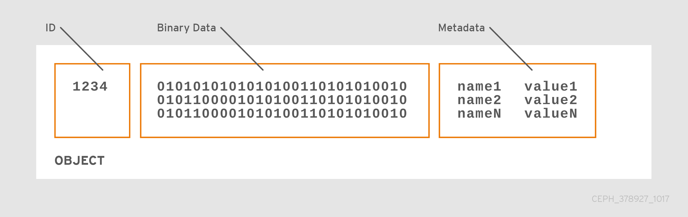

# OSD

<!--
A Ceph OSD Daemon checks its own state and the state of other OSDs and reports back to monitors.
-->

Ceph OSD Daemon 检查自身和其他 OSD 的状态，并上报给 Monitor 。

## 两大功能

* 存储数据到本地连接设备（HDD、SSD 或两者组合）
* 通过 Cluster Network 复制数据到其他 OSD

## Object 组成

* Unique ID
* Binary Data
* name/value paired metadata

