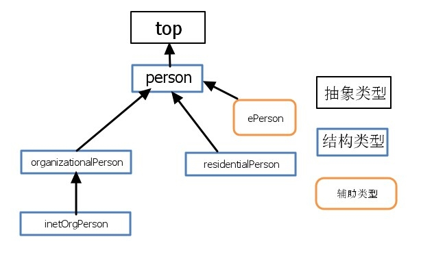

# LDAP 基本概念

## 目录结构

DN能 取这样的值：“ou=people,dc=wikipedia,dc=org”

```plain
         dc=org
           |
      dc=wikipedia
      /          \
ou=people     ou=groups
```

LDAP 目录与普通数据库的主要不同之处在于数据的组织方式，它是一种有层次的、树形结构。


DN（Distinguished Name）：

* 由 Relative Distinguished Name（`RDN`；根据条目中的某些属性构造）组成，后接父条目的 DN
* 将 DN 看作是完整文件路径，RDN 看做其父文件夹中的相对文件名（若 `/foo/bar/x.txt` 是 DN，则 `x.txt` 就是 RDN）

示例：

```plain
dn: cn=John Doe,dc=example,dc=com
cn: John Doe
givenName: John
sn: Doe
telephoneNumber: +1 888 555 6789
telephoneNumber: +1 888 555 1232
mail: john@example.com
manager: cn=Barbara Doe,dc=example,dc=com
objectClass: inetOrgPerson
objectClass: organizationalPerson
objectClass: person
objectClass: top
```

解释：

* `dn` - 条目的唯一标识；它既不是属性也不是条目的一部分
* `cn=John Doe` - 条目的 RDN（Relative Distinguished Name）
* `dc=example,dc=com` - 父条目的 DN
* 其他行显示条目的属性

## Entry

条目（Entry）是 LDAP 中对象的最基本单位，对 LDAP 目录数据库的添加、删除、修改、查询等操作都是基于条目的。

| 别名                       | 全名                        | 描述                                                       | 示例                                  |
| -------------------------- | --------------------------- | ---------------------------------------------------------- | ------------------------------------- |
| `dn`                       | Distinguished Name          | 专有名称；条目的唯一标识符，它既不是属性也不是条目的一部分 | dn: "cn=admin,dc=example,dc=org"      |
| `rdn`                      | Relative Distinguished Name | 相对 DN；相当于 LDAP 目录树的叶子                          | rdn: "cn=admin"                       |
| `base dn`                  | Base DN                     | 相当于 LDAP 目录树的根；它是条目的一部分                   | base dn: "dc=exmple,dc=org"           |
| `RootDN` / `Bind DN`       | ~                           | 超级管理员的 DN                                            | olcRootDN: "cn=admin,dc=eway,dc=link" |
| `RootPW` / `Bind Password` | ~                           | 超级管理员的密码                                           | ～                                    |

## Attribute

属性（`Attribute`）类似于程序设计中的变量，可以被赋值。在 OpenLDAP 中声明了许多常用的 Attribute，用户也可以自定义 Attribute，但必须通过 Schema 指定。

属性特点：

* 条目（Entry）由 Base DN 和一组属性（Attribute）组成
* 属性具有名称（属性类型和属性描述），以及一个或多个属性值；属性在模式（Schema）中定义
* 每个条目都有一个唯一的标识符：Distinguished Name（DN），它既不是属性也不是条目的一部分
* 属性名和属性值不区分大小写

| 属性名 | 全名              | 描述                                 | 属性值示例        |
| ------ | ----------------- | ------------------------------------ | ----------------- |
| `c`    | Country           | 国家                                 |                   |
| `cn`   | Common Name       | 指一个对象的名称；可以是用户名、组名 | cn=John Doe       |
| `dc`   | Domain Component  | 域名（Domain）的一部分（Component）  | dc=example,dc=com |
|        |
| `l`    | Location          | 指一个地名或一个城市名               |                   |
| `mail` | E-mail Address    | 邮箱账号                             | john@example.com  |
| `o`    | Organization Name | 组织                                 |                   |
| `ou`   | Organization Unit | 组织单元                             |                   |
| `sn`   | SurName           | 指一个人的姓                         | sn=Doe            |
| `uid`  | User Id           | 通常指一个用户的登录名               |                   |
| `gid`  | User Group        | 通常指一个用户的所属组               |                   |

## ObjectClass



对象类（`objectClass`）是属性的集合，LDAP 预想了很多人员组织机构中常见的对象，并将其封装成 `objectClass`。比如：

* `person`（人员） 含有以下属性：
  * `sn`（姓）
  * `cn`（名）
  * `telephoneNumber`（电话）
  * `userPassword`（密码）
* `organizationalPerson`（单位职工）是 `person`的子类，除上述属性外还有：
  * `title`（职务）
  * `postalCode`（邮政编码）
  * `postalAddress`（通信地址）

| objectClass        | 描述 |
| ------------------ | ---- |
| top                |      |
| dcObject           |      |
| organization       |      |
| organizationalUnit |      |

对象类有三种类型：

* 结构类型（Structural） - 规定了对象实体的基本属性；每个条目属于且仅属于一个结构型对象类
* 抽象类型（Abstract） - 可以是结构类型或其他抽象类型父类，包含对象属性的共性部分，称为其他类的模板；条目不能直接基础抽象型对象类
* 辅助类型（Auxiliary） - 规定了对象实体的扩展属性

属性类规定了哪些是必要属性（Must/Requeired），哪些是可选属性（May/Optional）。

```ldif
objectclass ( 2.16.840.1.113730.3.2.2
  NAME 'inetOrgPerson'
    DESC 'RFC2798: Internet Organizational Person'
  SUP organizationalPerson # inetOrgPerson 的父类；必要属性继承自 organizationalPerson
  STRUCTURAL
    MAY ( # 可选属性
      audio $ businessCategory $ carLicense $ departmentNumber $
      displayName $ employeeNumber $ employeeType $ givenName $
      homePhone $ homePostalAddress $ initials $ jpegPhoto $
      labeledURI $ mail $ manager $ mobile $ o $ pager $
      photo $ roomNumber $ secretary $ uid $ userCertificate $
      x500uniqueIdentifier $ preferredLanguage $
      userSMIMECertificate $ userPKCS12 )
)
```

## Schema

模式（`schema`）

## TLS & SASL

它能够实现openldap客户端到服务端的用户验证，也是ldapsearch、ldapmodify这些标准客户端工具默认尝试与LDAP服务端认证用户的方式（前提是已经安装好 Cyrus SASL）。SASL有几大工业实现标准：Kerveros V5、DIGEST-MD5、EXTERNAL、PLAIN、LOGIN。

## URI

## LDIF

LDIF（LDAP Data Interchange Format，数据交换格式）是 LDAP 数据库信息的一种文本格式

## 参考

* [LDAP 服务器的概念和原理简单介绍](https://segmentfault.com/a/1190000002607140#articleHeader8)
* [OpenLDAP 概念与工作原理介绍](https://www.linuxidc.com/Linux/2016-08/134225.htm)
* [LDIF 修改 LDAP 记录或配置示例](http://seanlook.com/2015/01/22/openldap_ldif_example/)
