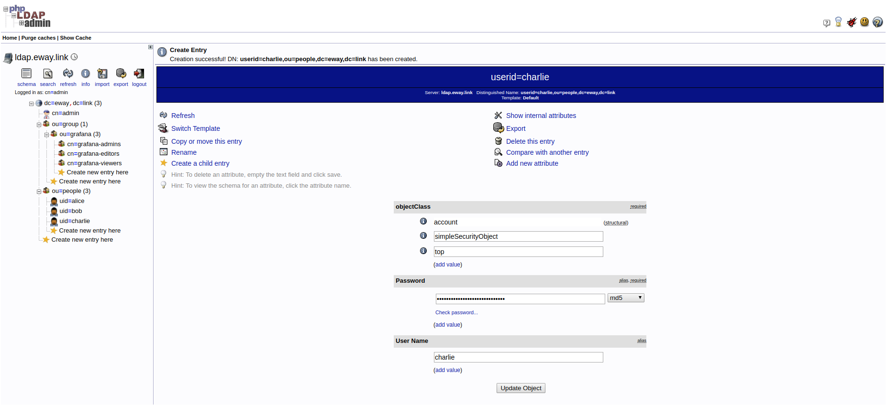

# ldapsearch 查询



## 语法、参数

```syntax
ldapsearch [-V[V]] [-d debuglevel] [-n] [-v] [-c] [-u] [-t[t]] [-T path] [-F prefix] [-A] [-L[L[L]]] [-S attribute] [-b searchbase]
    [-s {base|one|sub|children}] [-a {never|always|search|find}] [-l timelimit] [-z sizelimit] [-f file] [-M[M]] [-x] [-D binddn]  [-W]
    [-w passwd]  [-y passwdfile]  [-H ldapuri]  [-h ldaphost]  [-p ldapport]  [-P {2|3}]  [-e [!]ext[=extparam]] [-E [!]ext[=extparam]]
    [-o opt[=optparam]]  [-O security-properties]  [-I]  [-Q]  [-N]  [-U authcid]  [-R realm]  [-X authzid]  [-Y mech]  [-Z[Z]]  filter
    [attrs...]
```

| 常用参数    | 描述                                 |
| ----------- | ------------------------------------ |
| -LLL        | 以 ldif 格式输出结果，忽略注释、版本 |
| -x          | 简单认证                             |
| -Y EXTERNAL | 用 sasl 的 external 认证方法         |
| -b basedn   | 查询的基准路径，可以是根、树杈、叶子 |
| -D binddn   | 管理员 DN                            |
| -w passwd   | 管理员密码                           |
| -h host     | LDAP 服务器                          |
| -p port     | LDAP 端口                            |
| -H URI      | LDAP URI；本地地址可以是 "ldap:///"  |

## 查询所有条目

在以 `dc=eway,dc=link` 为根（Base DN）的子树中查询所有条目：

```sh
# 末尾不指定任何属性
$ ldapsearch -LLL -x -H ldap://localhost:389 -D "cn=admin,dc=eway,dc=link" -w "admin" -b "dc=eway,dc=link"

dn: dc=eway,dc=link
objectClass: top
objectClass: dcObject
objectClass: organization
o: Eway
dc: eway

dn: cn=admin,dc=eway,dc=link
objectClass: simpleSecurityObject
objectClass: organizationalRole
cn: admin
description: LDAP administrator
userPassword:: e1NTSEF9ZUZZcDYydnpvdVNhZDhMd2piczVkNExuWE1ueDFlVVA=

dn: ou=group,dc=eway,dc=link
ou: group
objectClass: organizationalUnit
objectClass: top

dn: ou=people,dc=eway,dc=link
ou: people
objectClass: organizationalUnit
objectClass: top

dn: ou=grafana,ou=group,dc=eway,dc=link
ou: grafana
objectClass: organizationalUnit
objectClass: top

dn: cn=grafana-admins,ou=grafana,ou=group,dc=eway,dc=link
cn: grafana-admins
gidNumber: 500
objectClass: posixGroup
objectClass: top

dn: cn=grafana-editors,ou=grafana,ou=group,dc=eway,dc=link
cn: grafana-editors
gidNumber: 501
objectClass: posixGroup
objectClass: top

dn: cn=grafana-viewers,ou=grafana,ou=group,dc=eway,dc=link
cn: grafana-viewers
gidNumber: 502
objectClass: posixGroup
objectClass: top

dn: cn=bob,ou=people,dc=eway,dc=link
sn: bob
cn:: IGJvYg==
uid: bob
userPassword:: e01ENX1vMlNjVFFIaFVLWnlTK05GMFRJUmlRPT0=
uidNumber: 1001
gidNumber: 501
homeDirectory: /home/users/bob
loginShell: /bin/sh
objectClass: inetOrgPerson
objectClass: posixAccount
objectClass: top

dn: cn=alice,ou=people,dc=eway,dc=link
sn: alice
cn:: IGFsaWNl
uid: alice
userPassword:: e01ENX1vMlNjVFFIaFVLWnlTK05GMFRJUmlRPT0=
uidNumber: 1000
gidNumber: 500
homeDirectory: /home/users/alice
loginShell: /bin/sh
objectClass: inetOrgPerson
objectClass: posixAccount
objectClass: top

dn: cn=charlie,ou=people,dc=eway,dc=link
sn: charlie
cn:: IGNoYXJsaWU=
uid: charlie
userPassword:: e01ENX1vMlNjVFFIaFVLWnlTK05GMFRJUmlRPT0=
uidNumber: 1002
gidNumber: 502
homeDirectory: /home/users/charlie
loginShell: /bin/sh
objectClass: inetOrgPerson
objectClass: posixAccount
objectClass: top
```

```sh
# 仅查询 dn
$ ldapsearch -LLL -x -H ldap://localhost:389 -D "cn=admin,dc=eway,dc=link" -w "admin" -b "dc=eway,dc=link" dn

# 仅查询 objectClass 属性
$ ldapsearch -LLL -x -H ldap://localhost:389 -D "cn=admin,dc=eway,dc=link" -w "admin" -b "dc=eway,dc=link" objectClass
```

## 查询特定条目

在以 `ou=people,dc=eway,dc=link` 为根（Base DN）的子树中查找 `uid=alice` 的条目：

```sh
$ ldapsearch -LLL -x -H ldap://localhost:389 -D "cn=admin,dc=eway,dc=link" -w "admin" -b "ou=people,dc=eway,dc=link" "(cn=alice)"
$ ldapsearch -LLL -x -H ldap://localhost:389 -D "cn=admin,dc=eway,dc=link" -w "admin" -b "ou=people,dc=eway,dc=link" "(uid=alice)"

dn: cn=alice,ou=people,dc=eway,dc=link
sn: alice
cn:: IGFsaWNl
uid: alice
userPassword:: e01ENX1vMlNjVFFIaFVLWnlTK05GMFRJUmlRPT0=
uidNumber: 1000
gidNumber: 500
homeDirectory: /home/users/alice
loginShell: /bin/sh
objectClass: inetOrgPerson
objectClass: posixAccount
objectClass: top
```

尽管在 phpLDAPadmin 的 `ou=people,dc=eway,dc=link` 子目录中使用的是 `cn=alice` 来显示 Alice，但从其属性可以看出，使用 `uid=alice` 同样可以（因为 uid 在同一目录下唯一的）

## 查询所有组

```
```

## 查询用户所在的组

```sh
$ ldapsearch -LLL -x -H ldap://localhost:389 -D "cn=admin,dc=eway,dc=link" -w "admin" -b "ou=grafana,ou=group,dc=eway,dc=link" "(memberUid=alice)"
```
