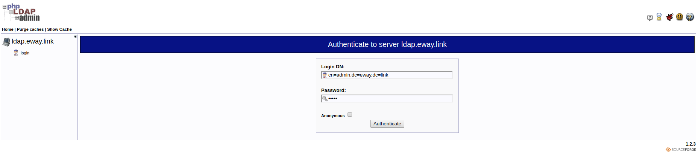

# Docker 环境

## OpenLDAP

```sh
$ docker run -d --name openldap \
  --restart=always \
  -p 389:389 \
  -p 636:636 \
  --hostname ldap.eway.link \
  --env LDAP_ORGANISATION="Eway" \
  --env LDAP_DOMAIN="eway.link" \
  --env LDAP_ADMIN_PASSWORD="admin" \
  osixia/openldap:1.2.3
```

```sh
# 默认 -D: cn=admin,dc=example,dc=org
# 默认 -w: admin
$ docker exec openldap ldapsearch -x -H ldap://localhost:389 -b "dc=eway,dc=link" -D "cn=admin,dc=eway,dc=link" -w admin
$ docker exec openldap ldapsearch -x -H ldaps://localhost:636 -b "dc=eway,dc=link" -D "cn=admin,dc=eway,dc=link" -w admin
```

## PhpLDAPadmin

```sh
$ docker run -d --name phpldapadmin \
  --restart=always \
  -p 6443:443 \
  --link openldap:ldap-host \
  --env PHPLDAPADMIN_LDAP_HOSTS=ldap.eway.link \
  osixia/phpldapadmin:0.7.2
```

```sh
# curl -k https://localhost:6443
$ google-chrome https://localhost:6443
```


